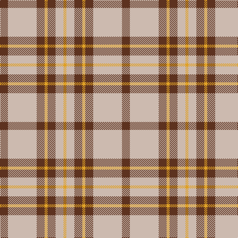

In pattern [BYBYBYY](/patterns/bybybyy/).

This was sourced from register-of-tartans.  It is a [7 stripes tartan](/stripes/stripes7/).

Original link https://www.tartanregister.gov.uk/tartanDetails.aspx?ref=10650

## Attestations

This cloth appears in 2 source records; the oldest owns this page.

- 07/07/2012 — Lister (Misty Mountain) (register-of-tartans, [record](https://www.tartanregister.gov.uk/tartanDetails.aspx?ref=10650))
- undated — Lister (Misty Mountain) Name Tartan Tartan Number: 10650. Earliest known date: 07/07/2012 Inspired by a sponsored challenge to wear kilts for a year, David Lister designed this tartan for his family. Colours: grey represents mountain mists; brown represents the matriarchal line and mountains; gold represents the first rays of the morning sun. There are no restrictions as to who can wear this tartan. See products available Copyright © Blair Urquhart, Comrie, 2015 (house-of-tartan, [record](http://www.house-of-tartan.scotland.net/house/TartanViewjs.asp?colr=Def&tnam=10650))

## Thread count
T/16 N58 T16 Y6 T16 N16 Y/6

## Palette
Each colour and its ΔE from the base-6 reference it is a variant of.

| Colour | Shade | Base | ΔE (OKLab) |
|---|---|---|---|
| N | <code style="background-color:#CCBAAF;">#CCBAAF</code> `#CCBAAF` | Y <code style="background-color:#E8C000;">#E8C000</code> | 0.15 |
| T | <code style="background-color:#5D321F;">#5D321F</code> `#5D321F` | B <code style="background-color:#2C4084;">#2C4084</code> | 0.18 |
| Y | <code style="background-color:#E0A126;">#E0A126</code> `#E0A126` | Y <code style="background-color:#E8C000;">#E8C000</code> | 0.08 |

# Sample pattern

ID: /setts/s7/b16y58b16ya6b16y16ya6-b5d321f-yccbaaf-yae0a126/
