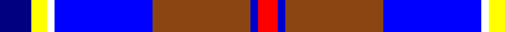

In pattern [BYWBRBR](/patterns/bywbrbr/).

This was sourced from register-of-tartans.  It is a [7 stripes tartan](/stripes/stripes7/).

Original link https://www.tartanregister.gov.uk/tartanDetails.aspx?ref=10048

## Thread count
DB/16 Y8 W4 B50 T50 Ba4 R/10

## Palette
Each colour and its ΔE from the base-6 reference it is a variant of.

| Colour | Shade | Base | ΔE (OKLab) |
|---|---|---|---|
| B | <code style="background-color:#0000FF;">#0000FF</code> `#0000FF` | B <code style="background-color:#2A418A;">#2A418A</code> | 0.20 |
| Ba | <code style="background-color:#0000CD;">#0000CD</code> `#0000CD` | B <code style="background-color:#2A418A;">#2A418A</code> | 0.14 |
| DB | <code style="background-color:#000080;">#000080</code> `#000080` | B <code style="background-color:#2A418A;">#2A418A</code> | 0.14 |
| R | <code style="background-color:#FF0000;">#FF0000</code> `#FF0000` | R <code style="background-color:#CC0000;">#CC0000</code> | 0.11 |
| T | <code style="background-color:#8B4513;">#8B4513</code> `#8B4513` | R <code style="background-color:#CC0000;">#CC0000</code> | 0.13 |
| W | <code style="background-color:#FFFFFF;">#FFFFFF</code> `#FFFFFF` | W <code style="background-color:#F7F7F7;">#F7F7F7</code> | 0.02 |
| Y | <code style="background-color:#FFFF00;">#FFFF00</code> `#FFFF00` | Y <code style="background-color:#F2BF00;">#F2BF00</code> | 0.16 |

# Sample pattern

## Nearest tartans

The nearest existing variants by ΔTartan distance.

1. [Fulbright Foundation](/setts/s8/r6y50b12ba6r4bb10ba36w6-b1c1c50-ba1c0070-bb507c94-rc8002c-we0e0e0-ya0a0a0/) — ΔT 1.17
1. [Alexander of Menstry](/setts/s8/g10r4g4r18k18y18b60w10-b2c2c80-g006818-k101010-r9c68a4-wf8f8f8-ya0a0a0/) — ΔT 1.39
1. [GYL (Personal)](/setts/s10/b28r3w3r3w3r3b14k12ba38y8-b2c2c80-ba2888c4-k101010-rc80000-we0e0e0-ye8c000/) — ΔT 1.40
1. [Dignan School of Dancing](/setts/s7/y8r4b64k20ba8w42ba4-b2474e8-ba6c0070-k101010-r880000-wc0c0c0-yd09800/) — ΔT 1.44
1. [Queen Margaret University](/setts/s9/b8w6b34wa20k2ba10k2wa12g6-b2c4084-ba5a008c-g005020-k101010-we0e0e0-wac0c0c0/) — ΔT 1.53
1. [Christian Dress (Personal)](/setts/s7/r6w4b54k38w54ba4y6-b2c2c80-ba780078-k101010-rc80000-wf8f8f8-ye8c000/) — ΔT 1.54
1. [Manx National](/setts/s7/b4g12r2ga2ba6bb20w2-b800080-ba000050-bb8080d0-g008000-ga908000-rc00000-we0e0e0/) — ΔT 1.57
1. [Ancient Gathering](/setts/s8/b2w24ba12wa2y6b28bb36wa2-b202060-ba9058d8-bb1870a4-w98c8e8-wafcfcfc-ye8c000/) — ΔT 1.57
1. [Unidentified (Woven sample)](/setts/s8/k16w6k4b64r19k8g42y6-b3850c8-g006818-k101010-r981c70-wf8f8f8-ye8c000/) — ΔT 1.59
1. [Waterford County Crest (Fashion)](/setts/s8/w16b10ba60y8b26y26g10ya10-b1c1c50-ba2c2c80-g006818-we0e0e0-ya0a0a0-yabc8c00/) — ΔT 1.62

## Neighbour map

Every grey dot is one of 15726 variants placed by the first two principal components of the ΔTartan feature space (44% of its variance). Red is this tartan; blue dots are its nearest — click one to open its page.

<svg viewBox="0 0 640 380" role="img" style="max-width:100%;height:auto;border:1px solid #e0e0e0;border-radius:4px;display:block" xmlns="http://www.w3.org/2000/svg"><image href="/nn/cloud.v1.png" width="640" height="380"/><a href="/setts/s8/r6y50b12ba6r4bb10ba36w6-b1c1c50-ba1c0070-bb507c94-rc8002c-we0e0e0-ya0a0a0/"><circle cx="148.4" cy="132.6" r="4" fill="#3465a4"><title>Fulbright Foundation</title></circle></a><a href="/setts/s8/g10r4g4r18k18y18b60w10-b2c2c80-g006818-k101010-r9c68a4-wf8f8f8-ya0a0a0/"><circle cx="158.9" cy="133.2" r="4" fill="#3465a4"><title>Alexander of Menstry</title></circle></a><a href="/setts/s10/b28r3w3r3w3r3b14k12ba38y8-b2c2c80-ba2888c4-k101010-rc80000-we0e0e0-ye8c000/"><circle cx="138.6" cy="125.7" r="4" fill="#3465a4"><title>GYL (Personal)</title></circle></a><a href="/setts/s7/y8r4b64k20ba8w42ba4-b2474e8-ba6c0070-k101010-r880000-wc0c0c0-yd09800/"><circle cx="173.3" cy="127.5" r="4" fill="#3465a4"><title>Dignan School of Dancing</title></circle></a><a href="/setts/s9/b8w6b34wa20k2ba10k2wa12g6-b2c4084-ba5a008c-g005020-k101010-we0e0e0-wac0c0c0/"><circle cx="164.9" cy="126.5" r="4" fill="#3465a4"><title>Queen Margaret University</title></circle></a><a href="/setts/s7/r6w4b54k38w54ba4y6-b2c2c80-ba780078-k101010-rc80000-wf8f8f8-ye8c000/"><circle cx="115.2" cy="125.7" r="4" fill="#3465a4"><title>Christian Dress (Personal)</title></circle></a><a href="/setts/s7/b4g12r2ga2ba6bb20w2-b800080-ba000050-bb8080d0-g008000-ga908000-rc00000-we0e0e0/"><circle cx="133.5" cy="139.9" r="4" fill="#3465a4"><title>Manx National</title></circle></a><a href="/setts/s8/b2w24ba12wa2y6b28bb36wa2-b202060-ba9058d8-bb1870a4-w98c8e8-wafcfcfc-ye8c000/"><circle cx="119.4" cy="128.2" r="4" fill="#3465a4"><title>Ancient Gathering</title></circle></a><a href="/setts/s8/k16w6k4b64r19k8g42y6-b3850c8-g006818-k101010-r981c70-wf8f8f8-ye8c000/"><circle cx="156.2" cy="133.1" r="4" fill="#3465a4"><title>Unidentified (Woven sample)</title></circle></a><a href="/setts/s8/w16b10ba60y8b26y26g10ya10-b1c1c50-ba2c2c80-g006818-we0e0e0-ya0a0a0-yabc8c00/"><circle cx="94.8" cy="170.2" r="4" fill="#3465a4"><title>Waterford County Crest (Fashion)</title></circle></a><circle cx="108.3" cy="122.4" r="5" fill="#c00000"/></svg>

ID: /setts/s7/b16y8w4ba50r50bb4ra10-b000080-ba0000ff-bb0000cd-r8b4513-raff0000-wffffff-yffff00/
