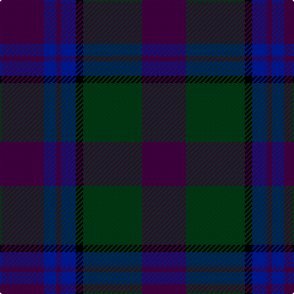

In pattern [BBBBKGB](/patterns/bbbbkgb/).

This was sourced from register-of-tartans.  It is a [7 stripes tartan](/stripes/stripes7/).

Original link https://www.tartanregister.gov.uk/tartanDetails.aspx?ref=10739

## Register references

External register numbers recorded for this tartan.

- Scottish Register of Tartans: [10739](https://www.tartanregister.gov.uk/tartanDetails.aspx?ref=10739)

## Thread count
DP/36 DB10 DP4 DB12 K6 DG48 DP/36

## Palette
Each colour and its ΔE from the base-6 reference it is a variant of.

| Colour | Shade | Base | ΔE (OKLab) |
|---|---|---|---|
| DB | <code style="background-color:#001A99;">#001A99</code> `#001A99` | B <code style="background-color:#2A418A;">#2A418A</code> | 0.10 |
| DG | <code style="background-color:#003C14;">#003C14</code> `#003C14` | G <code style="background-color:#006100;">#006100</code> | 0.13 |
| DP | <code style="background-color:#440044;">#440044</code> `#440044` | B <code style="background-color:#2A418A;">#2A418A</code> | 0.18 |
| K | <code style="background-color:#000000;">#000000</code> `#000000` | K <code style="background-color:#000000;">#000000</code> | 0.00 |

# Sample pattern

## Nearest tartans

The nearest existing variants by ΔTartan distance.

1. [Robert Gordon University](/setts/s6/k4r2k12b12k1y2~b202060-k101010-r880000-yd09800~x2/) — ΔT 1.15
1. [Perthshire, New /Tourist Board](/setts/s6/b37r10g22b11g3r3~b000050-g003000-r800000~x2/) — ΔT 1.44
1. [Marchmont (Personal)](/setts/s7/g1b12k12g1k12b12k1~b2c2c80-g289c18-k101010~x4/) — ΔT 1.46
1. [Aisteach](/setts/s7/b32g16r14k4r6b7k2~b3d2e60-g005020-k1c1714-r97342f~x2/) — ΔT 1.49
1. [Christian Dewar (Personal)](/setts/s9/b16k2b2k2b2k6g13y2g3~b00248c-g142814-k3c0000-ya08c28~x2/) — ΔT 1.50
1. [Scottish Monuments (Corporate)](/setts/s9/b3r2b2r3b20ba8k2ba6k3~b14283c-ba5c5c5c-k101010-r888888~x2/) — ΔT 1.51
1. [Bouncing Blackie (Personal)](/setts/s7/b5ba8bb13g21ba34bb55r3~b700070-ba24246c-bb1c1c1c-g007040-r742800/) — ΔT 1.52
1. [Gavin](/setts/s7/b26w2b3ba15ba26bb2ba3~b680028-ba14283c-bb4c0000-wfcfcfc~x2/) — ΔT 1.52
1. [Moray (Corporate)](/setts/s8/b15ba3b30k22g18ba3g3w3~b2c2c80-ba780078-g003820-k101010-we0e0e0~x2/) — ΔT 1.53
1. [Caledonian Dragon (Corporate)](/setts/s11/k3r2k12b8k2b4k2b4k12b22y3~b202060-k101010-rc80000-ye8c000~x2/) — ΔT 1.53

## Neighbour map

Every grey dot is one of 15726 variants placed by the first two principal components of the ΔTartan feature space (44% of its variance). Red is this tartan; blue dots are its nearest — click one to open its page.

<svg viewBox="0 0 640 380" role="img" style="max-width:100%;height:auto;border:1px solid #e0e0e0;border-radius:4px;display:block" xmlns="http://www.w3.org/2000/svg"><image href="/nn/cloud.v1.png" width="640" height="380"/><a href="/setts/s6/k4r2k12b12k1y2~b202060-k101010-r880000-yd09800~x2/"><circle cx="336.5" cy="232.6" r="4" fill="#3465a4"><title>Robert Gordon University</title></circle></a><a href="/setts/s6/b37r10g22b11g3r3~b000050-g003000-r800000~x2/"><circle cx="385.4" cy="259.4" r="4" fill="#3465a4"><title>Perthshire, New /Tourist Board</title></circle></a><a href="/setts/s7/g1b12k12g1k12b12k1~b2c2c80-g289c18-k101010~x4/"><circle cx="364.4" cy="258.8" r="4" fill="#3465a4"><title>Marchmont (Personal)</title></circle></a><a href="/setts/s7/b32g16r14k4r6b7k2~b3d2e60-g005020-k1c1714-r97342f~x2/"><circle cx="350.7" cy="225.0" r="4" fill="#3465a4"><title>Aisteach</title></circle></a><a href="/setts/s9/b16k2b2k2b2k6g13y2g3~b00248c-g142814-k3c0000-ya08c28~x2/"><circle cx="270.0" cy="223.3" r="4" fill="#3465a4"><title>Christian Dewar (Personal)</title></circle></a><a href="/setts/s9/b3r2b2r3b20ba8k2ba6k3~b14283c-ba5c5c5c-k101010-r888888~x2/"><circle cx="326.5" cy="211.3" r="4" fill="#3465a4"><title>Scottish Monuments (Corporate)</title></circle></a><a href="/setts/s7/b5ba8bb13g21ba34bb55r3~b700070-ba24246c-bb1c1c1c-g007040-r742800/"><circle cx="342.5" cy="206.9" r="4" fill="#3465a4"><title>Bouncing Blackie (Personal)</title></circle></a><a href="/setts/s7/b26w2b3ba15ba26bb2ba3~b680028-ba14283c-bb4c0000-wfcfcfc~x2/"><circle cx="411.0" cy="222.8" r="4" fill="#3465a4"><title>Gavin</title></circle></a><a href="/setts/s8/b15ba3b30k22g18ba3g3w3~b2c2c80-ba780078-g003820-k101010-we0e0e0~x2/"><circle cx="252.3" cy="209.1" r="4" fill="#3465a4"><title>Moray (Corporate)</title></circle></a><a href="/setts/s11/k3r2k12b8k2b4k2b4k12b22y3~b202060-k101010-rc80000-ye8c000~x2/"><circle cx="337.1" cy="208.6" r="4" fill="#3465a4"><title>Caledonian Dragon (Corporate)</title></circle></a><circle cx="333.3" cy="240.2" r="5" fill="#c00000"/></svg>

ID: /setts/s7/b18g24k3ba6b2ba5b18~b440044-ba001a99-g003c14-k000000~x2/
