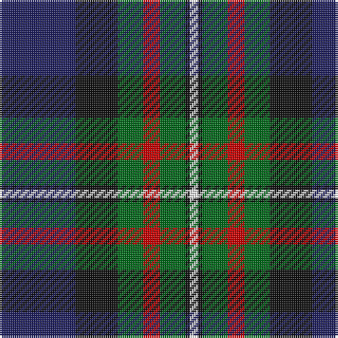

In pattern [BKGRGKW](/patterns/bkgrgkw/).

This was sourced from tartans-authority.  It is a [7 stripes tartan](/stripes/stripes7/).

Original link http://www.tartansauthority.com/tartan-ferret/display/337/

## Thread count
DB/36 K20 G12 R8 G12 K2 W/4

## Palette
Each colour and its ΔE from the base-6 reference it is a variant of.

| Colour | Shade | Base | ΔE (OKLab) |
|---|---|---|---|
| DB | <code style="background-color:#202060;">#202060</code> `#202060` | B <code style="background-color:#2A418A;">#2A418A</code> | 0.11 |
| G | <code style="background-color:#006818;">#006818</code> `#006818` | G <code style="background-color:#006100;">#006100</code> | 0.02 |
| K | <code style="background-color:#101010;">#101010</code> `#101010` | K <code style="background-color:#000000;">#000000</code> | 0.17 |
| R | <code style="background-color:#C80000;">#C80000</code> `#C80000` | R <code style="background-color:#CC0000;">#CC0000</code> | 0.01 |
| W | <code style="background-color:#FCFCFC;">#FCFCFC</code> `#FCFCFC` | W <code style="background-color:#F7F7F7;">#F7F7F7</code> | 0.01 |

# Sample pattern

## Nearest tartans

The nearest existing variants by ΔTartan distance.

1. [MacRae Hunting #2](/setts/s9/g14k2g4r2g4k14b15k1w3x2~b5a008c-g006428-k101010-r960028-we0e0e0/) — ΔT 0.66
1. [Colquhoun (Clan)](/setts/s7/b5k10b48k72w12g48r5~b1c1c50-g285800-k101010-rc80000-wfcfcfc/) — ΔT 0.69
1. [MacWilliam](/setts/s6/r2g12k10ra1b16ra2x2~b304080-g008000-k000000-r806050-rac00000/) — ΔT 0.77
1. [Genet, Citizen (Commem)](/setts/s7/r2k9g12b8r1b1w1x4~b1c0070-g006818-k101010-rc80000-we0e0e0/) — ΔT 0.78
1. [MacFadzean/MacPhedran](/setts/s7/g3b12w1k12g13r2g2x4~b2c2c80-g408060-k101010-rc80000-wf8f8f8/) — ΔT 0.79
1. [Smith, Sir William (?)](/setts/s6/b3ba18k20g20k1y3x2~b5c8ca8-ba2c2c80-g006818-k101010-yfccc00/) — ΔT 0.82
1. [Russell Clan Tartan Tartan Number: 1094. Earliest known date: c.1815 It seems certain that the tartan was first known as Galbraith. William Wilson and Sons of Bannockburn recorded the pattern as Russell in their pattern book of 1847, although it was named Hunter in the earlier book of 1819. See products available Copyright © Blair Urquhart, Comrie, 2015](/setts/s6/k2g12k12r1b12w2x2~b2c2c80-g006818-k101010-rc80000-we0e0e0/) — ΔT 0.87
1. [Whitson #2](/setts/s8/w4k1g18k17b13r1b3r1x2~b2c4084-g005020-k101010-rdc0000-we0e0e0/) — ΔT 0.89
1. [Sandberg of Greenock (Personal)](/setts/s8/y3k12b1g5b12r1k2r1x4~b2c2c80-g006818-k101010-rc80000-ye8c000/) — ΔT 0.91
1. [MacCormick](/setts/s7/w3k1g20k16b20k1y3x2~b2c2c80-g006818-k101010-we0e0e0-ye8c000/) — ΔT 0.91

## Neighbour map

Every grey dot is one of 15726 variants placed by the first two principal components of the ΔTartan feature space (44% of its variance). Red is this tartan; blue dots are its nearest — click one to open its page.

<svg viewBox="0 0 640 380" role="img" style="max-width:100%;height:auto;border:1px solid #e0e0e0;border-radius:4px;display:block" xmlns="http://www.w3.org/2000/svg"><image href="/nn/cloud.v1.png" width="640" height="380"/><a href="/setts/s9/g14k2g4r2g4k14b15k1w3x2~b5a008c-g006428-k101010-r960028-we0e0e0/"><circle cx="180.5" cy="162.7" r="4" fill="#3465a4"><title>MacRae Hunting #2</title></circle></a><a href="/setts/s7/b5k10b48k72w12g48r5~b1c1c50-g285800-k101010-rc80000-wfcfcfc/"><circle cx="204.4" cy="178.9" r="4" fill="#3465a4"><title>Colquhoun (Clan)</title></circle></a><a href="/setts/s6/r2g12k10ra1b16ra2x2~b304080-g008000-k000000-r806050-rac00000/"><circle cx="166.9" cy="178.2" r="4" fill="#3465a4"><title>MacWilliam</title></circle></a><a href="/setts/s7/r2k9g12b8r1b1w1x4~b1c0070-g006818-k101010-rc80000-we0e0e0/"><circle cx="167.4" cy="180.1" r="4" fill="#3465a4"><title>Genet, Citizen (Commem)</title></circle></a><a href="/setts/s7/g3b12w1k12g13r2g2x4~b2c2c80-g408060-k101010-rc80000-wf8f8f8/"><circle cx="190.7" cy="184.6" r="4" fill="#3465a4"><title>MacFadzean/MacPhedran</title></circle></a><a href="/setts/s6/b3ba18k20g20k1y3x2~b5c8ca8-ba2c2c80-g006818-k101010-yfccc00/"><circle cx="176.3" cy="180.1" r="4" fill="#3465a4"><title>Smith, Sir William (?)</title></circle></a><a href="/setts/s6/k2g12k12r1b12w2x2~b2c2c80-g006818-k101010-rc80000-we0e0e0/"><circle cx="164.7" cy="200.8" r="4" fill="#3465a4"><title>Russell Clan Tartan Tartan Number: 1094. Earliest known date: c.1815 It seems certain that the tartan was first known as Galbraith. William Wilson and Sons of Bannockburn recorded the pattern as Russell in their pattern book of 1847, although it was named Hunter in the earlier book of 1819. See products available Copyright © Blair Urquhart, Comrie, 2015</title></circle></a><a href="/setts/s8/w4k1g18k17b13r1b3r1x2~b2c4084-g005020-k101010-rdc0000-we0e0e0/"><circle cx="175.6" cy="156.5" r="4" fill="#3465a4"><title>Whitson #2</title></circle></a><a href="/setts/s8/y3k12b1g5b12r1k2r1x4~b2c2c80-g006818-k101010-rc80000-ye8c000/"><circle cx="184.8" cy="167.4" r="4" fill="#3465a4"><title>Sandberg of Greenock (Personal)</title></circle></a><a href="/setts/s7/w3k1g20k16b20k1y3x2~b2c2c80-g006818-k101010-we0e0e0-ye8c000/"><circle cx="168.5" cy="157.6" r="4" fill="#3465a4"><title>MacCormick</title></circle></a><circle cx="186.4" cy="172.8" r="5" fill="#c00000"/></svg>

ID: /setts/s7/b18k10g6r4g6k1w2x2~b202060-g006818-k101010-rc80000-wfcfcfc/
