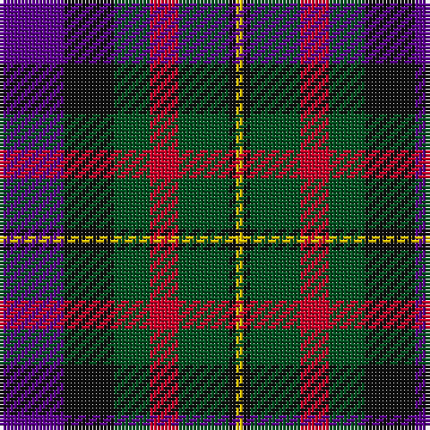

In pattern [BKGRGKY](/patterns/bkgrgky/).

This was sourced from register-of-tartans.  It is a [7 stripes tartan](/stripes/stripes7/).

Original link https://www.tartanregister.gov.uk/tartanDetails.aspx?ref=2595

## Thread count
P/18 K14 G10 R8 G14 K2 Y/2

## Palette
Each colour and its ΔE from the base-6 reference it is a variant of.

| Colour | Shade | Base | ΔE (OKLab) |
|---|---|---|---|
| G | <code style="background-color:#005020;">#005020</code> `#005020` | G <code style="background-color:#006400;">#006400</code> | 0.08 |
| K | <code style="background-color:#101010;">#101010</code> `#101010` | K <code style="background-color:#000000;">#000000</code> | 0.17 |
| P | <code style="background-color:#5A008C;">#5A008C</code> `#5A008C` | B <code style="background-color:#2C4084;">#2C4084</code> | 0.12 |
| R | <code style="background-color:#C80028;">#C80028</code> `#C80028` | R <code style="background-color:#C80000;">#C80000</code> | 0.02 |
| Y | <code style="background-color:#E8C000;">#E8C000</code> `#E8C000` | Y <code style="background-color:#E8C000;">#E8C000</code> | 0.00 |

# Sample pattern

## Nearest tartans

The nearest existing variants by ΔTartan distance.

1. [Dundas](/setts/s7/b9r24g24k24b24y2b9-b2c4084-g005020-k101010-rdc0000-ye8c000/) — ΔT 0.57
1. [Martin Hunting](/setts/s5/b40k10ka38g38y4-b780078-g006818-k000030-ka101010-ye8c000/) — ΔT 0.85
1. [Gold Brothers](/setts/s6/b12g54b6k38ba54w6-b2c2c80-ba780078-g006818-k101010-wf8f8f8/) — ΔT 0.89
1. [St. Clement of Rome (Corporate)](/setts/s8/b36k10r52k10g50k10b36y4-b202060-g006818-k101010-rc80000-ye8c000/) — ΔT 0.92
1. [Thompson's Fancy Personal Tartan Tartan Number: 286. Earliest known date: pre 2003 Designed for his own use. See products available Copyright © Blair Urquhart, Comrie, 2015](/setts/s6/r12g48b12ba24k24ba6-b2c2c80-ba5c8ca8-g604000-k101010-rc80000/) — ΔT 0.92
1. [Brodie Hunting Clan Tartan Tartan Number: 1334. Earliest known date: 1891 The Hunting Brodie first appears in Whyte's first edition of 1891, published by W. and A.K. Johnston, at which time it seems to have been a recent design. D.W. Stewart remarks in his book, 'Old And Rare..'(1893), "of late a green tartan has been sold as undress or hunting Brodie..." See products available Copyright © Blair Urquhart, Comrie, 2015](/setts/s7/r4b16g16k16y2k16r4-b2c2c80-g006818-k101010-rc80000-ye8c000/) — ΔT 0.93
1. [Swankie (Personal)](/setts/s7/k8b42g20ga8k40r12b6-b1474b4-g604000-ga8c7038-k101010-rc80000/) — ΔT 0.93
1. [MacLeish](/setts/s8/k36b24k10g8r12g24k4y8-b1c0070-g006818-k101010-rc80000-ybc8c00/) — ΔT 0.93
1. [Patterson, John (Personal)](/setts/s6/g6b24w2ga24r24ga4-b2c2c80-g006818-ga003820-rc80000-wfcfcfc/) — ΔT 0.94
1. [Cooke (Personal)](/setts/s7/k24b8ba48g32r20k8g12-b2888c4-ba2c2c80-g006818-k101010-rc8002c/) — ΔT 0.95

## Neighbour map

Every grey dot is one of 15726 variants placed by the first two principal components of the ΔTartan feature space (44% of its variance). Red is this tartan; blue dots are its nearest — click one to open its page.

<svg viewBox="0 0 640 380" role="img" style="max-width:100%;height:auto;border:1px solid #e0e0e0;border-radius:4px;display:block" xmlns="http://www.w3.org/2000/svg"><image href="/nn/cloud.v1.png" width="640" height="380"/><a href="/setts/s7/b9r24g24k24b24y2b9-b2c4084-g005020-k101010-rdc0000-ye8c000/"><circle cx="145.2" cy="212.4" r="4" fill="#3465a4"><title>Dundas</title></circle></a><a href="/setts/s5/b40k10ka38g38y4-b780078-g006818-k000030-ka101010-ye8c000/"><circle cx="134.8" cy="226.3" r="4" fill="#3465a4"><title>Martin Hunting</title></circle></a><a href="/setts/s6/b12g54b6k38ba54w6-b2c2c80-ba780078-g006818-k101010-wf8f8f8/"><circle cx="137.2" cy="204.6" r="4" fill="#3465a4"><title>Gold Brothers</title></circle></a><a href="/setts/s8/b36k10r52k10g50k10b36y4-b202060-g006818-k101010-rc80000-ye8c000/"><circle cx="155.3" cy="183.0" r="4" fill="#3465a4"><title>St. Clement of Rome (Corporate)</title></circle></a><a href="/setts/s6/r12g48b12ba24k24ba6-b2c2c80-ba5c8ca8-g604000-k101010-rc80000/"><circle cx="160.7" cy="222.4" r="4" fill="#3465a4"><title>Thompson's Fancy Personal Tartan Tartan Number: 286. Earliest known date: pre 2003 Designed for his own use. See products available Copyright © Blair Urquhart, Comrie, 2015</title></circle></a><a href="/setts/s7/r4b16g16k16y2k16r4-b2c2c80-g006818-k101010-rc80000-ye8c000/"><circle cx="168.7" cy="224.9" r="4" fill="#3465a4"><title>Brodie Hunting Clan Tartan Tartan Number: 1334. Earliest known date: 1891 The Hunting Brodie first appears in Whyte's first edition of 1891, published by W. and A.K. Johnston, at which time it seems to have been a recent design. D.W. Stewart remarks in his book, 'Old And Rare..'(1893), &quot;of late a green tartan has been sold as undress or hunting Brodie...&quot; See products available Copyright © Blair Urquhart, Comrie, 2015</title></circle></a><a href="/setts/s7/k8b42g20ga8k40r12b6-b1474b4-g604000-ga8c7038-k101010-rc80000/"><circle cx="143.7" cy="210.9" r="4" fill="#3465a4"><title>Swankie (Personal)</title></circle></a><a href="/setts/s8/k36b24k10g8r12g24k4y8-b1c0070-g006818-k101010-rc80000-ybc8c00/"><circle cx="152.8" cy="207.1" r="4" fill="#3465a4"><title>MacLeish</title></circle></a><a href="/setts/s6/g6b24w2ga24r24ga4-b2c2c80-g006818-ga003820-rc80000-wfcfcfc/"><circle cx="166.0" cy="197.6" r="4" fill="#3465a4"><title>Patterson, John (Personal)</title></circle></a><a href="/setts/s7/k24b8ba48g32r20k8g12-b2888c4-ba2c2c80-g006818-k101010-rc8002c/"><circle cx="110.4" cy="231.8" r="4" fill="#3465a4"><title>Cooke (Personal)</title></circle></a><circle cx="140.5" cy="218.3" r="5" fill="#c00000"/></svg>

ID: /setts/s7/b18k14g10r8g14k2y2-b5a008c-g005020-k101010-rc80028-ye8c000/
