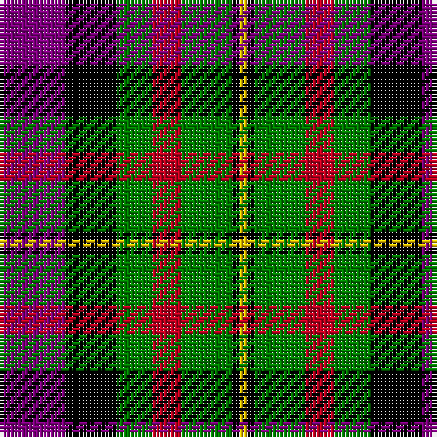

In pattern [BKGRGKY](/patterns/bkgrgky/).

This was sourced from weddslist.  It is a [7 stripes tartan](/stripes/stripes7/).

Original link http://www.weddslist.com/cgi-bin/tartans/pg.pl?source=sts

## Thread count
P/18 K14 G10 R8 G14 K2 Y/2

## Palette
Each colour and its ΔE from the base-6 reference it is a variant of.

| Colour | Shade | Base | ΔE (OKLab) |
|---|---|---|---|
| G | <code style="background-color:#008000;">#008000</code> `#008000` | G <code style="background-color:#006400;">#006400</code> | 0.09 |
| K | <code style="background-color:#000000;">#000000</code> `#000000` | K <code style="background-color:#000000;">#000000</code> | 0.00 |
| P | <code style="background-color:#800080;">#800080</code> `#800080` | B <code style="background-color:#2C4084;">#2C4084</code> | 0.17 |
| R | <code style="background-color:#C00020;">#C00020</code> `#C00020` | R <code style="background-color:#C80000;">#C80000</code> | 0.02 |
| Y | <code style="background-color:#F0C000;">#F0C000</code> `#F0C000` | Y <code style="background-color:#E8C000;">#E8C000</code> | 0.01 |

# Sample pattern

## Nearest tartans

The nearest existing variants by ΔTartan distance.

1. [Dundas](/setts/s7/b9r24g24k24b24y2b9-b304080-g008000-k000000-rc00000-yf0c000/) — ΔT 0.73
1. [Brough](/setts/s7/r40k28w4k28g18r6g22-g008000-k000030-rc00000-we0e0e0/) — ΔT 1.05
1. [Borthwick](/setts/s9/g24k4r24k6ga24k32ga24k6r12-g008000-ga808080-k000000-r900030/) — ΔT 1.08
1. [Cumming LO](/setts/s9/r4w1r4g10y1k10w4k2w4-g004c00-k000000-rc80000-wd0d0d0-yffc800/) — ΔT 1.09
1. [Colquhoun](/setts/s7/b12k6b42k46w6g48r6-b800080-g008000-k000000-rc00000-we0e0e0/) — ΔT 1.11
1. [MacWilliam](/setts/s6/r10b24r4k30g36ba5-b304080-ba000050-g008000-k000000-rc00000/) — ΔT 1.12
1. [Thompson's Fancy (Fashion)](/setts/s6/r6g36b12w24k24w6-b1c0070-g604000-k101010-r880000-w98c8e8/) — ΔT 1.13
1. [Sir George, Etienne-Cartier](/setts/s10/r8g12y6g24k28b10r40b10k8b4-b304080-g008000-k000000-rc00000-yf0c000/) — ΔT 1.13
1. [Cooke](/setts/s7/k24b8ba48g32r20k8g12-b8080d0-ba304080-g008000-k000000-rc00020/) — ΔT 1.13
1. [Rothesay](/setts/s7/g6ga24y4k20r20y6r4-g006030-ga808080-k000000-r806050-yf0c000/) — ΔT 1.17

## Neighbour map

Every grey dot is one of 15726 variants placed by the first two principal components of the ΔTartan feature space (44% of its variance). Red is this tartan; blue dots are its nearest — click one to open its page.

<svg viewBox="0 0 640 380" role="img" style="max-width:100%;height:auto;border:1px solid #e0e0e0;border-radius:4px;display:block" xmlns="http://www.w3.org/2000/svg"><image href="/nn/cloud.v1.png" width="640" height="380"/><a href="/setts/s7/b9r24g24k24b24y2b9-b304080-g008000-k000000-rc00000-yf0c000/"><circle cx="116.8" cy="202.0" r="4" fill="#3465a4"><title>Dundas</title></circle></a><a href="/setts/s7/r40k28w4k28g18r6g22-g008000-k000030-rc00000-we0e0e0/"><circle cx="159.4" cy="218.5" r="4" fill="#3465a4"><title>Brough</title></circle></a><a href="/setts/s9/g24k4r24k6ga24k32ga24k6r12-g008000-ga808080-k000000-r900030/"><circle cx="97.6" cy="214.3" r="4" fill="#3465a4"><title>Borthwick</title></circle></a><a href="/setts/s9/r4w1r4g10y1k10w4k2w4-g004c00-k000000-rc80000-wd0d0d0-yffc800/"><circle cx="77.4" cy="164.6" r="4" fill="#3465a4"><title>Cumming LO</title></circle></a><a href="/setts/s7/b12k6b42k46w6g48r6-b800080-g008000-k000000-rc00000-we0e0e0/"><circle cx="118.0" cy="185.9" r="4" fill="#3465a4"><title>Colquhoun</title></circle></a><a href="/setts/s6/r10b24r4k30g36ba5-b304080-ba000050-g008000-k000000-rc00000/"><circle cx="105.7" cy="205.3" r="4" fill="#3465a4"><title>MacWilliam</title></circle></a><a href="/setts/s6/r6g36b12w24k24w6-b1c0070-g604000-k101010-r880000-w98c8e8/"><circle cx="85.0" cy="219.1" r="4" fill="#3465a4"><title>Thompson's Fancy (Fashion)</title></circle></a><a href="/setts/s10/r8g12y6g24k28b10r40b10k8b4-b304080-g008000-k000000-rc00000-yf0c000/"><circle cx="99.5" cy="163.9" r="4" fill="#3465a4"><title>Sir George, Etienne-Cartier</title></circle></a><a href="/setts/s7/k24b8ba48g32r20k8g12-b8080d0-ba304080-g008000-k000000-rc00020/"><circle cx="78.2" cy="218.4" r="4" fill="#3465a4"><title>Cooke</title></circle></a><a href="/setts/s7/g6ga24y4k20r20y6r4-g006030-ga808080-k000000-r806050-yf0c000/"><circle cx="64.8" cy="201.9" r="4" fill="#3465a4"><title>Rothesay</title></circle></a><circle cx="104.0" cy="200.6" r="5" fill="#c00000"/></svg>

ID: /setts/s7/b18k14g10r8g14k2y2-b800080-g008000-k000000-rc00020-yf0c000/
