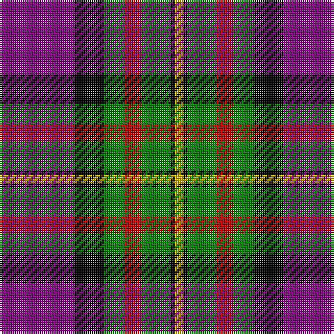

In pattern [BKGRGKY](/patterns/bkgrgky/).

This was sourced from weddslist.  It is a [7 stripes tartan](/stripes/stripes7/).

Original link http://www.weddslist.com/cgi-bin/tartans/pg.pl?source=sts

## Thread count
P/36 K14 G10 R8 G14 K2 Y/4

## Palette
Each colour and its ΔE from the base-6 reference it is a variant of.

| Colour | Shade | Base | ΔE (OKLab) |
|---|---|---|---|
| G | <code style="background-color:#008000;">#008000</code> `#008000` | G <code style="background-color:#006100;">#006100</code> | 0.10 |
| K | <code style="background-color:#000000;">#000000</code> `#000000` | K <code style="background-color:#000000;">#000000</code> | 0.00 |
| P | <code style="background-color:#800080;">#800080</code> `#800080` | B <code style="background-color:#2A418A;">#2A418A</code> | 0.17 |
| R | <code style="background-color:#C00000;">#C00000</code> `#C00000` | R <code style="background-color:#CC0000;">#CC0000</code> | 0.03 |
| Y | <code style="background-color:#F0C000;">#F0C000</code> `#F0C000` | Y <code style="background-color:#F2BF00;">#F2BF00</code> | 0.00 |

# Sample pattern

## Nearest tartans

The nearest existing variants by ΔTartan distance.

1. [Regent Trade Tartan Tartan Number: 341. Earliest known date: 1819 See MacLaren See products available Copyright © Blair Urquhart, Comrie, 2015](/setts/s7/b18k7g5r4g7k1y2x2~b780078-g006818-k101010-rc80000-ye8c000/) — ΔT 0.88
1. [McGurk (Personal)](/setts/s9/b8k4b31y5r26k5ya10y5k2~b2c2c80-k101010-rc80000-yd87c00-yae8c000/) — ΔT 0.99
1. [Lovell (2014)](/setts/s8/y2k2b14ba4k5r2y5r1x4~b2c2c80-ba202060-k101010-rc80000-ye8c000/) — ΔT 1.01
1. [Kuznetsov (2014)](/setts/s7/b49y12r12y12g32w8b3~b202060-g003820-rc80000-wfcfcfc-ye8c000/) — ΔT 1.03
1. [O2 (Corporate)](/setts/s5/k15b2r15ba6bb1x2~b2c2c80-ba1474b4-bb2474e8-k00002c-rc80000/) — ΔT 1.15
1. [Regent](/setts/s7/b18k7g5r4g7k1y2x2~b480048-g006818-k101010-rc80000-ye8c000/) — ΔT 1.15
1. [MacRae, hunting](/setts/s9/g14k2g4r2g4k14b15k1w3x2~b800080-g006030-k000000-r900030-we0e0e0/) — ΔT 1.18
1. [Sheboom](/setts/s8/k35r2k3b13g8w4g8b8x2~b780078-g408060-k101010-r9c68a4-wfcfcfc/) — ΔT 1.18
1. [Loch Etive](/setts/s8/w3g2r21k26b18k2b3y3x2~b2c4084-g00643c-k101010-rdc0000-we0e0e0-yfccc00/) — ΔT 1.20
1. [Afternoon Tea / Assam](/setts/s6/r15ra98b72ba25b8w15~b202060-ba5c8ca8-rc80000-ra880000-wfcfcfc/) — ΔT 1.24

## Neighbour map

Every grey dot is one of 15726 variants placed by the first two principal components of the ΔTartan feature space (44% of its variance). Red is this tartan; blue dots are its nearest — click one to open its page.

<svg viewBox="0 0 640 380" role="img" style="max-width:100%;height:auto;border:1px solid #e0e0e0;border-radius:4px;display:block" xmlns="http://www.w3.org/2000/svg"><image href="/nn/cloud.v1.png" width="640" height="380"/><a href="/setts/s7/b18k7g5r4g7k1y2x2~b780078-g006818-k101010-rc80000-ye8c000/"><circle cx="209.2" cy="161.3" r="4" fill="#3465a4"><title>Regent Trade Tartan Tartan Number: 341. Earliest known date: 1819 See MacLaren See products available Copyright © Blair Urquhart, Comrie, 2015</title></circle></a><a href="/setts/s9/b8k4b31y5r26k5ya10y5k2~b2c2c80-k101010-rc80000-yd87c00-yae8c000/"><circle cx="186.0" cy="137.4" r="4" fill="#3465a4"><title>McGurk (Personal)</title></circle></a><a href="/setts/s8/y2k2b14ba4k5r2y5r1x4~b2c2c80-ba202060-k101010-rc80000-ye8c000/"><circle cx="163.2" cy="152.9" r="4" fill="#3465a4"><title>Lovell (2014)</title></circle></a><a href="/setts/s7/b49y12r12y12g32w8b3~b202060-g003820-rc80000-wfcfcfc-ye8c000/"><circle cx="164.2" cy="155.5" r="4" fill="#3465a4"><title>Kuznetsov (2014)</title></circle></a><a href="/setts/s5/k15b2r15ba6bb1x2~b2c2c80-ba1474b4-bb2474e8-k00002c-rc80000/"><circle cx="196.4" cy="182.5" r="4" fill="#3465a4"><title>O2 (Corporate)</title></circle></a><a href="/setts/s7/b18k7g5r4g7k1y2x2~b480048-g006818-k101010-rc80000-ye8c000/"><circle cx="213.2" cy="167.8" r="4" fill="#3465a4"><title>Regent</title></circle></a><a href="/setts/s9/g14k2g4r2g4k14b15k1w3x2~b800080-g006030-k000000-r900030-we0e0e0/"><circle cx="161.7" cy="154.1" r="4" fill="#3465a4"><title>MacRae, hunting</title></circle></a><a href="/setts/s8/k35r2k3b13g8w4g8b8x2~b780078-g408060-k101010-r9c68a4-wfcfcfc/"><circle cx="236.9" cy="147.1" r="4" fill="#3465a4"><title>Sheboom</title></circle></a><a href="/setts/s8/w3g2r21k26b18k2b3y3x2~b2c4084-g00643c-k101010-rdc0000-we0e0e0-yfccc00/"><circle cx="151.1" cy="132.3" r="4" fill="#3465a4"><title>Loch Etive</title></circle></a><a href="/setts/s6/r15ra98b72ba25b8w15~b202060-ba5c8ca8-rc80000-ra880000-wfcfcfc/"><circle cx="215.3" cy="174.8" r="4" fill="#3465a4"><title>Afternoon Tea / Assam</title></circle></a><circle cx="183.9" cy="151.9" r="5" fill="#c00000"/></svg>

ID: /setts/s7/b18k7g5r4g7k1y2x2~b800080-g008000-k000000-rc00000-yf0c000/
