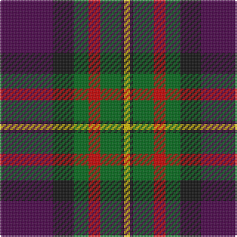

In pattern [BKGRGKY](/patterns/bkgrgky/).

This was sourced from register-of-tartans.  It is a [7 stripes tartan](/stripes/stripes7/).

Original link https://www.tartanregister.gov.uk/tartanDetails.aspx?ref=3490

## Attestations

This cloth appears in 2 source records; the oldest owns this page.

- 01/01/1819 — Regent (register-of-tartans, [record](https://www.tartanregister.gov.uk/tartanDetails.aspx?ref=3490))
- 1819 — Regent (tartans-authority, [record](http://www.tartansauthority.com/tartan-ferret/display/341/))

## Register references

External register numbers recorded for this tartan.

- Scottish Register of Tartans: [3490](https://www.tartanregister.gov.uk/tartanDetails.aspx?ref=3490)
- Scottish Tartans Authority (ITI): 341
- Scottish Tartans World Register: 341

## Thread count
DP/36 K14 G10 R8 G14 K2 Y/4

## Palette
Each colour and its ΔE from the base-6 reference it is a variant of.

| Colour | Shade | Base | ΔE (OKLab) |
|---|---|---|---|
| DP | <code style="background-color:#480048;">#480048</code> `#480048` | B <code style="background-color:#2A418A;">#2A418A</code> | 0.18 |
| G | <code style="background-color:#006818;">#006818</code> `#006818` | G <code style="background-color:#006100;">#006100</code> | 0.02 |
| K | <code style="background-color:#101010;">#101010</code> `#101010` | K <code style="background-color:#000000;">#000000</code> | 0.17 |
| R | <code style="background-color:#C80000;">#C80000</code> `#C80000` | R <code style="background-color:#CC0000;">#CC0000</code> | 0.01 |
| Y | <code style="background-color:#E8C000;">#E8C000</code> `#E8C000` | Y <code style="background-color:#F2BF00;">#F2BF00</code> | 0.02 |

# Sample pattern

## Nearest tartans

The nearest existing variants by ΔTartan distance.

1. [Regent Trade Tartan Tartan Number: 341. Earliest known date: 1819 See MacLaren See products available Copyright © Blair Urquhart, Comrie, 2015](/setts/s7/b18k7g5r4g7k1y2~b780078-g006818-k101010-rc80000-ye8c000~x2/) — ΔT 0.66
1. [Ross Dempster (Personal)](/setts/s7/b4ba29g10r10ra18g2ba4~b0000ff-ba141e46-g003c14-r960000-rac80028~x2/) — ΔT 0.88
1. [St. Clement of Rome (Corporate)](/setts/s8/b18k5r26k5g25k5b18y2~b202060-g006818-k101010-rc80000-ye8c000~x2/) — ΔT 0.94
1. [Ferguson - 1830 of Atholl (Clan)](/setts/s7/b18k10g6r4g6k1w2~b202060-g006818-k101010-rc80000-wfcfcfc~x2/) — ΔT 1.02
1. [Bennett, J P. (Personal)](/setts/s7/r2g18k2g3k20ga30w2~g74787c-ga604000-k101010-rc80000-we0e0e0~x2/) — ΔT 1.03
1. [Patterson, John (Personal)](/setts/s6/g3b12w1ga12r12ga2~b2c4084-g005020-ga002814-rdc0000-we0e0e0~x2/) — ΔT 1.08
1. [Patterson, John (Personal)](/setts/s6/g3b12w1ga12r12ga2~b2c2c80-g006818-ga003820-rc80000-wfcfcfc~x2/) — ΔT 1.10
1. [Logan - 1797 (Dark)](/setts/s7/k9y4k1y4g15r4k1~g003820-k101010-rc80000-ye08070~x4/) — ΔT 1.11
1. [Bryant (Dalgleish) (Personal)](/setts/s6/w3r30k18b6g30k2~b1c0070-g006818-k101010-r880000-wc0c0c0~x2/) — ΔT 1.12
1. [205 (Scottish) Field Hospital (Mil.)](/setts/s6/r3ra18k2g18k24rb1~g003820-k00002c-r888888-ra901c38-rbc80000~x2/) — ΔT 1.12

## Neighbour map

Every grey dot is one of 15726 variants placed by the first two principal components of the ΔTartan feature space (44% of its variance). Red is this tartan; blue dots are its nearest — click one to open its page.

<svg viewBox="0 0 640 380" role="img" style="max-width:100%;height:auto;border:1px solid #e0e0e0;border-radius:4px;display:block" xmlns="http://www.w3.org/2000/svg"><image href="/nn/cloud.v1.png" width="640" height="380"/><a href="/setts/s7/b18k7g5r4g7k1y2~b780078-g006818-k101010-rc80000-ye8c000~x2/"><circle cx="209.2" cy="161.3" r="4" fill="#3465a4"><title>Regent Trade Tartan Tartan Number: 341. Earliest known date: 1819 See MacLaren See products available Copyright © Blair Urquhart, Comrie, 2015</title></circle></a><a href="/setts/s7/b4ba29g10r10ra18g2ba4~b0000ff-ba141e46-g003c14-r960000-rac80028~x2/"><circle cx="223.0" cy="180.6" r="4" fill="#3465a4"><title>Ross Dempster (Personal)</title></circle></a><a href="/setts/s8/b18k5r26k5g25k5b18y2~b202060-g006818-k101010-rc80000-ye8c000~x2/"><circle cx="156.4" cy="182.5" r="4" fill="#3465a4"><title>St. Clement of Rome (Corporate)</title></circle></a><a href="/setts/s7/b18k10g6r4g6k1w2~b202060-g006818-k101010-rc80000-wfcfcfc~x2/"><circle cx="186.4" cy="172.8" r="4" fill="#3465a4"><title>Ferguson - 1830 of Atholl (Clan)</title></circle></a><a href="/setts/s7/r2g18k2g3k20ga30w2~g74787c-ga604000-k101010-rc80000-we0e0e0~x2/"><circle cx="230.1" cy="168.9" r="4" fill="#3465a4"><title>Bennett, J P. (Personal)</title></circle></a><a href="/setts/s6/g3b12w1ga12r12ga2~b2c4084-g005020-ga002814-rdc0000-we0e0e0~x2/"><circle cx="161.0" cy="194.0" r="4" fill="#3465a4"><title>Patterson, John (Personal)</title></circle></a><a href="/setts/s6/g3b12w1ga12r12ga2~b2c2c80-g006818-ga003820-rc80000-wfcfcfc~x2/"><circle cx="166.8" cy="197.2" r="4" fill="#3465a4"><title>Patterson, John (Personal)</title></circle></a><a href="/setts/s7/k9y4k1y4g15r4k1~g003820-k101010-rc80000-ye08070~x4/"><circle cx="213.0" cy="185.0" r="4" fill="#3465a4"><title>Logan - 1797 (Dark)</title></circle></a><a href="/setts/s6/w3r30k18b6g30k2~b1c0070-g006818-k101010-r880000-wc0c0c0~x2/"><circle cx="191.1" cy="187.1" r="4" fill="#3465a4"><title>Bryant (Dalgleish) (Personal)</title></circle></a><a href="/setts/s6/r3ra18k2g18k24rb1~g003820-k00002c-r888888-ra901c38-rbc80000~x2/"><circle cx="244.5" cy="175.6" r="4" fill="#3465a4"><title>205 (Scottish) Field Hospital (Mil.)</title></circle></a><circle cx="213.2" cy="167.8" r="5" fill="#c00000"/></svg>

ID: /setts/s7/b18k7g5r4g7k1y2~b480048-g006818-k101010-rc80000-ye8c000~x2/
