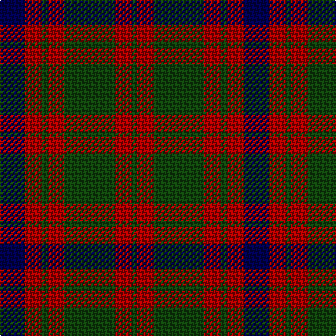

In pattern [BRGRGRG](/patterns/brgrgrg/).

This was sourced from weddslist.  It is a [7 stripes tartan](/stripes/stripes7/).

Original link http://www.weddslist.com/cgi-bin/tartans/pg.pl?source=tinsel

## Thread count
DB/18 DR12 DG4 DR12 DG36 DR12 DG/4

## Palette
Each colour and its ΔE from the base-6 reference it is a variant of.

| Colour | Shade | Base | ΔE (OKLab) |
|---|---|---|---|
| DB | <code style="background-color:#000052;">#000052</code> `#000052` | B <code style="background-color:#2C4084;">#2C4084</code> | 0.20 |
| DG | <code style="background-color:#11450D;">#11450D</code> `#11450D` | G <code style="background-color:#006400;">#006400</code> | 0.10 |
| DR | <code style="background-color:#AA0000;">#AA0000</code> `#AA0000` | R <code style="background-color:#C80000;">#C80000</code> | 0.06 |

# Sample pattern

## Nearest tartans

The nearest existing variants by ΔTartan distance.

1. [Skene D](/setts/s7/b9r6g2r6g18r6g2-b000052-g11450d-raa0000/) — ΔT 0.00
1. [MacBean of Tomatin (Clan)](/setts/s7/b6r38b26r10g42r16b6-b1c0070-g006818-r880000/) — ΔT 0.68
1. [Skene D](/setts/s7/b9r6g2r6g18r6g2-b00004c-g004c00-rc80000/) — ΔT 0.77
1. [Glasgow, Ciity of (District)](/setts/s7/g56r8b50r44g54r8b4-b440044-g285800-rc80000/) — ΔT 0.94
1. [GS Gaelic School (School)](/setts/s7/b30r5g30r22b30r5g4-b003c64-g006818-rc80000/) — ΔT 1.02
1. [Glasgow #2](/setts/s7/g50r8b48r42g50r6b8-b2c4084-g005020-rc82828/) — ΔT 1.02
1. [MacCormick (Dress)](/setts/s6/k6g26k20r26k4r6-g006818-k101010-r880000/) — ΔT 1.08
1. [Skene - 1831 (Clan)](/setts/s7/b24r12g4r12g48r12g4-b202060-g006818-rc80000/) — ΔT 1.10
1. [Canadian Autumn](/setts/s6/g8r56b12g20k20g6-b1c0070-g006818-k101010-r880000/) — ΔT 1.13
1. [Glasgow, City of](/setts/s7/g56r8b50r44g54r8b4-b780078-g006818-rc80000/) — ΔT 1.14

## Neighbour map

Every grey dot is one of 15726 variants placed by the first two principal components of the ΔTartan feature space (44% of its variance). Red is this tartan; blue dots are its nearest — click one to open its page.

<svg viewBox="0 0 640 380" role="img" style="max-width:100%;height:auto;border:1px solid #e0e0e0;border-radius:4px;display:block" xmlns="http://www.w3.org/2000/svg"><image href="/nn/cloud.v1.png" width="640" height="380"/><a href="/setts/s7/b9r6g2r6g18r6g2-b000052-g11450d-raa0000/"><circle cx="276.1" cy="243.6" r="4" fill="#3465a4"><title>Skene D</title></circle></a><a href="/setts/s7/b6r38b26r10g42r16b6-b1c0070-g006818-r880000/"><circle cx="255.5" cy="255.0" r="4" fill="#3465a4"><title>MacBean of Tomatin (Clan)</title></circle></a><a href="/setts/s7/b9r6g2r6g18r6g2-b00004c-g004c00-rc80000/"><circle cx="255.3" cy="232.7" r="4" fill="#3465a4"><title>Skene D</title></circle></a><a href="/setts/s7/g56r8b50r44g54r8b4-b440044-g285800-rc80000/"><circle cx="305.6" cy="226.9" r="4" fill="#3465a4"><title>Glasgow, Ciity of (District)</title></circle></a><a href="/setts/s7/b30r5g30r22b30r5g4-b003c64-g006818-rc80000/"><circle cx="269.0" cy="258.6" r="4" fill="#3465a4"><title>GS Gaelic School (School)</title></circle></a><a href="/setts/s7/g50r8b48r42g50r6b8-b2c4084-g005020-rc82828/"><circle cx="280.5" cy="257.6" r="4" fill="#3465a4"><title>Glasgow #2</title></circle></a><a href="/setts/s6/k6g26k20r26k4r6-g006818-k101010-r880000/"><circle cx="227.1" cy="271.4" r="4" fill="#3465a4"><title>MacCormick (Dress)</title></circle></a><a href="/setts/s7/b24r12g4r12g48r12g4-b202060-g006818-rc80000/"><circle cx="297.5" cy="214.9" r="4" fill="#3465a4"><title>Skene - 1831 (Clan)</title></circle></a><a href="/setts/s6/g8r56b12g20k20g6-b1c0070-g006818-k101010-r880000/"><circle cx="266.2" cy="223.4" r="4" fill="#3465a4"><title>Canadian Autumn</title></circle></a><a href="/setts/s7/g56r8b50r44g54r8b4-b780078-g006818-rc80000/"><circle cx="298.3" cy="222.3" r="4" fill="#3465a4"><title>Glasgow, City of</title></circle></a><circle cx="276.1" cy="243.6" r="5" fill="#c00000"/></svg>

ID: /setts/s7/b18r12g4r12g36r12g4-b000052-g11450d-raa0000/
