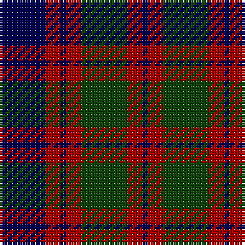

In pattern [BRBRGRB](/patterns/brbrgrb/).

This was sourced from weddslist.  It is a [7 stripes tartan](/stripes/stripes7/).

Original link http://www.weddslist.com/cgi-bin/tartans/pg.pl?source=tinsel

## Attestations

This cloth appears in 2 source records; the oldest owns this page.

- undated — Skene (weddslist, [record](http://www.weddslist.com/cgi-bin/tartans/pg.pl?source=tinsel))
- undated — Skene (weddslist, [record](http://www.weddslist.com/cgi-bin/tartans/pg.pl?source=x))

## Thread count
DB/18 DR6 DB2 DR6 DG18 DR6 DB/2

## Palette
Each colour and its ΔE from the base-6 reference it is a variant of.

| Colour | Shade | Base | ΔE (OKLab) |
|---|---|---|---|
| DB | <code style="background-color:#000052;">#000052</code> `#000052` | B <code style="background-color:#2C4084;">#2C4084</code> | 0.20 |
| DG | <code style="background-color:#11450D;">#11450D</code> `#11450D` | G <code style="background-color:#006400;">#006400</code> | 0.10 |
| DR | <code style="background-color:#AA0000;">#AA0000</code> `#AA0000` | R <code style="background-color:#C80000;">#C80000</code> | 0.06 |

# Sample pattern

## Nearest tartans

The nearest existing variants by ΔTartan distance.

1. [Skene](/setts/s7/b18r6b2r6g18r6b2-b00004c-g004c00-rc80000/) — ΔT 0.66
1. [Remony (Red)](/setts/s8/r34b4r4b26r4b4g34b4-b1c0070-g006818-r880000/) — ΔT 0.78
1. [Unidentified #61](/setts/s8/b12ba4g20b12r36b4r4b8-b000064-ba00008c-g007800-r8c0000/) — ΔT 1.00
1. [Logan #5](/setts/s6/b18r6b2g18r6b2-b2c2c80-g006818-rc80000/) — ΔT 1.01
1. [MacBean of Tomatin (Clan)](/setts/s7/b6r38b26r10g42r16b6-b1c0070-g006818-r880000/) — ΔT 1.05
1. [Wilson's No.100](/setts/s6/g6b34k36y4g34k6-b5a008c-g005020-k101010-ye8c000/) — ΔT 1.12
1. [Skene D](/setts/s7/b18r12g4r12g36r12g4-b000052-g11450d-raa0000/) — ΔT 1.15
1. [Skene D](/setts/s7/b9r6g2r6g18r6g2-b000052-g11450d-raa0000/) — ΔT 1.15
1. [Robertson of Struan 1816](/setts/s7/r12b4r4b44g40r8b8-b202060-g006818-rc80000/) — ΔT 1.17
1. [Sandberg](/setts/s7/r12k48g16b48r4k8r4-b2c2c80-g006818-k101010-rc80000/) — ΔT 1.18

## Neighbour map

Every grey dot is one of 15726 variants placed by the first two principal components of the ΔTartan feature space (44% of its variance). Red is this tartan; blue dots are its nearest — click one to open its page.

<svg viewBox="0 0 640 380" role="img" style="max-width:100%;height:auto;border:1px solid #e0e0e0;border-radius:4px;display:block" xmlns="http://www.w3.org/2000/svg"><image href="/nn/cloud.v1.png" width="640" height="380"/><a href="/setts/s7/b18r6b2r6g18r6b2-b00004c-g004c00-rc80000/"><circle cx="216.9" cy="227.4" r="4" fill="#3465a4"><title>Skene</title></circle></a><a href="/setts/s8/r34b4r4b26r4b4g34b4-b1c0070-g006818-r880000/"><circle cx="245.5" cy="219.0" r="4" fill="#3465a4"><title>Remony (Red)</title></circle></a><a href="/setts/s8/b12ba4g20b12r36b4r4b8-b000064-ba00008c-g007800-r8c0000/"><circle cx="215.0" cy="205.7" r="4" fill="#3465a4"><title>Unidentified #61</title></circle></a><a href="/setts/s6/b18r6b2g18r6b2-b2c2c80-g006818-rc80000/"><circle cx="258.9" cy="240.1" r="4" fill="#3465a4"><title>Logan #5</title></circle></a><a href="/setts/s7/b6r38b26r10g42r16b6-b1c0070-g006818-r880000/"><circle cx="255.5" cy="255.0" r="4" fill="#3465a4"><title>MacBean of Tomatin (Clan)</title></circle></a><a href="/setts/s6/g6b34k36y4g34k6-b5a008c-g005020-k101010-ye8c000/"><circle cx="200.9" cy="235.4" r="4" fill="#3465a4"><title>Wilson's No.100</title></circle></a><a href="/setts/s7/b18r12g4r12g36r12g4-b000052-g11450d-raa0000/"><circle cx="276.1" cy="243.6" r="4" fill="#3465a4"><title>Skene D</title></circle></a><a href="/setts/s7/b9r6g2r6g18r6g2-b000052-g11450d-raa0000/"><circle cx="276.1" cy="243.6" r="4" fill="#3465a4"><title>Skene D</title></circle></a><a href="/setts/s7/r12b4r4b44g40r8b8-b202060-g006818-rc80000/"><circle cx="293.1" cy="216.5" r="4" fill="#3465a4"><title>Robertson of Struan 1816</title></circle></a><a href="/setts/s7/r12k48g16b48r4k8r4-b2c2c80-g006818-k101010-rc80000/"><circle cx="240.0" cy="202.4" r="4" fill="#3465a4"><title>Sandberg</title></circle></a><circle cx="234.6" cy="236.8" r="5" fill="#c00000"/></svg>

ID: /setts/s7/b18r6b2r6g18r6b2-b000052-g11450d-raa0000/
