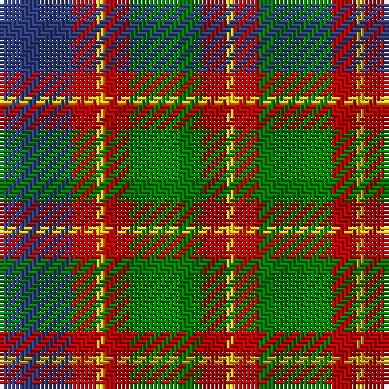

In pattern [BRYRGRY](/patterns/bryrgry/).

This was sourced from weddslist.  It is a [7 stripes tartan](/stripes/stripes7/).

Original link http://www.weddslist.com/cgi-bin/tartans/pg.pl?source=sts

## Thread count
B/18 R6 Y2 R6 G18 R6 Y/2

## Palette
Each colour and its ΔE from the base-6 reference it is a variant of.

| Colour | Shade | Base | ΔE (OKLab) |
|---|---|---|---|
| B | <code style="background-color:#304080;">#304080</code> `#304080` | B <code style="background-color:#2C4084;">#2C4084</code> | 0.01 |
| G | <code style="background-color:#008000;">#008000</code> `#008000` | G <code style="background-color:#006400;">#006400</code> | 0.09 |
| R | <code style="background-color:#C00000;">#C00000</code> `#C00000` | R <code style="background-color:#C80000;">#C80000</code> | 0.02 |
| Y | <code style="background-color:#F0C000;">#F0C000</code> `#F0C000` | Y <code style="background-color:#E8C000;">#E8C000</code> | 0.01 |

# Sample pattern

## Nearest tartans

The nearest existing variants by ΔTartan distance.

1. [Logan #2](/setts/s7/b18r6y2r6g18r6y2-b2c4084-g005020-rdc0000-ye8c000/) — ΔT 0.59
1. [Carnegie](/setts/s8/r33g17b50g17r11g17r9k7-b304080-g008000-k000000-rc00000/) — ΔT 0.74
1. [Cercle de Fermieres de St-Elie . . .](/setts/s7/r12y6b48r6g42y6r12-b1474b4-g006818-rc80000-yfccc00/) — ΔT 1.00
1. [Lamont](/setts/s8/b22r4b4r4b4r22g28w4-b800080-g008000-r806050-we0e0e0/) — ΔT 1.04
1. [Wilson's No.193](/setts/s8/g24k4r4b8r8b8r4k4-b2888c4-g006818-k101010-rc80000/) — ΔT 1.06
1. [Thompson/Thomson/MacTavish special grey](/setts/s6/r6g54k12y26k28r6-g808080-k101010-rdc0000-yc89664/) — ΔT 1.07
1. [Eyre (Personal)](/setts/s6/r6b24r8g36r12k4-b202060-g006818-k101010-rc80000/) — ΔT 1.09
1. [Stevenson Family Tartan Tartan Number: 1558. Earliest known date: 1980 Charles Stevenson of Glasgow emigrated to America in 1861. The Monitoring Committee of the Scottish Tartans Society operated until 1984 when the present system of accreditation was introduced for the 'Register of All Publicly Known Tartans'. The original count has been proportionately increased from the 1980 recording. See products available Copyright © Blair Urquhart, Comrie, 2015](/setts/s9/r4g32y4r8y4r8y4b32y4-b2c2c60-g006818-rc80000-ye8c000/) — ΔT 1.09
1. [MacEdward](/setts/s10/r12y4r38g25b8g10b8g8b25r3-b304080-g008000-rc00000-yf0c000/) — ΔT 1.11
1. [Wilson's No.179](/setts/s8/g24y4r4b8r8b8r4y4-b2888c4-g006818-rc80000-ye8c000/) — ΔT 1.12

## Neighbour map

Every grey dot is one of 15726 variants placed by the first two principal components of the ΔTartan feature space (44% of its variance). Red is this tartan; blue dots are its nearest — click one to open its page.

<svg viewBox="0 0 640 380" role="img" style="max-width:100%;height:auto;border:1px solid #e0e0e0;border-radius:4px;display:block" xmlns="http://www.w3.org/2000/svg"><image href="/nn/cloud.v1.png" width="640" height="380"/><a href="/setts/s7/b18r6y2r6g18r6y2-b2c4084-g005020-rdc0000-ye8c000/"><circle cx="166.0" cy="205.3" r="4" fill="#3465a4"><title>Logan #2</title></circle></a><a href="/setts/s8/r33g17b50g17r11g17r9k7-b304080-g008000-k000000-rc00000/"><circle cx="156.1" cy="220.0" r="4" fill="#3465a4"><title>Carnegie</title></circle></a><a href="/setts/s7/r12y6b48r6g42y6r12-b1474b4-g006818-rc80000-yfccc00/"><circle cx="182.6" cy="201.8" r="4" fill="#3465a4"><title>Cercle de Fermieres de St-Elie . . .</title></circle></a><a href="/setts/s8/b22r4b4r4b4r22g28w4-b800080-g008000-r806050-we0e0e0/"><circle cx="184.6" cy="208.9" r="4" fill="#3465a4"><title>Lamont</title></circle></a><a href="/setts/s8/g24k4r4b8r8b8r4k4-b2888c4-g006818-k101010-rc80000/"><circle cx="161.7" cy="216.6" r="4" fill="#3465a4"><title>Wilson's No.193</title></circle></a><a href="/setts/s6/r6g54k12y26k28r6-g808080-k101010-rdc0000-yc89664/"><circle cx="190.9" cy="207.0" r="4" fill="#3465a4"><title>Thompson/Thomson/MacTavish special grey</title></circle></a><a href="/setts/s6/r6b24r8g36r12k4-b202060-g006818-k101010-rc80000/"><circle cx="213.7" cy="221.9" r="4" fill="#3465a4"><title>Eyre (Personal)</title></circle></a><a href="/setts/s9/r4g32y4r8y4r8y4b32y4-b2c2c60-g006818-rc80000-ye8c000/"><circle cx="154.8" cy="175.5" r="4" fill="#3465a4"><title>Stevenson Family Tartan Tartan Number: 1558. Earliest known date: 1980 Charles Stevenson of Glasgow emigrated to America in 1861. The Monitoring Committee of the Scottish Tartans Society operated until 1984 when the present system of accreditation was introduced for the 'Register of All Publicly Known Tartans'. The original count has been proportionately increased from the 1980 recording. See products available Copyright © Blair Urquhart, Comrie, 2015</title></circle></a><a href="/setts/s10/r12y4r38g25b8g10b8g8b25r3-b304080-g008000-rc00000-yf0c000/"><circle cx="209.1" cy="182.2" r="4" fill="#3465a4"><title>MacEdward</title></circle></a><a href="/setts/s8/g24y4r4b8r8b8r4y4-b2888c4-g006818-rc80000-ye8c000/"><circle cx="160.0" cy="211.9" r="4" fill="#3465a4"><title>Wilson's No.179</title></circle></a><circle cx="164.7" cy="206.1" r="5" fill="#c00000"/></svg>

ID: /setts/s7/b18r6y2r6g18r6y2-b304080-g008000-rc00000-yf0c000/
