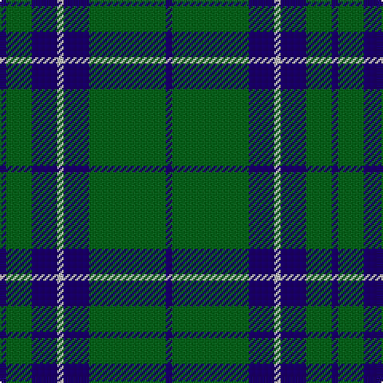

In pattern [BGBWBGB](/patterns/bgbwbgb/).

This was sourced from register-of-tartans.  It is a [7 stripes tartan](/stripes/stripes7/).

Original link https://www.tartanregister.gov.uk/tartanDetails.aspx?ref=3888

## Attestations

This cloth appears in 2 source records; the oldest owns this page.

- 01/01/1995 — St. Dennis & Cranley School (register-of-tartans, [record](https://www.tartanregister.gov.uk/tartanDetails.aspx?ref=3888))
- 1995 — St. Dennis & Cranley (Corporate) (tartans-authority, [record](http://www.tartansauthority.com/tartan-ferret/display/5310/))

## Register references

External register numbers recorded for this tartan.

- Scottish Register of Tartans: [3888](https://www.tartanregister.gov.uk/tartanDetails.aspx?ref=3888)
- Scottish Tartans Authority (ITI): 5310

## Thread count
DB/4 G16 DB16 N4 DB16 G48 DB/4

## Palette
Each colour and its ΔE from the base-6 reference it is a variant of.

| Colour | Shade | Base | ΔE (OKLab) |
|---|---|---|---|
| DB | <code style="background-color:#1C0070;">#1C0070</code> `#1C0070` | B <code style="background-color:#2A418A;">#2A418A</code> | 0.14 |
| G | <code style="background-color:#006818;">#006818</code> `#006818` | G <code style="background-color:#006100;">#006100</code> | 0.02 |
| N | <code style="background-color:#C0C0C0;">#C0C0C0</code> `#C0C0C0` | W <code style="background-color:#F7F7F7;">#F7F7F7</code> | 0.17 |

# Sample pattern

## Nearest tartans

The nearest existing variants by ΔTartan distance.

1. [Glen Esk](/setts/s8/g10r1g1r2g8b10g1y1~b0000b4-g004800-r9c0030-yfcc800~x4/) — ΔT 1.11
1. [Unidentified, Tweed](/setts/s6/b4w1b12g12b1g4~b304080-g008000-we0e0e0~x2/) — ΔT 1.24
1. [Gracie (Name)](/setts/s5/g47r3g6b35y3~b1c0070-g006818-r880000-yd09800~x2/) — ΔT 1.25
1. [MacIntyre L](/setts/s6/g4b12r3b12g32w4~b000064-g004c00-rc80000-wd0d0d0/) — ΔT 1.31
1. [Connacht Irish District Tartan Tartan Number: 4485. Earliest known date: 1994 Phil Smith obtained in Perthshire from a swatch dated 1994 shown to him by Keith Lumsden of the Scottish Tartans Society. However www.uniq-orn.com shows this as Connaught Green. See products available Copyright © Blair Urquhart, Comrie, 2015](/setts/s6/r2b32g14b5g16w2~b202060-g288028-ra00000-we0e0e0~x2/) — ΔT 1.32
1. [MacLean of Duart Hunting](/setts/s8/g3k6w2k6g2k2g16k2~g006428-k101010-we0e0e0~x2/) — ΔT 1.33
1. [MacIntyre Hunting Clan Tartan Tartan Number: 743. Earliest known date: 1800 There is a doublet in Kingussie Museum dated 1800 in this tartan. It also appeared in the Vestiarium Scoticum (1842). See products available Copyright © Blair Urquhart, Comrie, 2015](/setts/s6/g4b12r3b12g32w4~b2c2c80-g006818-rc80000-we0e0e0~x2/) — ΔT 1.33
1. [Scottish Scouts (1957) (Corporate)](/setts/s7/r3g22b16g14r2g6y2~b1c0070-g006818-r880000-yd09800~x2/) — ΔT 1.34
1. [Campbell of Loch Awe](/setts/s5/k2b11k26g11k2~b1474b4-g006818-k101010~x2/) — ΔT 1.34
1. [Roxburgh](/setts/s8/b16w1b1w1b8g16r1b2~b304080-g008000-rc00000-we0e0e0~x2/) — ΔT 1.37

## Neighbour map

Every grey dot is one of 15726 variants placed by the first two principal components of the ΔTartan feature space (44% of its variance). Red is this tartan; blue dots are its nearest — click one to open its page.

<svg viewBox="0 0 640 380" role="img" style="max-width:100%;height:auto;border:1px solid #e0e0e0;border-radius:4px;display:block" xmlns="http://www.w3.org/2000/svg"><image href="/nn/cloud.v1.png" width="640" height="380"/><a href="/setts/s8/g10r1g1r2g8b10g1y1~b0000b4-g004800-r9c0030-yfcc800~x4/"><circle cx="321.6" cy="206.8" r="4" fill="#3465a4"><title>Glen Esk</title></circle></a><a href="/setts/s6/b4w1b12g12b1g4~b304080-g008000-we0e0e0~x2/"><circle cx="336.9" cy="241.8" r="4" fill="#3465a4"><title>Unidentified, Tweed</title></circle></a><a href="/setts/s5/g47r3g6b35y3~b1c0070-g006818-r880000-yd09800~x2/"><circle cx="353.9" cy="209.6" r="4" fill="#3465a4"><title>Gracie (Name)</title></circle></a><a href="/setts/s6/g4b12r3b12g32w4~b000064-g004c00-rc80000-wd0d0d0/"><circle cx="298.0" cy="217.8" r="4" fill="#3465a4"><title>MacIntyre L</title></circle></a><a href="/setts/s6/r2b32g14b5g16w2~b202060-g288028-ra00000-we0e0e0~x2/"><circle cx="320.6" cy="201.9" r="4" fill="#3465a4"><title>Connacht Irish District Tartan Tartan Number: 4485. Earliest known date: 1994 Phil Smith obtained in Perthshire from a swatch dated 1994 shown to him by Keith Lumsden of the Scottish Tartans Society. However www.uniq-orn.com shows this as Connaught Green. See products available Copyright © Blair Urquhart, Comrie, 2015</title></circle></a><a href="/setts/s8/g3k6w2k6g2k2g16k2~g006428-k101010-we0e0e0~x2/"><circle cx="318.0" cy="231.2" r="4" fill="#3465a4"><title>MacLean of Duart Hunting</title></circle></a><a href="/setts/s6/g4b12r3b12g32w4~b2c2c80-g006818-rc80000-we0e0e0~x2/"><circle cx="303.4" cy="215.1" r="4" fill="#3465a4"><title>MacIntyre Hunting Clan Tartan Tartan Number: 743. Earliest known date: 1800 There is a doublet in Kingussie Museum dated 1800 in this tartan. It also appeared in the Vestiarium Scoticum (1842). See products available Copyright © Blair Urquhart, Comrie, 2015</title></circle></a><a href="/setts/s7/r3g22b16g14r2g6y2~b1c0070-g006818-r880000-yd09800~x2/"><circle cx="363.4" cy="225.6" r="4" fill="#3465a4"><title>Scottish Scouts (1957) (Corporate)</title></circle></a><a href="/setts/s5/k2b11k26g11k2~b1474b4-g006818-k101010~x2/"><circle cx="347.5" cy="243.7" r="4" fill="#3465a4"><title>Campbell of Loch Awe</title></circle></a><a href="/setts/s8/b16w1b1w1b8g16r1b2~b304080-g008000-rc00000-we0e0e0~x2/"><circle cx="366.7" cy="179.1" r="4" fill="#3465a4"><title>Roxburgh</title></circle></a><circle cx="366.5" cy="224.9" r="5" fill="#c00000"/></svg>

ID: /setts/s7/b1g12b4w1b4g4b1~b1c0070-g006818-wc0c0c0~x4/
