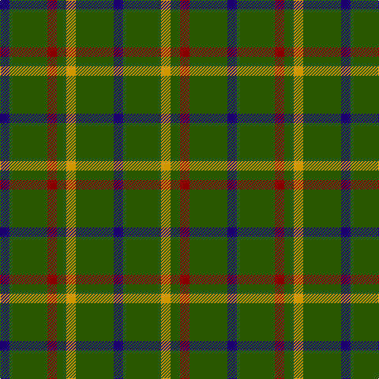

In pattern [BGRGYGB](/patterns/bgrgygb/).

This was sourced from register-of-tartans.  It is a [7 stripes tartan](/stripes/stripes7/).

Original link https://www.tartanregister.gov.uk/tartanDetails.aspx?ref=1921

## Attestations

This cloth appears in 2 source records; the oldest owns this page.

- 01/01/1990 — Justus Hunting (Personal) (register-of-tartans, [record](https://www.tartanregister.gov.uk/tartanDetails.aspx?ref=1921))
- pre 2002 — Justus Htg (Personal) (tartans-authority, [record](http://www.tartansauthority.com/tartan-ferret/display/2499/))

## Register references

External register numbers recorded for this tartan.

- Scottish Register of Tartans: [1921](https://www.tartanregister.gov.uk/tartanDetails.aspx?ref=1921)
- Scottish Tartans Authority (ITI): 2499
- Scottish Tartans World Register: 2499

## Thread count
DB/12 G48 DR12 G12 DY12 G48 DB/12

## Palette
Each colour and its ΔE from the base-6 reference it is a variant of.

| Colour | Shade | Base | ΔE (OKLab) |
|---|---|---|---|
| DB | <code style="background-color:#1C0070;">#1C0070</code> `#1C0070` | B <code style="background-color:#2A418A;">#2A418A</code> | 0.14 |
| DR | <code style="background-color:#880000;">#880000</code> `#880000` | R <code style="background-color:#CC0000;">#CC0000</code> | 0.15 |
| DY | <code style="background-color:#D09800;">#D09800</code> `#D09800` | Y <code style="background-color:#F2BF00;">#F2BF00</code> | 0.12 |
| G | <code style="background-color:#285800;">#285800</code> `#285800` | G <code style="background-color:#006100;">#006100</code> | 0.03 |

# Sample pattern

## Nearest tartans

The nearest existing variants by ΔTartan distance.

1. [Ayrton Laoch Family Tartan Tartan Number: 1330. Earliest known date: 1982 The weaving and wearing of this tartan is 'Restricted'. This is not a legal definition and is applied by the Scottish Tartans Society irrespective of Design Patent or Copyright, in the spirit of a gentlemans agreement. Interested parties should contact the person listed under 'Source:' in this document. See products available Copyright © Blair Urquhart, Comrie, 2015](/setts/s10/r1g6y1g6b1g1b1g1b2r1~b2c2c80-g006818-rc80000-ye8c000~x4/) — ΔT 1.33
1. [Ayrton of Laoch (Personal)](/setts/s10/r2g12y2g12b3g2b2g2b4r2~b2c2c80-g006818-rc80000-ye8c000~x2/) — ΔT 1.33
1. [Meath County Crest (Fashion)](/setts/s6/y21g28b24g72w16g20~b2c2c80-g006818-we0e0e0-ybc8c00/) — ΔT 1.37
1. [Justus hunting](/setts/s7/b1g4r1g1y1g4b1~b304080-g008000-rc00000-yf0c000~x12/) — ΔT 1.40
1. [Leeds University Corporate Tartan Tartan Number: 980. Earliest known date: pre 2003 Leeds University Scottish Country Dance Club. See products available Copyright © Blair Urquhart, Comrie, 2015](/setts/s8/g9r2g2r2g2r8g11w2~g006818-ra00048-we0e0e0~x4/) — ΔT 1.51
1. [MacArthur-Fox (Personal)](/setts/s8/k8g3k4g20r3g20k4g3~g006818-k101010-r880000~x2/) — ΔT 1.58
1. [Lauder (Family)](/setts/s6/g3b8g3k4g15r2~b202060-g006818-k101010-rc80000~x2/) — ΔT 1.59
1. [Lauder Clan Tartan Tartan Number: 709. Earliest known date: 1842 Possibly designed by Sir Thomas Dick Lauder who was a particular friend of the Sobieski brothers. The Setts No: 87. W & A K Johnston(1906). See products available Copyright © Blair Urquhart, Comrie, 2015](/setts/s6/g3b8g3k4g15r2~b2c2c80-g006818-k101010-rc80000~x2/) — ΔT 1.62
1. [Salvation Army Hunting](/setts/s12/g8k1y2k1g8b4g8k1y2k1g8b5~b1c1c50-g285800-k101010-ycca800~x4/) — ΔT 1.62
1. [Ayrton, Laoch](/setts/s10/r1g6y1g6b1g1b1g1b2r1~b304080-g008000-rc00000-yf0c000~x4/) — ΔT 1.67

## Neighbour map

Every grey dot is one of 15726 variants placed by the first two principal components of the ΔTartan feature space (44% of its variance). Red is this tartan; blue dots are its nearest — click one to open its page.

<svg viewBox="0 0 640 380" role="img" style="max-width:100%;height:auto;border:1px solid #e0e0e0;border-radius:4px;display:block" xmlns="http://www.w3.org/2000/svg"><image href="/nn/cloud.v1.png" width="640" height="380"/><a href="/setts/s10/r1g6y1g6b1g1b1g1b2r1~b2c2c80-g006818-rc80000-ye8c000~x4/"><circle cx="356.4" cy="218.3" r="4" fill="#3465a4"><title>Ayrton Laoch Family Tartan Tartan Number: 1330. Earliest known date: 1982 The weaving and wearing of this tartan is 'Restricted'. This is not a legal definition and is applied by the Scottish Tartans Society irrespective of Design Patent or Copyright, in the spirit of a gentlemans agreement. Interested parties should contact the person listed under 'Source:' in this document. See products available Copyright © Blair Urquhart, Comrie, 2015</title></circle></a><a href="/setts/s10/r2g12y2g12b3g2b2g2b4r2~b2c2c80-g006818-rc80000-ye8c000~x2/"><circle cx="343.2" cy="219.8" r="4" fill="#3465a4"><title>Ayrton of Laoch (Personal)</title></circle></a><a href="/setts/s6/y21g28b24g72w16g20~b2c2c80-g006818-we0e0e0-ybc8c00/"><circle cx="305.4" cy="270.5" r="4" fill="#3465a4"><title>Meath County Crest (Fashion)</title></circle></a><a href="/setts/s7/b1g4r1g1y1g4b1~b304080-g008000-rc00000-yf0c000~x12/"><circle cx="343.3" cy="264.3" r="4" fill="#3465a4"><title>Justus hunting</title></circle></a><a href="/setts/s8/g9r2g2r2g2r8g11w2~g006818-ra00048-we0e0e0~x4/"><circle cx="349.0" cy="251.9" r="4" fill="#3465a4"><title>Leeds University Corporate Tartan Tartan Number: 980. Earliest known date: pre 2003 Leeds University Scottish Country Dance Club. See products available Copyright © Blair Urquhart, Comrie, 2015</title></circle></a><a href="/setts/s8/k8g3k4g20r3g20k4g3~g006818-k101010-r880000~x2/"><circle cx="434.1" cy="261.6" r="4" fill="#3465a4"><title>MacArthur-Fox (Personal)</title></circle></a><a href="/setts/s6/g3b8g3k4g15r2~b202060-g006818-k101010-rc80000~x2/"><circle cx="326.7" cy="250.4" r="4" fill="#3465a4"><title>Lauder (Family)</title></circle></a><a href="/setts/s6/g3b8g3k4g15r2~b2c2c80-g006818-k101010-rc80000~x2/"><circle cx="326.0" cy="249.6" r="4" fill="#3465a4"><title>Lauder Clan Tartan Tartan Number: 709. Earliest known date: 1842 Possibly designed by Sir Thomas Dick Lauder who was a particular friend of the Sobieski brothers. The Setts No: 87. W &amp; A K Johnston(1906). See products available Copyright © Blair Urquhart, Comrie, 2015</title></circle></a><a href="/setts/s12/g8k1y2k1g8b4g8k1y2k1g8b5~b1c1c50-g285800-k101010-ycca800~x4/"><circle cx="344.9" cy="222.7" r="4" fill="#3465a4"><title>Salvation Army Hunting</title></circle></a><a href="/setts/s10/r1g6y1g6b1g1b1g1b2r1~b304080-g008000-rc00000-yf0c000~x4/"><circle cx="353.6" cy="217.0" r="4" fill="#3465a4"><title>Ayrton, Laoch</title></circle></a><circle cx="358.4" cy="270.3" r="5" fill="#c00000"/></svg>

ID: /setts/s7/b1g4r1g1y1g4b1~b1c0070-g285800-r880000-yd09800~x12/
