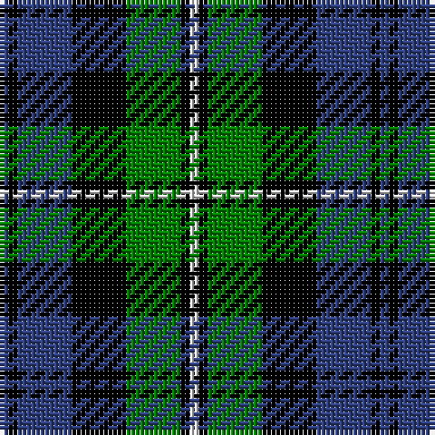

In pattern [BKBKGKW](/patterns/bkbkgkw/).

This was sourced from weddslist.  It is a [7 stripes tartan](/stripes/stripes7/).

Original link http://www.weddslist.com/cgi-bin/tartans/pg.pl?source=sts

## Thread count
B/2 K2 B12 K12 G12 K2 LN/2

## Palette
Each colour and its ΔE from the base-6 reference it is a variant of.

| Colour | Shade | Base | ΔE (OKLab) |
|---|---|---|---|
| B | <code style="background-color:#304080;">#304080</code> `#304080` | B <code style="background-color:#2A418A;">#2A418A</code> | 0.02 |
| G | <code style="background-color:#008000;">#008000</code> `#008000` | G <code style="background-color:#006100;">#006100</code> | 0.10 |
| K | <code style="background-color:#000000;">#000000</code> `#000000` | K <code style="background-color:#000000;">#000000</code> | 0.00 |
| LN | <code style="background-color:#E0E0E0;">#E0E0E0</code> `#E0E0E0` | W <code style="background-color:#F7F7F7;">#F7F7F7</code> | 0.07 |

# Sample pattern

## Nearest tartans

The nearest existing variants by ΔTartan distance.

1. [Campbell, The White Stripe](/setts/s6/b2k2b12k11g12w2~b304080-g008000-k000000-we0e0e0~x2/) — ΔT 0.51
1. [Murray](/setts/s6/b2k2b12k8g11r2~b304080-g008000-k000000-rc00000~x2/) — ΔT 0.63
1. [Brabender](/setts/s8/g1b7k1b1k4r1g4k1~b304080-g008000-k000000-rc00000~x6/) — ΔT 0.68
1. [Morrison](/setts/s6/k3g14k14g2b14r3~b304080-g008000-k000000-rc00000~x2/) — ΔT 0.71
1. [Ferguson](/setts/s6/g4b24r3k24g25k4~b304080-g008000-k000000-rc00000~x2/) — ΔT 0.74
1. [MacNeil 1](/setts/s6/w1b9k9g9k2w1~b304080-g008000-k000000-we0e0e0~x4/) — ΔT 0.74
1. [Glenturret](/setts/s6/k3g14k14g2b15y2~b000050-g008000-k000000-yf0c000~x2/) — ΔT 0.75
1. [Reid Taylor, "House Check"](/setts/s7/b2k1r1b9k9g10k2~b304080-g008000-k000000-rc00000~x2/) — ΔT 0.83
1. [Fletcher](/setts/s7/b6k1b6k8r1g8k2~b304080-g008000-k000000-rc00000~x2/) — ΔT 0.84
1. [Forbes](/setts/s9/b8k2b2k2b2k8g7k1w1~b304080-g008000-k000000-we0e0e0~x2/) — ΔT 0.84

## Neighbour map

Every grey dot is one of 15726 variants placed by the first two principal components of the ΔTartan feature space (44% of its variance). Red is this tartan; blue dots are its nearest — click one to open its page.

<svg viewBox="0 0 640 380" role="img" style="max-width:100%;height:auto;border:1px solid #e0e0e0;border-radius:4px;display:block" xmlns="http://www.w3.org/2000/svg"><image href="/nn/cloud.v1.png" width="640" height="380"/><a href="/setts/s6/b2k2b12k11g12w2~b304080-g008000-k000000-we0e0e0~x2/"><circle cx="125.5" cy="236.5" r="4" fill="#3465a4"><title>Campbell, The White Stripe</title></circle></a><a href="/setts/s6/b2k2b12k8g11r2~b304080-g008000-k000000-rc00000~x2/"><circle cx="148.6" cy="240.0" r="4" fill="#3465a4"><title>Murray</title></circle></a><a href="/setts/s8/g1b7k1b1k4r1g4k1~b304080-g008000-k000000-rc00000~x6/"><circle cx="172.0" cy="210.3" r="4" fill="#3465a4"><title>Brabender</title></circle></a><a href="/setts/s6/k3g14k14g2b14r3~b304080-g008000-k000000-rc00000~x2/"><circle cx="133.2" cy="235.5" r="4" fill="#3465a4"><title>Morrison</title></circle></a><a href="/setts/s6/g4b24r3k24g25k4~b304080-g008000-k000000-rc00000~x2/"><circle cx="151.1" cy="225.4" r="4" fill="#3465a4"><title>Ferguson</title></circle></a><a href="/setts/s6/w1b9k9g9k2w1~b304080-g008000-k000000-we0e0e0~x4/"><circle cx="142.4" cy="217.5" r="4" fill="#3465a4"><title>MacNeil 1</title></circle></a><a href="/setts/s6/k3g14k14g2b15y2~b000050-g008000-k000000-yf0c000~x2/"><circle cx="139.1" cy="233.0" r="4" fill="#3465a4"><title>Glenturret</title></circle></a><a href="/setts/s7/b2k1r1b9k9g10k2~b304080-g008000-k000000-rc00000~x2/"><circle cx="166.2" cy="207.6" r="4" fill="#3465a4"><title>Reid Taylor, &quot;House Check&quot;</title></circle></a><a href="/setts/s7/b6k1b6k8r1g8k2~b304080-g008000-k000000-rc00000~x2/"><circle cx="154.4" cy="232.0" r="4" fill="#3465a4"><title>Fletcher</title></circle></a><a href="/setts/s9/b8k2b2k2b2k8g7k1w1~b304080-g008000-k000000-we0e0e0~x2/"><circle cx="167.4" cy="206.7" r="4" fill="#3465a4"><title>Forbes</title></circle></a><circle cx="138.6" cy="223.6" r="5" fill="#c00000"/></svg>

ID: /setts/s7/b1k1b6k6g6k1w1~b304080-g008000-k000000-we0e0e0~x2/
