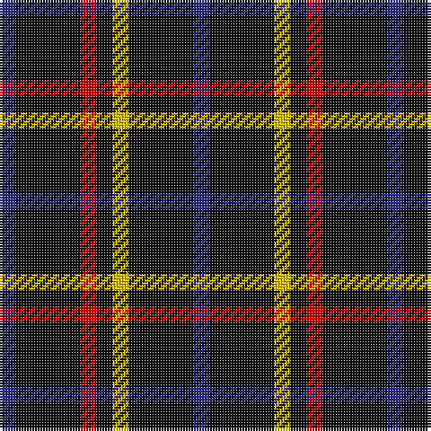

In pattern [BKRKYKB](/patterns/bkrkykb/).

This was sourced from house-of-tartan.  It is a [7 stripes tartan](/stripes/stripes7/).

Original link http://www.house-of-tartan.scotland.net/house/TartanViewjs.asp?colr=Def&tnam=2100

## Thread count
DB/6 K24 R6 K6 Y6 K24 DB/6

## Palette
Each colour and its ΔE from the base-6 reference it is a variant of.

| Colour | Shade | Base | ΔE (OKLab) |
|---|---|---|---|
| DB | <code style="background-color:#2C2C80;">#2C2C80</code> `#2C2C80` | B <code style="background-color:#2A418A;">#2A418A</code> | 0.06 |
| K | <code style="background-color:#101010;">#101010</code> `#101010` | K <code style="background-color:#000000;">#000000</code> | 0.17 |
| R | <code style="background-color:#C80000;">#C80000</code> `#C80000` | R <code style="background-color:#CC0000;">#CC0000</code> | 0.01 |
| Y | <code style="background-color:#E8C000;">#E8C000</code> `#E8C000` | Y <code style="background-color:#F2BF00;">#F2BF00</code> | 0.02 |

# Sample pattern

## Nearest tartans

The nearest existing variants by ΔTartan distance.

1. [Justus (Personal)](/setts/s7/b1k4r1k1y1k4b1x12~b1c0070-k101010-r880000-yd09800/) — ΔT 0.91
1. [Benson (New England)](/setts/s7/k16b2k8r3y3r3k8x2~b1474b4-k101010-rc80000-yb8b8b8/) — ΔT 1.32
1. [Black (symmetrical)](/setts/s6/k17r6k2w6k17y2x2~k101010-r880000-wc0c0c0-ybc8c00/) — ΔT 1.34
1. [Black Clan/Family Tartan Tartan Number: 2761. Earliest known date: pre 1945 In 1990, taken to a TECA stand at one of the US Highland Games by a Timothy Wood, who explained that his faher had 'found' it in a shop in northern England during World War II. See products available Copyright © Blair Urquhart, Comrie, 2015](/setts/s6/k17r6k2w6k17y2x2~k101010-r880000-wc0c0c0-yd09800/) — ΔT 1.35
1. [Black 1990 (Name)](/setts/s6/k17r6k2w6k17y2x2~k101010-r880000-we0e0e0-ybc8c00/) — ΔT 1.46
1. [Modowny](/setts/s9/r1b6k1b1k2b1k1b6y1x8~b646464-k000000-r8c0000-yc89800/) — ΔT 1.56
1. [London Community Gospel Choir](/setts/s7/k25y5k5g25k25b3k10x2~b1474b4-g006818-k101010-ye8c000/) — ΔT 1.65
1. [de Grussa (Personal)](/setts/s6/b24w4b24y4r5k4x2~b1c1c50-k101010-r880000-wf8f8f8-ybc8c00/) — ΔT 1.79
1. [St. Eloi](/setts/s6/r3y2k10w1k10y2x6~k00002c-r880000-we0e0e0-yd09800/) — ΔT 1.80
1. [Cowe (Personal)](/setts/s7/k8b3k32ba14w3k25b3x2~b5c8ca8-ba1474b4-k101010-wfcfcfc/) — ΔT 1.87

## Neighbour map

Every grey dot is one of 15726 variants placed by the first two principal components of the ΔTartan feature space (44% of its variance). Red is this tartan; blue dots are its nearest — click one to open its page.

<svg viewBox="0 0 640 380" role="img" style="max-width:100%;height:auto;border:1px solid #e0e0e0;border-radius:4px;display:block" xmlns="http://www.w3.org/2000/svg"><image href="/nn/cloud.v1.png" width="640" height="380"/><a href="/setts/s7/b1k4r1k1y1k4b1x12~b1c0070-k101010-r880000-yd09800/"><circle cx="359.6" cy="271.2" r="4" fill="#3465a4"><title>Justus (Personal)</title></circle></a><a href="/setts/s7/k16b2k8r3y3r3k8x2~b1474b4-k101010-rc80000-yb8b8b8/"><circle cx="402.0" cy="233.1" r="4" fill="#3465a4"><title>Benson (New England)</title></circle></a><a href="/setts/s6/k17r6k2w6k17y2x2~k101010-r880000-wc0c0c0-ybc8c00/"><circle cx="379.8" cy="232.7" r="4" fill="#3465a4"><title>Black (symmetrical)</title></circle></a><a href="/setts/s6/k17r6k2w6k17y2x2~k101010-r880000-wc0c0c0-yd09800/"><circle cx="378.5" cy="232.1" r="4" fill="#3465a4"><title>Black Clan/Family Tartan Tartan Number: 2761. Earliest known date: pre 1945 In 1990, taken to a TECA stand at one of the US Highland Games by a Timothy Wood, who explained that his faher had 'found' it in a shop in northern England during World War II. See products available Copyright © Blair Urquhart, Comrie, 2015</title></circle></a><a href="/setts/s6/k17r6k2w6k17y2x2~k101010-r880000-we0e0e0-ybc8c00/"><circle cx="370.3" cy="228.7" r="4" fill="#3465a4"><title>Black 1990 (Name)</title></circle></a><a href="/setts/s9/r1b6k1b1k2b1k1b6y1x8~b646464-k000000-r8c0000-yc89800/"><circle cx="359.6" cy="210.1" r="4" fill="#3465a4"><title>Modowny</title></circle></a><a href="/setts/s7/k25y5k5g25k25b3k10x2~b1474b4-g006818-k101010-ye8c000/"><circle cx="348.1" cy="243.1" r="4" fill="#3465a4"><title>London Community Gospel Choir</title></circle></a><a href="/setts/s6/b24w4b24y4r5k4x2~b1c1c50-k101010-r880000-wf8f8f8-ybc8c00/"><circle cx="375.1" cy="224.1" r="4" fill="#3465a4"><title>de Grussa (Personal)</title></circle></a><a href="/setts/s6/r3y2k10w1k10y2x6~k00002c-r880000-we0e0e0-yd09800/"><circle cx="374.1" cy="221.2" r="4" fill="#3465a4"><title>St. Eloi</title></circle></a><a href="/setts/s7/k8b3k32ba14w3k25b3x2~b5c8ca8-ba1474b4-k101010-wfcfcfc/"><circle cx="410.1" cy="216.7" r="4" fill="#3465a4"><title>Cowe (Personal)</title></circle></a><circle cx="334.0" cy="259.2" r="5" fill="#c00000"/></svg>

ID: /setts/s7/b1k4r1k1y1k4b1x6~b2c2c80-k101010-rc80000-ye8c000/
