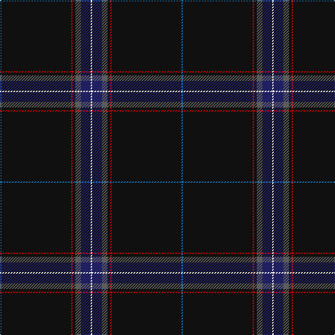

In pattern [BKRKBBW](/stripes/bkrkbbw/).

This was sourced from tartans-authority.  It is a [7 stripe tartan](/stripes/stripes7/).

Original link http://www.tartansauthority.com/tartan-ferret/display/8450/

## Thread count
B/2 K100 R2 K4 N8 DB14 W/2

## Palette
Each colour and its ΔE from the base-6 reference it is a variant of.

| Colour | Shade | Base | ΔE (OKLab) |
|---|---|---|---|
| B | <code style="background-color:#1474B4;">#1474B4</code> `#1474B4` | B <code style="background-color:#2A418A;">#2A418A</code> | 0.15 |
| DB | <code style="background-color:#202060;">#202060</code> `#202060` | B <code style="background-color:#2A418A;">#2A418A</code> | 0.11 |
| K | <code style="background-color:#101010;">#101010</code> `#101010` | K <code style="background-color:#000000;">#000000</code> | 0.17 |
| N | <code style="background-color:#5C5C5C;">#5C5C5C</code> `#5C5C5C` | B <code style="background-color:#2A418A;">#2A418A</code> | 0.15 |
| R | <code style="background-color:#C80000;">#C80000</code> `#C80000` | R <code style="background-color:#CC0000;">#CC0000</code> | 0.01 |
| W | <code style="background-color:#FCFCFC;">#FCFCFC</code> `#FCFCFC` | W <code style="background-color:#F7F7F7;">#F7F7F7</code> | 0.01 |

# Sample pattern

## Nearest tartans

The nearest existing variants by ΔTartan distance.

1. [Forand (Personal)](/setts/s5/k100r1o10db10ly2~x2/) — ΔT 1.46
1. [Center](/setts/s8/k50db2k13w1k13db5dg15r2~x2/) — ΔT 1.57
1. [Spirit of Lanarkshire (Corporate)](/setts/s8/k83ly2db4r2k8g5r4w3~x2/) — ΔT 1.58
1. [Royal Canadian Mounted Police](/setts/s9/dt76b1dt2lb1g14r5dt13o1lo1~x2/) — ΔT 1.67
1. [Venters (Edinburgh)](/setts/s6/n15k55w1dp5r2ly1~x2/) — ΔT 1.70
1. [Moeller, Karsten (Personal)](/setts/s7/k10r5k5dg55db2lo1w1~x2/) — ΔT 1.70
1. [McCann of Castlecraig (Personal)](/setts/s7/k64y12n6k15o1y5lr1~x2/) — ΔT 1.74
1. [Fettes (Personal)](/setts/s5/k50db3p2r3w1~x4/) — ΔT 1.76
1. [Center (Name)](/setts/s8/k50b2k13w1k13b5g15r2~x2/) — ΔT 1.82
1. [MacHattie Family Tartan Tartan Number: 5917. Earliest known date: 2003 A tartan for the McHattie family of Aberdeen See products available Copyright © Blair Urquhart, Comrie, 2015](/setts/s10/k45dt2r2r2ly1w1~x2/) — ΔT 1.84

## Neighbour map

Every grey dot is one of 14299 variants placed by the first two principal components of the ΔTartan feature space (44% of its variance). Red is this tartan; blue dots are its nearest — click one to open its page.

<svg viewBox="0 0 640 380" role="img" style="max-width:100%;height:auto;border:1px solid #e0e0e0;border-radius:4px;display:block" xmlns="http://www.w3.org/2000/svg"><image href="/nn/cloud.v1.png" width="640" height="380"/><a href="/setts/s5/k100r1o10db10ly2~x2/"><circle cx="598.6" cy="139.3" r="4" fill="#3465a4"><title>Forand (Personal)</title></circle></a><a href="/setts/s8/k50db2k13w1k13db5dg15r2~x2/"><circle cx="549.3" cy="151.0" r="4" fill="#3465a4"><title>Center</title></circle></a><a href="/setts/s8/k83ly2db4r2k8g5r4w3~x2/"><circle cx="564.5" cy="87.3" r="4" fill="#3465a4"><title>Spirit of Lanarkshire (Corporate)</title></circle></a><a href="/setts/s9/dt76b1dt2lb1g14r5dt13o1lo1~x2/"><circle cx="592.6" cy="96.1" r="4" fill="#3465a4"><title>Royal Canadian Mounted Police</title></circle></a><a href="/setts/s6/n15k55w1dp5r2ly1~x2/"><circle cx="503.4" cy="129.6" r="4" fill="#3465a4"><title>Venters (Edinburgh)</title></circle></a><a href="/setts/s7/k10r5k5dg55db2lo1w1~x2/"><circle cx="482.4" cy="107.8" r="4" fill="#3465a4"><title>Moeller, Karsten (Personal)</title></circle></a><a href="/setts/s7/k64y12n6k15o1y5lr1~x2/"><circle cx="535.7" cy="132.6" r="4" fill="#3465a4"><title>McCann of Castlecraig (Personal)</title></circle></a><a href="/setts/s5/k50db3p2r3w1~x4/"><circle cx="626.0" cy="135.3" r="4" fill="#3465a4"><title>Fettes (Personal)</title></circle></a><a href="/setts/s8/k50b2k13w1k13b5g15r2~x2/"><circle cx="515.1" cy="133.1" r="4" fill="#3465a4"><title>Center (Name)</title></circle></a><a href="/setts/s10/k45dt2r2r2ly1w1~x2/"><circle cx="511.6" cy="60.7" r="4" fill="#3465a4"><title>MacHattie Family Tartan Tartan Number: 5917. Earliest known date: 2003 A tartan for the McHattie family of Aberdeen See products available Copyright © Blair Urquhart, Comrie, 2015</title></circle></a><circle cx="581.4" cy="111.2" r="5" fill="#c00000"/></svg>

ID: /setts/s7/b1k50r1k2n4db7w1~x2/
