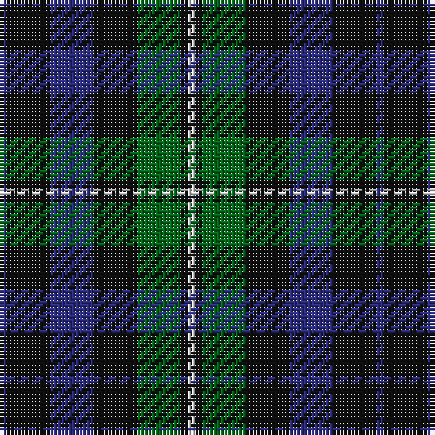

In pattern [BKBKGKW](/patterns/bkbkgkw/).

This was sourced from house-of-tartan.  It is a [7 stripes tartan](/stripes/stripes7/).

Original link http://www.house-of-tartan.scotland.net/house/TartanViewjs.asp?colr=Def&tnam=212

## Thread count
DB/2 K12 DB12 K12 G12 K2 LN/2

## Palette
Each colour and its ΔE from the base-6 reference it is a variant of.

| Colour | Shade | Base | ΔE (OKLab) |
|---|---|---|---|
| DB | <code style="background-color:#2C2C80;">#2C2C80</code> `#2C2C80` | B <code style="background-color:#2A418A;">#2A418A</code> | 0.06 |
| G | <code style="background-color:#006818;">#006818</code> `#006818` | G <code style="background-color:#006100;">#006100</code> | 0.02 |
| K | <code style="background-color:#101010;">#101010</code> `#101010` | K <code style="background-color:#000000;">#000000</code> | 0.17 |
| LN | <code style="background-color:#E0E0E0;">#E0E0E0</code> `#E0E0E0` | W <code style="background-color:#F7F7F7;">#F7F7F7</code> | 0.07 |

# Sample pattern

## Nearest tartans

The nearest existing variants by ΔTartan distance.

1. [Forbes - 1947 (Lyon Court)](/setts/s7/b1k6b6k6g6k1w1x6~b2c2c80-g006818-k101010-wfcfcfc/) — ΔT 0.21
1. [Glen Nevis #1 (Fashion)](/setts/s8/g8r2g2r3g8b12g2y2x2~b1c0070-g003820-r880000-ye8c000/) — ΔT 0.83
1. [MacLaggan Artifact Tartan Tartan Number: 1045. Earliest known date: pre 1856 Same as Graham of Montrose. From Baronage of Angus & Mearns 1856. Dalgety Archives say "Family . . . of Glenquiech". Is this Glen Quaich in Perthshire which runs from Amulree up into the hills that lead down to Kenmore on Loch Tay? See products available Copyright © Blair Urquhart, Comrie, 2015](/setts/s7/k7g6w1g6k7b7k1x4~b2c2c80-g006818-k101010-we0e0e0/) — ΔT 0.92
1. [MacArthur of Milton (Clan)](/setts/s6/g7b1g1k4ba4k1x4~b28287c-ba700070-g006c3c-k101010/) — ΔT 0.97
1. [MacArthur of Milton Hunting Clan Tartan Tartan Number: 700. Earliest known date: 1823 This is the older of the two MacArthur setts, which links the clan with the Campbells. See products available Copyright © Blair Urquhart, Comrie, 2015](/setts/s6/g14b2g2k8ba9k2x2~b2c2c80-ba780078-g006818-k101010/) — ΔT 1.00
1. [Gallamore](/setts/s6/k3b14r2k14g14k3x2~b2c2c80-g006818-k101010-rc80000/) — ΔT 1.02
1. [Blackrock (Corporate)](/setts/s8/g10w4r4k8g20ka6g3ka10x2~g003820-k101010-ka00002c-r880000-wfcfcfc/) — ΔT 1.05
1. [Abercrombie (Wilsons No 2/64)](/setts/s7/k6g6y1g6k6b6k1x4~b5a008c-g005020-k101010-ye8c000/) — ΔT 1.06
1. [BlackRock (Symmetrical)](/setts/s8/g10w4r4k8g20ka6g3ka10x2~g003820-k101010-ka00002c-r880000-wffffff/) — ΔT 1.06
1. [Cameron Hunting](/setts/s7/r3g10r3g14b16g3y2x2~b000052-g11450d-raa0000-yaaaa00/) — ΔT 1.07

## Neighbour map

Every grey dot is one of 15726 variants placed by the first two principal components of the ΔTartan feature space (44% of its variance). Red is this tartan; blue dots are its nearest — click one to open its page.

<svg viewBox="0 0 640 380" role="img" style="max-width:100%;height:auto;border:1px solid #e0e0e0;border-radius:4px;display:block" xmlns="http://www.w3.org/2000/svg"><image href="/nn/cloud.v1.png" width="640" height="380"/><a href="/setts/s7/b1k6b6k6g6k1w1x6~b2c2c80-g006818-k101010-wfcfcfc/"><circle cx="213.1" cy="252.0" r="4" fill="#3465a4"><title>Forbes - 1947 (Lyon Court)</title></circle></a><a href="/setts/s8/g8r2g2r3g8b12g2y2x2~b1c0070-g003820-r880000-ye8c000/"><circle cx="261.3" cy="242.6" r="4" fill="#3465a4"><title>Glen Nevis #1 (Fashion)</title></circle></a><a href="/setts/s7/k7g6w1g6k7b7k1x4~b2c2c80-g006818-k101010-we0e0e0/"><circle cx="190.3" cy="263.8" r="4" fill="#3465a4"><title>MacLaggan Artifact Tartan Tartan Number: 1045. Earliest known date: pre 1856 Same as Graham of Montrose. From Baronage of Angus &amp; Mearns 1856. Dalgety Archives say &quot;Family . . . of Glenquiech&quot;. Is this Glen Quaich in Perthshire which runs from Amulree up into the hills that lead down to Kenmore on Loch Tay? See products available Copyright © Blair Urquhart, Comrie, 2015</title></circle></a><a href="/setts/s6/g7b1g1k4ba4k1x4~b28287c-ba700070-g006c3c-k101010/"><circle cx="230.6" cy="245.0" r="4" fill="#3465a4"><title>MacArthur of Milton (Clan)</title></circle></a><a href="/setts/s6/g14b2g2k8ba9k2x2~b2c2c80-ba780078-g006818-k101010/"><circle cx="218.6" cy="242.3" r="4" fill="#3465a4"><title>MacArthur of Milton Hunting Clan Tartan Tartan Number: 700. Earliest known date: 1823 This is the older of the two MacArthur setts, which links the clan with the Campbells. See products available Copyright © Blair Urquhart, Comrie, 2015</title></circle></a><a href="/setts/s6/k3b14r2k14g14k3x2~b2c2c80-g006818-k101010-rc80000/"><circle cx="211.1" cy="255.8" r="4" fill="#3465a4"><title>Gallamore</title></circle></a><a href="/setts/s8/g10w4r4k8g20ka6g3ka10x2~g003820-k101010-ka00002c-r880000-wfcfcfc/"><circle cx="200.8" cy="228.8" r="4" fill="#3465a4"><title>Blackrock (Corporate)</title></circle></a><a href="/setts/s7/k6g6y1g6k6b6k1x4~b5a008c-g005020-k101010-ye8c000/"><circle cx="189.9" cy="274.5" r="4" fill="#3465a4"><title>Abercrombie (Wilsons No 2/64)</title></circle></a><a href="/setts/s8/g10w4r4k8g20ka6g3ka10x2~g003820-k101010-ka00002c-r880000-wffffff/"><circle cx="199.8" cy="228.4" r="4" fill="#3465a4"><title>BlackRock (Symmetrical)</title></circle></a><a href="/setts/s7/r3g10r3g14b16g3y2x2~b000052-g11450d-raa0000-yaaaa00/"><circle cx="282.7" cy="238.7" r="4" fill="#3465a4"><title>Cameron Hunting</title></circle></a><circle cx="219.3" cy="254.5" r="5" fill="#c00000"/></svg>

ID: /setts/s7/b1k6b6k6g6k1w1x2~b2c2c80-g006818-k101010-we0e0e0/
