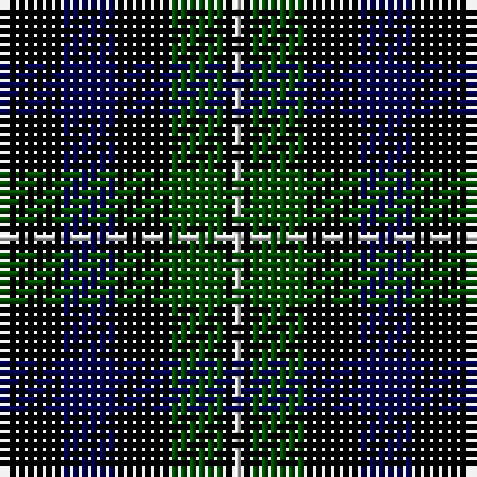

In pattern [BKBKGKW](/patterns/bkbkgkw/).

This was sourced from weddslist.  It is a [7 stripes tartan](/stripes/stripes7/).

Original link http://www.weddslist.com/cgi-bin/tartans/pg.pl?source=rb

## Thread count
DB/1 K6 DB6 K6 G6 K1 N/1

## Palette
Each colour and its ΔE from the base-6 reference it is a variant of.

| Colour | Shade | Base | ΔE (OKLab) |
|---|---|---|---|
| DB | <code style="background-color:#00004C;">#00004C</code> `#00004C` | B <code style="background-color:#2A418A;">#2A418A</code> | 0.21 |
| G | <code style="background-color:#004C00;">#004C00</code> `#004C00` | G <code style="background-color:#006100;">#006100</code> | 0.07 |
| K | <code style="background-color:#000000;">#000000</code> `#000000` | K <code style="background-color:#000000;">#000000</code> | 0.00 |
| N | <code style="background-color:#D0D0D0;">#D0D0D0</code> `#D0D0D0` | W <code style="background-color:#F7F7F7;">#F7F7F7</code> | 0.12 |

# Sample pattern

## Nearest tartans

The nearest existing variants by ΔTartan distance.

1. [Forbes LC](/setts/s7/b1k6b6k6g6k1y1~b000052-g11450d-k000000-yaaaaaa~x2/) — ΔT 0.36
1. [Forbes LC](/setts/s7/b1k6b6k6g6k1y1~b000052-g11450d-k000000-yaaaaaa/) — ΔT 0.36
1. [Printing Industries of America](/setts/s8/k7r2k2ka6y1ka1y1ka4~k000000-ka000034-r8c0000-yc88c00~x4/) — ΔT 0.99
1. [MacCallum](/setts/s7/g8k2w1g4k6b6k1~b00004c-g004c00-k000000-wd0d0d0~x2/) — ΔT 1.02
1. [MacCallum](/setts/s7/g8k2b1g4k6ba6k1~b4367ae-ba000052-g11450d-k000000~x2/) — ΔT 1.05
1. [MacCallum W](/setts/s7/k6g6r1g6k6b6k1~b00004c-g004c00-k000000-rc80000/) — ΔT 1.12
1. [MacCallum W](/setts/s7/k6g6r1g6k6b6k1~b000052-g11450d-k000000-raa0000~x2/) — ΔT 1.16
1. [MacCallum W](/setts/s7/k6g6r1g6k6b6k1~b000052-g11450d-k000000-raa0000/) — ΔT 1.16
1. [Forbes Ancient](/setts/s7/b1k6b6k6g6k1w1~b304080-g008000-k000000-we0e0e0~x2/) — ΔT 1.17
1. [Keith McCormick (Personal)](/setts/s8/g1k6g3k1g3k4b5k1~b483d8b-g006400-k000000~x4/) — ΔT 1.20

## Neighbour map

Every grey dot is one of 15726 variants placed by the first two principal components of the ΔTartan feature space (44% of its variance). Red is this tartan; blue dots are its nearest — click one to open its page.

<svg viewBox="0 0 640 380" role="img" style="max-width:100%;height:auto;border:1px solid #e0e0e0;border-radius:4px;display:block" xmlns="http://www.w3.org/2000/svg"><image href="/nn/cloud.v1.png" width="640" height="380"/><a href="/setts/s7/b1k6b6k6g6k1y1~b000052-g11450d-k000000-yaaaaaa~x2/"><circle cx="219.3" cy="261.1" r="4" fill="#3465a4"><title>Forbes LC</title></circle></a><a href="/setts/s7/b1k6b6k6g6k1y1~b000052-g11450d-k000000-yaaaaaa/"><circle cx="219.3" cy="261.1" r="4" fill="#3465a4"><title>Forbes LC</title></circle></a><a href="/setts/s8/k7r2k2ka6y1ka1y1ka4~k000000-ka000034-r8c0000-yc88c00~x4/"><circle cx="227.9" cy="234.9" r="4" fill="#3465a4"><title>Printing Industries of America</title></circle></a><a href="/setts/s7/g8k2w1g4k6b6k1~b00004c-g004c00-k000000-wd0d0d0~x2/"><circle cx="190.5" cy="243.2" r="4" fill="#3465a4"><title>MacCallum</title></circle></a><a href="/setts/s7/g8k2b1g4k6ba6k1~b4367ae-ba000052-g11450d-k000000~x2/"><circle cx="212.8" cy="252.0" r="4" fill="#3465a4"><title>MacCallum</title></circle></a><a href="/setts/s7/k6g6r1g6k6b6k1~b00004c-g004c00-k000000-rc80000/"><circle cx="173.4" cy="275.6" r="4" fill="#3465a4"><title>MacCallum W</title></circle></a><a href="/setts/s7/k6g6r1g6k6b6k1~b000052-g11450d-k000000-raa0000~x2/"><circle cx="182.7" cy="278.9" r="4" fill="#3465a4"><title>MacCallum W</title></circle></a><a href="/setts/s7/k6g6r1g6k6b6k1~b000052-g11450d-k000000-raa0000/"><circle cx="182.7" cy="278.9" r="4" fill="#3465a4"><title>MacCallum W</title></circle></a><a href="/setts/s7/b1k6b6k6g6k1w1~b304080-g008000-k000000-we0e0e0~x2/"><circle cx="180.6" cy="242.4" r="4" fill="#3465a4"><title>Forbes Ancient</title></circle></a><a href="/setts/s8/g1k6g3k1g3k4b5k1~b483d8b-g006400-k000000~x4/"><circle cx="222.8" cy="264.9" r="4" fill="#3465a4"><title>Keith McCormick (Personal)</title></circle></a><circle cx="208.8" cy="257.2" r="5" fill="#c00000"/></svg>

ID: /setts/s7/b1k6b6k6g6k1w1~b00004c-g004c00-k000000-wd0d0d0/
