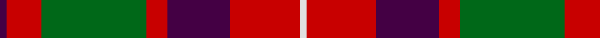

In pattern [BRGRBRW](/patterns/brgrbrw/).

This was sourced from register-of-tartans.  It is a [7 stripes tartan](/stripes/stripes7/).

Original link https://www.tartanregister.gov.uk/tartanDetails.aspx?ref=1325

## Attestations

This cloth appears in 2 source records; the oldest owns this page.

- 01/01/1840 — Geddes (register-of-tartans, [record](https://www.tartanregister.gov.uk/tartanDetails.aspx?ref=1325))
- 1840 — Geddes (Clan) (tartans-authority, [record](http://www.tartansauthority.com/tartan-ferret/display/4969/))

## Thread count
DP/4 R20 G60 R12 DP36 R40 LN/4

## Palette
Each colour and its ΔE from the base-6 reference it is a variant of.

| Colour | Shade | Base | ΔE (OKLab) |
|---|---|---|---|
| DP | <code style="background-color:#440044;">#440044</code> `#440044` | B <code style="background-color:#2A418A;">#2A418A</code> | 0.18 |
| G | <code style="background-color:#006818;">#006818</code> `#006818` | G <code style="background-color:#006100;">#006100</code> | 0.02 |
| LN | <code style="background-color:#E0E0E0;">#E0E0E0</code> `#E0E0E0` | W <code style="background-color:#F7F7F7;">#F7F7F7</code> | 0.07 |
| R | <code style="background-color:#C80000;">#C80000</code> `#C80000` | R <code style="background-color:#CC0000;">#CC0000</code> | 0.01 |

# Sample pattern

## Nearest tartans

The nearest existing variants by ΔTartan distance.

1. [MacKintosh Geddes](/setts/s7/b1r5g18r4b9r10w1~b2c4084-g005020-rdc0000-we0e0e0~x4/) — ΔT 0.60
1. [MacBean/MacElvain](/setts/s7/k2r12b6r3g12r4b1~b2c4084-g005020-k101010-rdc0000~x2/) — ΔT 0.67
1. [Unidentified #15](/setts/s6/k6r2g17r16k1b2~b3c82af-g005020-k101010-rdc0000~x2/) — ΔT 0.75
1. [Logan - 1819 (with yellow)](/setts/s7/b8r3y1r3g14r3y1~b440044-g285800-rc80000-ye8c000~x4/) — ΔT 0.76
1. [MacBean, MacElvain](/setts/s7/k2r12b6r3g12r4b1~b304080-g008000-k000000-rc00000~x2/) — ΔT 0.78
1. [Logan with Yellow](/setts/s7/b8r3y1r3g14r3y1~b780078-g006818-rc80000-ye8c000~x4/) — ΔT 0.79
1. [MacNaughton Clan Tartan Tartan Number: 1066. Earliest known date: 1831 James Logan collected information for his book 'The Scottish Gael' between 1826 and 1831. The MacNaughton tartan is also recorded by William and Andrew Smith in their 'Authenticated Tartans of the Clans and Families of Scotland' (1850). Other works contain a commonly reproduced error. The tartan closely resembles the MacDuff, which may bear out the claim that the MacNaughtons were originally a Moray tribe transplanted by Malcolm IV. The MacNaughton tartan is worn by the 'Vale of Athol' pipe band. See products available Copyright © Blair Urquhart, Comrie, 2015](/setts/s9/k1b1r16g16k12b8r16b1k1~b2c2c80-g006818-k101010-rc80000~x2/) — ΔT 0.80
1. [Wyeth (Personal)](/setts/s8/b18r18ba2g12b1g12ba2r18~b2c2c80-ba780078-g006818-rc80000~x4/) — ΔT 0.80
1. [Ruthven (V.S.) (Name)](/setts/s6/w6g15b18r30g2r4~b202060-g006818-rc80000-we0e0e0~x2/) — ΔT 0.82
1. [Cook (Name)](/setts/s7/g12ga6g6r15k1r1k2~g003820-ga048888-k101010-rc80000~x2/) — ΔT 0.82

## Neighbour map

Every grey dot is one of 15726 variants placed by the first two principal components of the ΔTartan feature space (44% of its variance). Red is this tartan; blue dots are its nearest — click one to open its page.

<svg viewBox="0 0 640 380" role="img" style="max-width:100%;height:auto;border:1px solid #e0e0e0;border-radius:4px;display:block" xmlns="http://www.w3.org/2000/svg"><image href="/nn/cloud.v1.png" width="640" height="380"/><a href="/setts/s7/b1r5g18r4b9r10w1~b2c4084-g005020-rdc0000-we0e0e0~x4/"><circle cx="248.5" cy="180.0" r="4" fill="#3465a4"><title>MacKintosh Geddes</title></circle></a><a href="/setts/s7/k2r12b6r3g12r4b1~b2c4084-g005020-k101010-rdc0000~x2/"><circle cx="259.3" cy="199.4" r="4" fill="#3465a4"><title>MacBean/MacElvain</title></circle></a><a href="/setts/s6/k6r2g17r16k1b2~b3c82af-g005020-k101010-rdc0000~x2/"><circle cx="257.4" cy="179.6" r="4" fill="#3465a4"><title>Unidentified #15</title></circle></a><a href="/setts/s7/b8r3y1r3g14r3y1~b440044-g285800-rc80000-ye8c000~x4/"><circle cx="247.2" cy="180.3" r="4" fill="#3465a4"><title>Logan - 1819 (with yellow)</title></circle></a><a href="/setts/s7/k2r12b6r3g12r4b1~b304080-g008000-k000000-rc00000~x2/"><circle cx="249.2" cy="198.3" r="4" fill="#3465a4"><title>MacBean, MacElvain</title></circle></a><a href="/setts/s7/b8r3y1r3g14r3y1~b780078-g006818-rc80000-ye8c000~x4/"><circle cx="246.1" cy="178.0" r="4" fill="#3465a4"><title>Logan with Yellow</title></circle></a><a href="/setts/s9/k1b1r16g16k12b8r16b1k1~b2c2c80-g006818-k101010-rc80000~x2/"><circle cx="241.2" cy="169.1" r="4" fill="#3465a4"><title>MacNaughton Clan Tartan Tartan Number: 1066. Earliest known date: 1831 James Logan collected information for his book 'The Scottish Gael' between 1826 and 1831. The MacNaughton tartan is also recorded by William and Andrew Smith in their 'Authenticated Tartans of the Clans and Families of Scotland' (1850). Other works contain a commonly reproduced error. The tartan closely resembles the MacDuff, which may bear out the claim that the MacNaughtons were originally a Moray tribe transplanted by Malcolm IV. The MacNaughton tartan is worn by the 'Vale of Athol' pipe band. See products available Copyright © Blair Urquhart, Comrie, 2015</title></circle></a><a href="/setts/s8/b18r18ba2g12b1g12ba2r18~b2c2c80-ba780078-g006818-rc80000~x4/"><circle cx="250.9" cy="187.8" r="4" fill="#3465a4"><title>Wyeth (Personal)</title></circle></a><a href="/setts/s6/w6g15b18r30g2r4~b202060-g006818-rc80000-we0e0e0~x2/"><circle cx="238.0" cy="186.5" r="4" fill="#3465a4"><title>Ruthven (V.S.) (Name)</title></circle></a><a href="/setts/s7/g12ga6g6r15k1r1k2~g003820-ga048888-k101010-rc80000~x2/"><circle cx="251.6" cy="190.4" r="4" fill="#3465a4"><title>Cook (Name)</title></circle></a><circle cx="242.6" cy="188.0" r="5" fill="#c00000"/></svg>

ID: /setts/s7/b1r5g15r3b9r10w1~b440044-g006818-rc80000-we0e0e0~x4/
