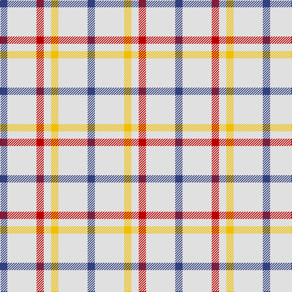

In pattern [BWRWYWB](/patterns/bwrwywb/).

This was sourced from weddslist.  It is a [7 stripes tartan](/stripes/stripes7/).

Original link http://www.weddslist.com/cgi-bin/tartans/pg.pl?source=sts

## Thread count
B/12 LN48 R12 LN12 Y12 LN48 B/12

## Palette
Each colour and its ΔE from the base-6 reference it is a variant of.

| Colour | Shade | Base | ΔE (OKLab) |
|---|---|---|---|
| B | <code style="background-color:#304080;">#304080</code> `#304080` | B <code style="background-color:#2A418A;">#2A418A</code> | 0.02 |
| LN | <code style="background-color:#E0E0E0;">#E0E0E0</code> `#E0E0E0` | W <code style="background-color:#F7F7F7;">#F7F7F7</code> | 0.07 |
| R | <code style="background-color:#C00000;">#C00000</code> `#C00000` | R <code style="background-color:#CC0000;">#CC0000</code> | 0.03 |
| Y | <code style="background-color:#F0C000;">#F0C000</code> `#F0C000` | Y <code style="background-color:#F2BF00;">#F2BF00</code> | 0.00 |

# Sample pattern

## Nearest tartans

The nearest existing variants by ΔTartan distance.

1. [Justus Dress (Personal)](/setts/s7/b1y4r1y1ya1y4b1~b3850c8-r880000-yb8b8b8-yad09800~x12/) — ΔT 1.34
1. [Milne (Personal)](/setts/s8/w12g2w12r17w12g2w5b2~b6840fc-g005448-rd05054-wfcfcfc~x4/) — ΔT 1.43
1. [Milne, Green (Dance)](/setts/s8/w12r2w12g17w12r2w5b2~b9058d8-g009468-rc80000-wf8f8f8~x4/) — ΔT 1.49
1. [Milne Purple Dress (Dance)](/setts/s8/w12b2w12r17w12b2w5ra2~b202060-rb468ac-rac80000-wfcfcfc~x4/) — ΔT 1.52
1. [Milne, Dress (Dance)](/setts/s8/w12b2w12r17w12b2w5ba2~b2888c4-ba780078-rc80000-wf8f8f8~x4/) — ΔT 1.58
1. [Milne Royal Blue Dress Fashion Tartan Tartan Number: 6547. Earliest known date: 01/01/2005 A Dance version of #634 (original Scottish Tartans Authority reference) reputed to be a personal tartan./Threadcount and colours aren't 100% original. Generated manually./ See products available Copyright © Blair Urquhart, Comrie, 2015](/setts/s8/w24b5w24ba36w28b6w12r6~b20608c-ba2c2c80-rc80000-we0e0e0/) — ΔT 1.73
1. [Boswell Dress Personal Tartan Tartan Number: 6359. Earliest known date: 2004 A tartan for William Boswell of Balmuto in Fife. See products available Copyright © Blair Urquhart, Comrie, 2015](/setts/s8/w13r3w2k5w2r3w13b8~b2c2c80-k101010-rc80000-we0e0e0~x2/) — ΔT 1.76
1. [Milne, dress](/setts/s8/w18b4w18r30w18b4w9ba4~b304080-ba800080-rc00000-we0e0e0/) — ΔT 1.79
1. [Milne Dress Family Tartan Tartan Number: 634. Earliest known date: pre 2003 Milnes are usually regarded as being a Sept of the Gordons or of the Ogilvys. See products available Copyright © Blair Urquhart, Comrie, 2015](/setts/s8/w18b4w18r30w18b4w9ba4~b2c2c80-ba780078-rc80000-we0e0e0/) — ΔT 1.82
1. [London Fog Camel 2 (Fashion)](/setts/s10/y3w2y18b9y18w2y18k9y18w2~b2888c4-k101010-wd4d4c4-yccc0a4/) — ΔT 1.87

## Neighbour map

Every grey dot is one of 15726 variants placed by the first two principal components of the ΔTartan feature space (44% of its variance). Red is this tartan; blue dots are its nearest — click one to open its page.

<svg viewBox="0 0 640 380" role="img" style="max-width:100%;height:auto;border:1px solid #e0e0e0;border-radius:4px;display:block" xmlns="http://www.w3.org/2000/svg"><image href="/nn/cloud.v1.png" width="640" height="380"/><a href="/setts/s7/b1y4r1y1ya1y4b1~b3850c8-r880000-yb8b8b8-yad09800~x12/"><circle cx="342.6" cy="244.8" r="4" fill="#3465a4"><title>Justus Dress (Personal)</title></circle></a><a href="/setts/s8/w12g2w12r17w12g2w5b2~b6840fc-g005448-rd05054-wfcfcfc~x4/"><circle cx="299.1" cy="189.3" r="4" fill="#3465a4"><title>Milne (Personal)</title></circle></a><a href="/setts/s8/w12r2w12g17w12r2w5b2~b9058d8-g009468-rc80000-wf8f8f8~x4/"><circle cx="298.1" cy="197.5" r="4" fill="#3465a4"><title>Milne, Green (Dance)</title></circle></a><a href="/setts/s8/w12b2w12r17w12b2w5ra2~b202060-rb468ac-rac80000-wfcfcfc~x4/"><circle cx="297.2" cy="189.9" r="4" fill="#3465a4"><title>Milne Purple Dress (Dance)</title></circle></a><a href="/setts/s8/w12b2w12r17w12b2w5ba2~b2888c4-ba780078-rc80000-wf8f8f8~x4/"><circle cx="296.9" cy="186.9" r="4" fill="#3465a4"><title>Milne, Dress (Dance)</title></circle></a><a href="/setts/s8/w24b5w24ba36w28b6w12r6~b20608c-ba2c2c80-rc80000-we0e0e0/"><circle cx="260.8" cy="207.7" r="4" fill="#3465a4"><title>Milne Royal Blue Dress Fashion Tartan Tartan Number: 6547. Earliest known date: 01/01/2005 A Dance version of #634 (original Scottish Tartans Authority reference) reputed to be a personal tartan./Threadcount and colours aren't 100% original. Generated manually./ See products available Copyright © Blair Urquhart, Comrie, 2015</title></circle></a><a href="/setts/s8/w13r3w2k5w2r3w13b8~b2c2c80-k101010-rc80000-we0e0e0~x2/"><circle cx="245.1" cy="197.4" r="4" fill="#3465a4"><title>Boswell Dress Personal Tartan Tartan Number: 6359. Earliest known date: 2004 A tartan for William Boswell of Balmuto in Fife. See products available Copyright © Blair Urquhart, Comrie, 2015</title></circle></a><a href="/setts/s8/w18b4w18r30w18b4w9ba4~b304080-ba800080-rc00000-we0e0e0/"><circle cx="270.4" cy="196.6" r="4" fill="#3465a4"><title>Milne, dress</title></circle></a><a href="/setts/s8/w18b4w18r30w18b4w9ba4~b2c2c80-ba780078-rc80000-we0e0e0/"><circle cx="269.3" cy="195.9" r="4" fill="#3465a4"><title>Milne Dress Family Tartan Tartan Number: 634. Earliest known date: pre 2003 Milnes are usually regarded as being a Sept of the Gordons or of the Ogilvys. See products available Copyright © Blair Urquhart, Comrie, 2015</title></circle></a><a href="/setts/s10/y3w2y18b9y18w2y18k9y18w2~b2888c4-k101010-wd4d4c4-yccc0a4/"><circle cx="393.7" cy="198.5" r="4" fill="#3465a4"><title>London Fog Camel 2 (Fashion)</title></circle></a><circle cx="308.6" cy="226.8" r="5" fill="#c00000"/></svg>

ID: /setts/s7/b1w4r1w1y1w4b1~b304080-rc00000-we0e0e0-yf0c000~x12/
