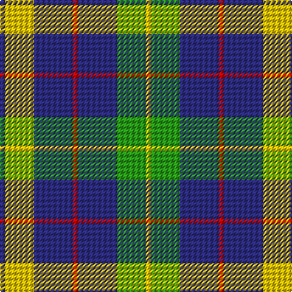

In pattern [BYBRBGY](/patterns/bybrbgy/).

This was sourced from tartans-authority.  It is a [7 stripes tartan](/stripes/stripes7/).

Original link http://www.tartansauthority.com/tartan-ferret/display/7659/

## Attestations

This cloth appears in 2 source records; the oldest owns this page.

- August 2008 — Hill of Banchory Primary (School) (tartans-authority, [record](http://www.tartansauthority.com/tartan-ferret/display/7659/))
- undated — Hill of Banchory Primary School (register-of-tartans, [record](https://www.tartanregister.gov.uk/tartanDetails.aspx?ref=5666))

## Thread count
DB/4 Y24 DB32 R4 DB32 G24 Y/4

## Palette
Each colour and its ΔE from the base-6 reference it is a variant of.

| Colour | Shade | Base | ΔE (OKLab) |
|---|---|---|---|
| DB | <code style="background-color:#2C2C80;">#2C2C80</code> `#2C2C80` | B <code style="background-color:#2A418A;">#2A418A</code> | 0.06 |
| G | <code style="background-color:#289C18;">#289C18</code> `#289C18` | G <code style="background-color:#006100;">#006100</code> | 0.19 |
| R | <code style="background-color:#C80000;">#C80000</code> `#C80000` | R <code style="background-color:#CC0000;">#CC0000</code> | 0.01 |
| Y | <code style="background-color:#E8C000;">#E8C000</code> `#E8C000` | Y <code style="background-color:#F2BF00;">#F2BF00</code> | 0.02 |

# Sample pattern

## Nearest tartans

The nearest existing variants by ΔTartan distance.

1. [MacCrimmon from Skye](/setts/s7/r5k3b22k17b22k3y5x2~b5c8ca8-k101010-rc80000-ye8c000/) — ΔT 0.55
1. [MacMillan](/setts/s9/k6r2k12g3k6w16g3w16k2x2~g8c7038-k101010-r980044-wc0c0c0/) — ΔT 1.07
1. [MacCrimmon from Skye](/setts/s7/r5k3b22k17b22k3y5x2~b5480b0-k000000-rc00000-yf0c000/) — ΔT 1.08
1. [Oban Grey (Fashion)](/setts/s5/k4w4k4r15ra2x4~k101010-r888888-ra880000-wc0c0c0/) — ΔT 1.13
1. [Burberry Hunting](/setts/s5/k3w3k3g10r1x6~g406054-k101010-rc80000-wfcfcfc/) — ΔT 1.14
1. [Kile](/setts/s8/b20w3b3w3b3w3k5y10x2~b304080-k000000-we0e0e0-yf0c000/) — ΔT 1.15
1. [New York State Police Pipe Band](/setts/s5/r5b3r18k16y3x4~b780078-k101010-r888888-ye8c000/) — ΔT 1.17
1. [Yusra (Malay) (Personal)](/setts/s7/r12y3w14b10y2b24r2x2~b003c64-rc80000-we0e0e0-ye8c000/) — ΔT 1.19
1. [Yusra (Personal)](/setts/s7/r12y3w14b10y2b24r2x2~b003c64-rc80000-we0e0e0-yfccc00/) — ΔT 1.20
1. [Scotsburn Croft](/setts/s9/y16k3y16k26b4k26r20k3r8~b780078-k101010-r888888-y48a4c0/) — ΔT 1.22

## Neighbour map

Every grey dot is one of 15726 variants placed by the first two principal components of the ΔTartan feature space (44% of its variance). Red is this tartan; blue dots are its nearest — click one to open its page.

<svg viewBox="0 0 640 380" role="img" style="max-width:100%;height:auto;border:1px solid #e0e0e0;border-radius:4px;display:block" xmlns="http://www.w3.org/2000/svg"><image href="/nn/cloud.v1.png" width="640" height="380"/><a href="/setts/s7/r5k3b22k17b22k3y5x2~b5c8ca8-k101010-rc80000-ye8c000/"><circle cx="262.3" cy="217.6" r="4" fill="#3465a4"><title>MacCrimmon from Skye</title></circle></a><a href="/setts/s9/k6r2k12g3k6w16g3w16k2x2~g8c7038-k101010-r980044-wc0c0c0/"><circle cx="206.2" cy="191.4" r="4" fill="#3465a4"><title>MacMillan</title></circle></a><a href="/setts/s7/r5k3b22k17b22k3y5x2~b5480b0-k000000-rc00000-yf0c000/"><circle cx="246.8" cy="214.5" r="4" fill="#3465a4"><title>MacCrimmon from Skye</title></circle></a><a href="/setts/s5/k4w4k4r15ra2x4~k101010-r888888-ra880000-wc0c0c0/"><circle cx="240.5" cy="220.9" r="4" fill="#3465a4"><title>Oban Grey (Fashion)</title></circle></a><a href="/setts/s5/k3w3k3g10r1x6~g406054-k101010-rc80000-wfcfcfc/"><circle cx="229.5" cy="214.0" r="4" fill="#3465a4"><title>Burberry Hunting</title></circle></a><a href="/setts/s8/b20w3b3w3b3w3k5y10x2~b304080-k000000-we0e0e0-yf0c000/"><circle cx="205.3" cy="187.8" r="4" fill="#3465a4"><title>Kile</title></circle></a><a href="/setts/s5/r5b3r18k16y3x4~b780078-k101010-r888888-ye8c000/"><circle cx="233.3" cy="237.6" r="4" fill="#3465a4"><title>New York State Police Pipe Band</title></circle></a><a href="/setts/s7/r12y3w14b10y2b24r2x2~b003c64-rc80000-we0e0e0-ye8c000/"><circle cx="227.9" cy="184.4" r="4" fill="#3465a4"><title>Yusra (Malay) (Personal)</title></circle></a><a href="/setts/s7/r12y3w14b10y2b24r2x2~b003c64-rc80000-we0e0e0-yfccc00/"><circle cx="226.7" cy="183.7" r="4" fill="#3465a4"><title>Yusra (Personal)</title></circle></a><a href="/setts/s9/y16k3y16k26b4k26r20k3r8~b780078-k101010-r888888-y48a4c0/"><circle cx="194.5" cy="210.6" r="4" fill="#3465a4"><title>Scotsburn Croft</title></circle></a><circle cx="231.8" cy="215.5" r="5" fill="#c00000"/></svg>

ID: /setts/s7/b1y6b8r1b8g6y1x4~b2c2c80-g289c18-rc80000-ye8c000/
