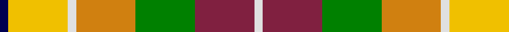
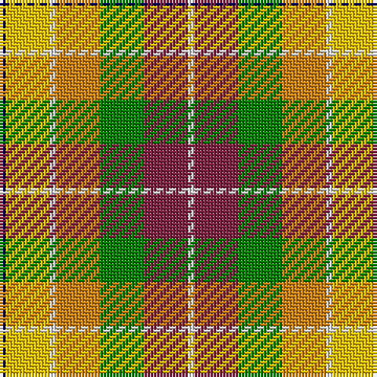

In pattern [BYWYGRW](/patterns/bywygrw/).

This was sourced from weddslist.  It is a [7 stripes tartan](/stripes/stripes7/).

Original link http://www.weddslist.com/cgi-bin/tartans/pg.pl?source=sts

## Thread count
DB/2 Y14 LN2 O14 G14 DR14 LN/2

## Palette
Each colour and its ΔE from the base-6 reference it is a variant of.

| Colour | Shade | Base | ΔE (OKLab) |
|---|---|---|---|
| DB | <code style="background-color:#000050;">#000050</code> `#000050` | B <code style="background-color:#2A418A;">#2A418A</code> | 0.21 |
| DR | <code style="background-color:#802040;">#802040</code> `#802040` | R <code style="background-color:#CC0000;">#CC0000</code> | 0.17 |
| G | <code style="background-color:#008000;">#008000</code> `#008000` | G <code style="background-color:#006100;">#006100</code> | 0.10 |
| LN | <code style="background-color:#E0E0E0;">#E0E0E0</code> `#E0E0E0` | W <code style="background-color:#F7F7F7;">#F7F7F7</code> | 0.07 |
| O | <code style="background-color:#D08010;">#D08010</code> `#D08010` | Y <code style="background-color:#F2BF00;">#F2BF00</code> | 0.17 |
| Y | <code style="background-color:#F0C000;">#F0C000</code> `#F0C000` | Y <code style="background-color:#F2BF00;">#F2BF00</code> | 0.00 |

# Sample pattern

## Nearest tartans

The nearest existing variants by ΔTartan distance.

1. [Kipp (Personal)](/setts/s7/b2y10w1r8g7ba10w2~b1c0070-ba4c0000-g006818-rb84c00-wc0c0c0-yd09800~x2/) — ΔT 1.18
1. [Jacobite, Silk sash](/setts/s10/w2r8ra5y6w5g21w6r8rb4w2~g008000-rc00000-ra806050-rbd03030-we0e0e0-yf0c000/) — ΔT 1.27
1. [Pride, The Tartan of](/setts/s6/r8y4ya3g6b6ba1~b2888c4-ba780078-g006818-rc80000-yd87c00-yae8c000~x5/) — ΔT 1.44
1. [Jacobite Silk sash](/setts/s10/w2r8g5y6w5ga21w6r8ra4w2~g503c14-ga005020-rdc0000-rac82828-we0e0e0-ye8c000/) — ΔT 1.47
1. [Unnamed No 14](/setts/s9/r22b6ba10y4r4w4g22ba8y3~b5480b0-ba304080-g008000-rc00000-we0e0e0-yf0c000/) — ΔT 1.51
1. [Devon Rural Skills Trust](/setts/s8/w5g4b1g4r4b1ga4y1~b8080d0-g607030-ga004010-rc00000-we0e0e0-yf0c000~x2/) — ΔT 1.51
1. [Ellis (Personal)](/setts/s9/w2k1g4r2g2r4ga5k1y2~g009894-ga006818-k101010-rfc7878-we0e0e0-ye8c000~x6/) — ΔT 1.52
1. [Porcupine City of](/setts/s7/r10b3ba1w8ba1y2g5~b5c5c5c-ba1c0070-g006818-rb03000-wc0c0c0-yd09800~x4/) — ΔT 1.55
1. [Ontario Northern Canadian District Tartan Tartan Number: 956. Earliest known date: 1967 The six colours represent the nickel bearing rocks (grey), the snow (white), the sky and the lakes (blue), gold, the forests and fields (green), and the Indian Nation (red brown). See products available Copyright © Blair Urquhart, Comrie, 2015](/setts/s7/g17r5b2w12b2y4ga7~b2c2c80-g604000-ga006818-r888888-we0e0e0-ye8c000~x2/) — ΔT 1.55
1. [Devon Rural Skills Trust](/setts/s8/w5g4b1g4r4b1ga4y1~b2888c4-g5c6428-ga005834-rc80000-wfcfcfc-ye8c000~x6/) — ΔT 1.57

## Neighbour map

Every grey dot is one of 15726 variants placed by the first two principal components of the ΔTartan feature space (44% of its variance). Red is this tartan; blue dots are its nearest — click one to open its page.

<svg viewBox="0 0 640 380" role="img" style="max-width:100%;height:auto;border:1px solid #e0e0e0;border-radius:4px;display:block" xmlns="http://www.w3.org/2000/svg"><image href="/nn/cloud.v1.png" width="640" height="380"/><a href="/setts/s7/b2y10w1r8g7ba10w2~b1c0070-ba4c0000-g006818-rb84c00-wc0c0c0-yd09800~x2/"><circle cx="62.4" cy="171.6" r="4" fill="#3465a4"><title>Kipp (Personal)</title></circle></a><a href="/setts/s10/w2r8ra5y6w5g21w6r8rb4w2~g008000-rc00000-ra806050-rbd03030-we0e0e0-yf0c000/"><circle cx="87.8" cy="136.8" r="4" fill="#3465a4"><title>Jacobite, Silk sash</title></circle></a><a href="/setts/s6/r8y4ya3g6b6ba1~b2888c4-ba780078-g006818-rc80000-yd87c00-yae8c000~x5/"><circle cx="63.4" cy="205.7" r="4" fill="#3465a4"><title>Pride, The Tartan of</title></circle></a><a href="/setts/s10/w2r8g5y6w5ga21w6r8ra4w2~g503c14-ga005020-rdc0000-rac82828-we0e0e0-ye8c000/"><circle cx="79.4" cy="133.1" r="4" fill="#3465a4"><title>Jacobite Silk sash</title></circle></a><a href="/setts/s9/r22b6ba10y4r4w4g22ba8y3~b5480b0-ba304080-g008000-rc00000-we0e0e0-yf0c000/"><circle cx="87.5" cy="161.4" r="4" fill="#3465a4"><title>Unnamed No 14</title></circle></a><a href="/setts/s8/w5g4b1g4r4b1ga4y1~b8080d0-g607030-ga004010-rc00000-we0e0e0-yf0c000~x2/"><circle cx="42.7" cy="201.4" r="4" fill="#3465a4"><title>Devon Rural Skills Trust</title></circle></a><a href="/setts/s9/w2k1g4r2g2r4ga5k1y2~g009894-ga006818-k101010-rfc7878-we0e0e0-ye8c000~x6/"><circle cx="14.0" cy="195.3" r="4" fill="#3465a4"><title>Ellis (Personal)</title></circle></a><a href="/setts/s7/r10b3ba1w8ba1y2g5~b5c5c5c-ba1c0070-g006818-rb03000-wc0c0c0-yd09800~x4/"><circle cx="114.8" cy="161.3" r="4" fill="#3465a4"><title>Porcupine City of</title></circle></a><a href="/setts/s7/g17r5b2w12b2y4ga7~b2c2c80-g604000-ga006818-r888888-we0e0e0-ye8c000~x2/"><circle cx="85.2" cy="165.5" r="4" fill="#3465a4"><title>Ontario Northern Canadian District Tartan Tartan Number: 956. Earliest known date: 1967 The six colours represent the nickel bearing rocks (grey), the snow (white), the sky and the lakes (blue), gold, the forests and fields (green), and the Indian Nation (red brown). See products available Copyright © Blair Urquhart, Comrie, 2015</title></circle></a><a href="/setts/s8/w5g4b1g4r4b1ga4y1~b2888c4-g5c6428-ga005834-rc80000-wfcfcfc-ye8c000~x6/"><circle cx="34.5" cy="198.2" r="4" fill="#3465a4"><title>Devon Rural Skills Trust</title></circle></a><circle cx="39.1" cy="176.1" r="5" fill="#c00000"/></svg>

ID: /setts/s7/b1y7w1ya7g7r7w1~b000050-g008000-r802040-we0e0e0-yf0c000-yad08010~x2/
