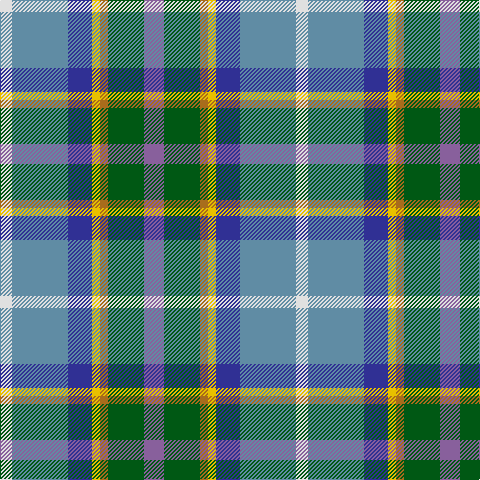

In pattern [BGRYBBW](/patterns/bgrybbw/).

This was sourced from register-of-tartans.  It is a [7 stripes tartan](/stripes/stripes7/).

Original link https://www.tartanregister.gov.uk/tartanDetails.aspx?ref=2822

## Thread count
LN/12 B56 DB24 Y8 LT8 G36 LP/20

## Palette
Each colour and its ΔE from the base-6 reference it is a variant of.

| Colour | Shade | Base | ΔE (OKLab) |
|---|---|---|---|
| B | <code style="background-color:#608CA4;">#608CA4</code> `#608CA4` | B <code style="background-color:#2C4084;">#2C4084</code> | 0.24 |
| DB | <code style="background-color:#303094;">#303094</code> `#303094` | B <code style="background-color:#2C4084;">#2C4084</code> | 0.05 |
| G | <code style="background-color:#005814;">#005814</code> `#005814` | G <code style="background-color:#006400;">#006400</code> | 0.04 |
| LN | <code style="background-color:#E0E0E0;">#E0E0E0</code> `#E0E0E0` | W <code style="background-color:#F4F4F0;">#F4F4F0</code> | 0.06 |
| LP | <code style="background-color:#88609C;">#88609C</code> `#88609C` | B <code style="background-color:#2C4084;">#2C4084</code> | 0.18 |
| LT | <code style="background-color:#A86C1C;">#A86C1C</code> `#A86C1C` | R <code style="background-color:#C80000;">#C80000</code> | 0.16 |
| Y | <code style="background-color:#E8C000;">#E8C000</code> `#E8C000` | Y <code style="background-color:#E8C000;">#E8C000</code> | 0.00 |

# Sample pattern

ID: /setts/s7/b20g36r8y8ba24bb56w12-b88609c-ba303094-bb608ca4-g005814-ra86c1c-we0e0e0-ye8c000/
