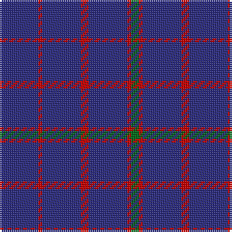

In pattern [BRBRBRG](/patterns/brbrbrg/).

This was sourced from house-of-tartan.  It is a [7 stripes tartan](/stripes/stripes7/).

Original link http://www.house-of-tartan.scotland.net/house/TartanViewjs.asp?colr=Def&tnam=414

## Thread count
DB/20 R2 DB20 R4 DB20 R2 G/4

## Palette
Each colour and its ΔE from the base-6 reference it is a variant of.

| Colour | Shade | Base | ΔE (OKLab) |
|---|---|---|---|
| DB | <code style="background-color:#2C2C80;">#2C2C80</code> `#2C2C80` | B <code style="background-color:#2A418A;">#2A418A</code> | 0.06 |
| G | <code style="background-color:#006818;">#006818</code> `#006818` | G <code style="background-color:#006100;">#006100</code> | 0.02 |
| R | <code style="background-color:#C80000;">#C80000</code> `#C80000` | R <code style="background-color:#CC0000;">#CC0000</code> | 0.01 |

# Sample pattern

## Nearest tartans

The nearest existing variants by ΔTartan distance.

1. [Hebridean, (Old..)](/setts/s7/b20r2b20r4b20r2g4-b304080-g008000-rc00000/) — ΔT 0.79
1. [Hebrides #5](/setts/s12/b20r2b20r4b20r2g4r2b20r4b20r2-b2c2c80-g006818-rc80000/) — ΔT 1.12
1. [Brooks Brothers Tattersall Blue](/setts/s5/r4b36y8b36y4-b202060-r880000-ya08858/) — ΔT 1.16
1. [Lochaber #3](/setts/s4/b2ba2b16r2-b2c4084-ba3c82af-rdc0000/) — ΔT 1.69
1. [Lynch](/setts/s6/r12b8r4b72g4b8-b2c2c80-g007c00-rc80000/) — ΔT 1.78
1. [Sultan of Qaboo's Air Force](/setts/s6/b48ba12b20ba12b64y6-b1c0070-ba5c8ca8-ye8c000/) — ΔT 1.83
1. [Dollar Academy](/setts/s6/b18k18b18k18b84w10-b2c2c80-k101010-wc0c0c0/) — ΔT 1.93
1. [Lochaber](/setts/s4/b2ba2b16r2-b304080-ba5480b0-rc00000/) — ΔT 1.97
1. [Elliott](/setts/s4/b32r8b6ra2-b000064-r900000-rac80000/) — ΔT 2.00
1. [MacLaine of Lochbuie](/setts/s4/b64r6b8y6-b304080-rc00000-yf0c000/) — ΔT 2.03

## Neighbour map

Every grey dot is one of 15726 variants placed by the first two principal components of the ΔTartan feature space (44% of its variance). Red is this tartan; blue dots are its nearest — click one to open its page.

<svg viewBox="0 0 640 380" role="img" style="max-width:100%;height:auto;border:1px solid #e0e0e0;border-radius:4px;display:block" xmlns="http://www.w3.org/2000/svg"><image href="/nn/cloud.v1.png" width="640" height="380"/><a href="/setts/s7/b20r2b20r4b20r2g4-b304080-g008000-rc00000/"><circle cx="579.2" cy="262.0" r="4" fill="#3465a4"><title>Hebridean, (Old..)</title></circle></a><a href="/setts/s12/b20r2b20r4b20r2g4r2b20r4b20r2-b2c2c80-g006818-rc80000/"><circle cx="559.7" cy="230.9" r="4" fill="#3465a4"><title>Hebrides #5</title></circle></a><a href="/setts/s5/r4b36y8b36y4-b202060-r880000-ya08858/"><circle cx="544.6" cy="266.1" r="4" fill="#3465a4"><title>Brooks Brothers Tattersall Blue</title></circle></a><a href="/setts/s4/b2ba2b16r2-b2c4084-ba3c82af-rdc0000/"><circle cx="591.0" cy="273.9" r="4" fill="#3465a4"><title>Lochaber #3</title></circle></a><a href="/setts/s6/r12b8r4b72g4b8-b2c2c80-g007c00-rc80000/"><circle cx="601.5" cy="201.2" r="4" fill="#3465a4"><title>Lynch</title></circle></a><a href="/setts/s6/b48ba12b20ba12b64y6-b1c0070-ba5c8ca8-ye8c000/"><circle cx="510.8" cy="250.1" r="4" fill="#3465a4"><title>Sultan of Qaboo's Air Force</title></circle></a><a href="/setts/s6/b18k18b18k18b84w10-b2c2c80-k101010-wc0c0c0/"><circle cx="463.0" cy="253.6" r="4" fill="#3465a4"><title>Dollar Academy</title></circle></a><a href="/setts/s4/b2ba2b16r2-b304080-ba5480b0-rc00000/"><circle cx="609.4" cy="281.5" r="4" fill="#3465a4"><title>Lochaber</title></circle></a><a href="/setts/s4/b32r8b6ra2-b000064-r900000-rac80000/"><circle cx="554.0" cy="247.4" r="4" fill="#3465a4"><title>Elliott</title></circle></a><a href="/setts/s4/b64r6b8y6-b304080-rc00000-yf0c000/"><circle cx="596.8" cy="239.8" r="4" fill="#3465a4"><title>MacLaine of Lochbuie</title></circle></a><circle cx="570.1" cy="258.1" r="5" fill="#c00000"/></svg>

ID: /setts/s7/b20r2b20r4b20r2g4-b2c2c80-g006818-rc80000/
