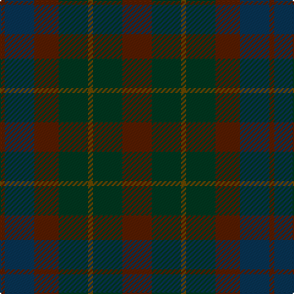

In pattern [BBBGGGB](/patterns/bbbgggb/).

This was sourced from tartans-authority.  It is a [7 stripes tartan](/stripes/stripes7/).

Original link http://www.tartansauthority.com/tartan-ferret/display/2107/

## Thread count
T/4 DB24 T20 DG24 Ta4 DG24 T/24

## Palette
Each colour and its ΔE from the base-6 reference it is a variant of.

| Colour | Shade | Base | ΔE (OKLab) |
|---|---|---|---|
| DB | <code style="background-color:#083454;">#083454</code> `#083454` | B <code style="background-color:#2C4084;">#2C4084</code> | 0.10 |
| DG | <code style="background-color:#003820;">#003820</code> `#003820` | G <code style="background-color:#006400;">#006400</code> | 0.16 |
| T | <code style="background-color:#581C00;">#581C00</code> `#581C00` | B <code style="background-color:#2C4084;">#2C4084</code> | 0.21 |
| Ta | <code style="background-color:#684800;">#684800</code> `#684800` | G <code style="background-color:#006400;">#006400</code> | 0.13 |

# Sample pattern

ID: /setts/s7/b24g24ga4g24b20ba24b4-b581c00-ba083454-g003820-ga684800/
