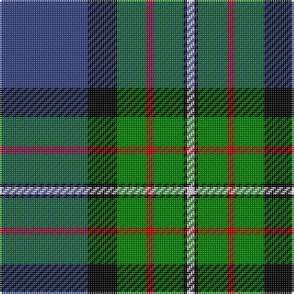

In pattern [BKGRGKW](/patterns/bkgrgkw/).

This was sourced from weddslist.  It is a [7 stripes tartan](/stripes/stripes7/).

Original link http://www.weddslist.com/cgi-bin/tartans/pg.pl?source=sts

## Thread count
B/48 K16 G16 R4 G16 K2 LN/4

## Palette
Each colour and its ΔE from the base-6 reference it is a variant of.

| Colour | Shade | Base | ΔE (OKLab) |
|---|---|---|---|
| B | <code style="background-color:#304080;">#304080</code> `#304080` | B <code style="background-color:#2A418A;">#2A418A</code> | 0.02 |
| G | <code style="background-color:#008000;">#008000</code> `#008000` | G <code style="background-color:#006100;">#006100</code> | 0.10 |
| K | <code style="background-color:#000000;">#000000</code> `#000000` | K <code style="background-color:#000000;">#000000</code> | 0.00 |
| LN | <code style="background-color:#E0E0E0;">#E0E0E0</code> `#E0E0E0` | W <code style="background-color:#F7F7F7;">#F7F7F7</code> | 0.07 |
| R | <code style="background-color:#C00000;">#C00000</code> `#C00000` | R <code style="background-color:#CC0000;">#CC0000</code> | 0.03 |

# Sample pattern

## Nearest tartans

The nearest existing variants by ΔTartan distance.

1. [MacLaren](/setts/s7/b24k8g8r2g8k1y2x2~b304080-g008000-k000000-rc00000-yf0c000/) — ΔT 0.14
1. [MacFadzean](/setts/s6/b48w2k20g22r3g4x2~b304080-g008000-k000000-rc00000-we0e0e0/) — ΔT 0.54
1. [Colquhoun](/setts/s7/b4k2b16w1k8g24r4x2~b304080-g008000-k000000-rc00000-we0e0e0/) — ΔT 0.71
1. [Gillies](/setts/s8/b32k12b12g6r6g18k2y3x2~b304080-g008000-k000000-rc00000-yf0c000/) — ΔT 0.90
1. [MacNeil 3](/setts/s8/g45w2r3k15r3b15r3b15x2~b304080-g008000-k000000-rc00000-we0e0e0/) — ΔT 0.94
1. [Ogilvie 1](/setts/s9/b24y2k8g16k1g3k1g3r4x2~b304080-g008000-k000000-rc00000-yf0c000/) — ΔT 0.94
1. [Ebdon Muir (Personal)](/setts/s9/b4ba40k15g10b2g10b2g10w4x2~b780078-ba000058-g00801c-k101010-wf0f0c4/) — ΔT 0.95
1. [Sandelin #2 (Personal)](/setts/s8/w10b2w1b35g10y3g10r4x2~b141e46-g003c14-rdc0000-we0e0e0-yc89600/) — ΔT 1.00
1. [Wishart Htg (Clan)](/setts/s7/k7b4g31b3y2b27w4x2~b2c2c80-g004c00-k000000-wc8c8c8-ye8c000/) — ΔT 1.00
1. [Ferguson of Atholl Clan](/setts/s7/b24k8g8r2g8k1w2x2~b1860a8-g006818-k101010-rc80000-wfcfcfc/) — ΔT 1.01

## Neighbour map

Every grey dot is one of 15726 variants placed by the first two principal components of the ΔTartan feature space (44% of its variance). Red is this tartan; blue dots are its nearest — click one to open its page.

<svg viewBox="0 0 640 380" role="img" style="max-width:100%;height:auto;border:1px solid #e0e0e0;border-radius:4px;display:block" xmlns="http://www.w3.org/2000/svg"><image href="/nn/cloud.v1.png" width="640" height="380"/><a href="/setts/s7/b24k8g8r2g8k1y2x2~b304080-g008000-k000000-rc00000-yf0c000/"><circle cx="233.1" cy="146.5" r="4" fill="#3465a4"><title>MacLaren</title></circle></a><a href="/setts/s6/b48w2k20g22r3g4x2~b304080-g008000-k000000-rc00000-we0e0e0/"><circle cx="256.1" cy="154.5" r="4" fill="#3465a4"><title>MacFadzean</title></circle></a><a href="/setts/s7/b4k2b16w1k8g24r4x2~b304080-g008000-k000000-rc00000-we0e0e0/"><circle cx="209.3" cy="147.7" r="4" fill="#3465a4"><title>Colquhoun</title></circle></a><a href="/setts/s8/b32k12b12g6r6g18k2y3x2~b304080-g008000-k000000-rc00000-yf0c000/"><circle cx="218.8" cy="167.3" r="4" fill="#3465a4"><title>Gillies</title></circle></a><a href="/setts/s8/g45w2r3k15r3b15r3b15x2~b304080-g008000-k000000-rc00000-we0e0e0/"><circle cx="227.0" cy="134.4" r="4" fill="#3465a4"><title>MacNeil 3</title></circle></a><a href="/setts/s9/b24y2k8g16k1g3k1g3r4x2~b304080-g008000-k000000-rc00000-yf0c000/"><circle cx="206.8" cy="125.2" r="4" fill="#3465a4"><title>Ogilvie 1</title></circle></a><a href="/setts/s9/b4ba40k15g10b2g10b2g10w4x2~b780078-ba000058-g00801c-k101010-wf0f0c4/"><circle cx="203.7" cy="139.8" r="4" fill="#3465a4"><title>Ebdon Muir (Personal)</title></circle></a><a href="/setts/s8/w10b2w1b35g10y3g10r4x2~b141e46-g003c14-rdc0000-we0e0e0-yc89600/"><circle cx="268.8" cy="114.4" r="4" fill="#3465a4"><title>Sandelin #2 (Personal)</title></circle></a><a href="/setts/s7/k7b4g31b3y2b27w4x2~b2c2c80-g004c00-k000000-wc8c8c8-ye8c000/"><circle cx="243.3" cy="166.8" r="4" fill="#3465a4"><title>Wishart Htg (Clan)</title></circle></a><a href="/setts/s7/b24k8g8r2g8k1w2x2~b1860a8-g006818-k101010-rc80000-wfcfcfc/"><circle cx="250.3" cy="153.7" r="4" fill="#3465a4"><title>Ferguson of Atholl Clan</title></circle></a><circle cx="231.3" cy="146.0" r="5" fill="#c00000"/></svg>

ID: /setts/s7/b24k8g8r2g8k1w2x2~b304080-g008000-k000000-rc00000-we0e0e0/
