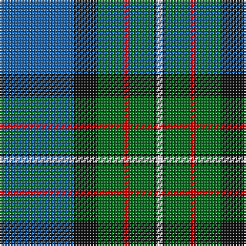

In pattern [BKGRGKW](/stripes/bkgrgkw/).

This was sourced from register-of-tartans.  It is a [7 stripe tartan](/stripes/stripes7/).

Original link https://www.tartanregister.gov.uk/tartanDetails.aspx?ref=1165

## Register references

External register numbers recorded for this tartan.

- Scottish Register of Tartans: [1165](https://www.tartanregister.gov.uk/tartanDetails.aspx?ref=1165)
- Scottish Tartans Authority (ITI): 337
- Scottish Tartans World Register: 337

## Thread count
B/48 K16 G16 R4 G16 K2 W/4

## Palette
Each colour and its ΔE from the base-6 reference it is a variant of.

| Colour | Shade | Base | ΔE (OKLab) |
|---|---|---|---|
| B | <code style="background-color:#1860A8;">#1860A8</code> `#1860A8` | B <code style="background-color:#2A418A;">#2A418A</code> | 0.09 |
| G | <code style="background-color:#006818;">#006818</code> `#006818` | G <code style="background-color:#006100;">#006100</code> | 0.02 |
| K | <code style="background-color:#101010;">#101010</code> `#101010` | K <code style="background-color:#000000;">#000000</code> | 0.17 |
| R | <code style="background-color:#C80000;">#C80000</code> `#C80000` | R <code style="background-color:#CC0000;">#CC0000</code> | 0.01 |
| W | <code style="background-color:#FCFCFC;">#FCFCFC</code> `#FCFCFC` | W <code style="background-color:#F7F7F7;">#F7F7F7</code> | 0.01 |

# Sample pattern

## Nearest tartans

The nearest existing variants by ΔTartan distance.

1. [MacCord / McCord (Personal)](/setts/s7/dg6r2db1r3db16g20w2~x2/) — ΔT 0.75
1. [MX-5 Owners' Club](/setts/s7/r6db27t2g2t2g30w4~x2/) — ΔT 0.96
1. [McFadden (Personal)](/setts/s8/db18dp2db16k13g3k2g42lo3~x2/) — ΔT 0.97
1. [Dollar Academy (1999) (Corporate)](/setts/s8/w2db19k4db4k4g9db2k1~x4/) — ΔT 0.98
1. [Ferguson of Athol](/setts/s7/db24k8g8r2g8k1w2~x2/) — ΔT 1.01
1. [MacLaren](/setts/s7/db24k8g8r2g8k1ly2~x2/) — ΔT 1.04
1. [Ferguson (Tarlogie)](/setts/s9/b24k8g8r2g4k1w2k1g4~x2/) — ΔT 1.04
1. [Hardie Clan Tartan Tartan Number: 3903. Earliest known date: 2001 Designed by Paul Hardie of Ecclesmachan, West Lothian so that the Hardie family could have their own tartan. Hardie's have worn the MacHardie tartan till now. See products available Copyright © Blair Urquhart, Comrie, 2015](/setts/s6/m4g9w2g24db37r3~x2/) — ΔT 1.07
1. [Phoenix Police Honor Guard](/setts/s5/db10k3t65dg56ly6/) — ΔT 1.08
1. [Weisfeld (Name)](/setts/s7/k6db3g28w1db28db2w3~x2/) — ΔT 1.08

## Neighbour map

Every grey dot is one of 14299 variants placed by the first two principal components of the ΔTartan feature space (44% of its variance). Red is this tartan; blue dots are its nearest — click one to open its page.

<svg viewBox="0 0 640 380" role="img" style="max-width:100%;height:auto;border:1px solid #e0e0e0;border-radius:4px;display:block" xmlns="http://www.w3.org/2000/svg"><image href="/nn/cloud.v1.png" width="640" height="380"/><a href="/setts/s7/dg6r2db1r3db16g20w2~x2/"><circle cx="226.6" cy="157.6" r="4" fill="#3465a4"><title>MacCord / McCord (Personal)</title></circle></a><a href="/setts/s7/r6db27t2g2t2g30w4~x2/"><circle cx="242.9" cy="158.5" r="4" fill="#3465a4"><title>MX-5 Owners' Club</title></circle></a><a href="/setts/s8/db18dp2db16k13g3k2g42lo3~x2/"><circle cx="270.5" cy="160.1" r="4" fill="#3465a4"><title>McFadden (Personal)</title></circle></a><a href="/setts/s8/w2db19k4db4k4g9db2k1~x4/"><circle cx="284.3" cy="169.8" r="4" fill="#3465a4"><title>Dollar Academy (1999) (Corporate)</title></circle></a><a href="/setts/s7/db24k8g8r2g8k1w2~x2/"><circle cx="234.9" cy="146.5" r="4" fill="#3465a4"><title>Ferguson of Athol</title></circle></a><a href="/setts/s7/db24k8g8r2g8k1ly2~x2/"><circle cx="236.5" cy="147.1" r="4" fill="#3465a4"><title>MacLaren</title></circle></a><a href="/setts/s9/b24k8g8r2g4k1w2k1g4~x2/"><circle cx="245.1" cy="127.0" r="4" fill="#3465a4"><title>Ferguson (Tarlogie)</title></circle></a><a href="/setts/s6/m4g9w2g24db37r3~x2/"><circle cx="299.4" cy="180.5" r="4" fill="#3465a4"><title>Hardie Clan Tartan Tartan Number: 3903. Earliest known date: 2001 Designed by Paul Hardie of Ecclesmachan, West Lothian so that the Hardie family could have their own tartan. Hardie's have worn the MacHardie tartan till now. See products available Copyright © Blair Urquhart, Comrie, 2015</title></circle></a><a href="/setts/s5/db10k3t65dg56ly6/"><circle cx="285.2" cy="181.3" r="4" fill="#3465a4"><title>Phoenix Police Honor Guard</title></circle></a><a href="/setts/s7/k6db3g28w1db28db2w3~x2/"><circle cx="268.8" cy="152.0" r="4" fill="#3465a4"><title>Weisfeld (Name)</title></circle></a><circle cx="253.7" cy="157.0" r="5" fill="#c00000"/></svg>

ID: /setts/s7/b24k8g8r2g8k1w2~x2/
