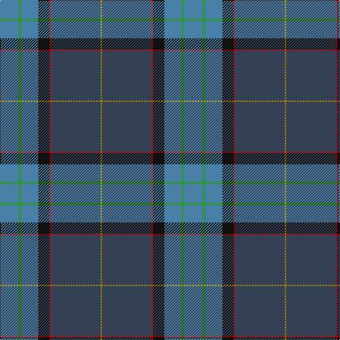

In pattern [BGBKRBY](/patterns/bgbkrby/).

This was sourced from tartans-authority.  It is a [7 stripes tartan](/stripes/stripes7/).

Original link http://www.tartansauthority.com/tartan-ferret/display/7507/

## Attestations

This cloth appears in 3 source records; the oldest owns this page.

- Nov 2007 — Spirit of South Lanarkshire (Distric (tartans-authority, [record](http://www.tartansauthority.com/tartan-ferret/display/7507/))
- undated — Spirit of South Lanarkshire (register-of-tartans, [record](https://www.tartanregister.gov.uk/tartanDetails.aspx?ref=5545))
- undated — Spirit of South Lanarkshire District Tartan Tartan Number: 7507. Earliest known date: Nov 2007 This council previously used No.4017 which was designed by the late Don Smith of Heraldic Graphics. Copyright problems were experienced with his estate and the council ceased using this tartan and chose a new design from the Scottish Tartans Authority. Woven by House of Edgar and made-up by Robert Matheson of the Kilt Centre in Hamilton. The basis for this design is the Hamilton clan tartan incorporating the requested colours of blue, light blue, green, gold and black with the addition of the Hamilton red as a highlight. See products available Copyright © Blair Urquhart, Comrie, 2015 (house-of-tartan, [record](http://www.house-of-tartan.scotland.net/house/TartanViewjs.asp?colr=Def&tnam=7507))

## Thread count
B/26 G4 B24 K16 R2 N70 DY/2

## Palette
Each colour and its ΔE from the base-6 reference it is a variant of.

| Colour | Shade | Base | ΔE (OKLab) |
|---|---|---|---|
| B | <code style="background-color:#4880A8;">#4880A8</code> `#4880A8` | B <code style="background-color:#2A418A;">#2A418A</code> | 0.19 |
| DY | <code style="background-color:#BC8C00;">#BC8C00</code> `#BC8C00` | Y <code style="background-color:#F2BF00;">#F2BF00</code> | 0.16 |
| G | <code style="background-color:#289C18;">#289C18</code> `#289C18` | G <code style="background-color:#006100;">#006100</code> | 0.19 |
| K | <code style="background-color:#101010;">#101010</code> `#101010` | K <code style="background-color:#000000;">#000000</code> | 0.17 |
| N | <code style="background-color:#344054;">#344054</code> `#344054` | B <code style="background-color:#2A418A;">#2A418A</code> | 0.09 |
| R | <code style="background-color:#C80000;">#C80000</code> `#C80000` | R <code style="background-color:#CC0000;">#CC0000</code> | 0.01 |

# Sample pattern

## Nearest tartans

The nearest existing variants by ΔTartan distance.

1. [Lawrie](/setts/s7/b12g4b2ga50ba32k4ba8-b700070-ba2c2c84-g784400-ga007040-k101010/) — ΔT 1.08
1. [Heriot Watt University (Corporate)](/setts/s10/g10y2b8ba36g4r4g32bb2b64ba6-b1474b4-ba14283c-bb202060-g285800-ra00000-yd09800/) — ΔT 1.17
1. [Lowry](/setts/s7/b12y4b2g50ba32k4ba8-b440044-ba282878-g006438-k101010-yd8b000/) — ΔT 1.17
1. [Yorkland](/setts/s8/b60r4b8w2ra22g8y4g44-b304080-g008000-rc00000-ra806050-we0e0e0-yf0c000/) — ΔT 1.21
1. [The Climb (Fashion)](/setts/s8/g4ga18r32ra4b60g6ga12w2-b1474b4-g5c6428-ga285800-r880000-rac80000-we8ccb8/) — ΔT 1.22
1. [Lawrie Clan Tartan Tartan Number: 3202. Earliest known date: 2000 One of a set of three similar designs for Laurie, Lawrie and Lowry, designed by Peter MacDonald for Iain Laurie. See products available Copyright © Blair Urquhart, Comrie, 2015](/setts/s7/b12r4b2g50ba32k4ba8-b440044-ba2c2c80-g006818-k101010-r945008/) — ΔT 1.25
1. [Laurie](/setts/s7/b12r4b2g50ba32k4ba8-b6c006c-ba28287c-g005c34-k101010-rc80000/) — ΔT 1.27
1. [Laurie Clan Tartan Tartan Number: 3201. Earliest known date: 2000 One of a set of three similar designs for Laurie, Lawrie and Lowry, designed by Peter MacDonald for Iain Laurie. See products available Copyright © Blair Urquhart, Comrie, 2015](/setts/s7/b12r4b2g50ba32k4ba8-b440044-ba2c2c80-g006818-k101010-rc80000/) — ΔT 1.27
1. [MacFadzean](/setts/s6/b96w4k40g44r6g8-b2c4084-g005020-k101010-rdc0000-we0e0e0/) — ΔT 1.29
1. [Mulcahy (Name)](/setts/s9/b66k2b10k16g16r4g30y2w4-b2c2c80-g006818-k101010-rc80000-we0e0e0-ye8c000/) — ΔT 1.29

## Neighbour map

Every grey dot is one of 15726 variants placed by the first two principal components of the ΔTartan feature space (44% of its variance). Red is this tartan; blue dots are its nearest — click one to open its page.

<svg viewBox="0 0 640 380" role="img" style="max-width:100%;height:auto;border:1px solid #e0e0e0;border-radius:4px;display:block" xmlns="http://www.w3.org/2000/svg"><image href="/nn/cloud.v1.png" width="640" height="380"/><a href="/setts/s7/b12g4b2ga50ba32k4ba8-b700070-ba2c2c84-g784400-ga007040-k101010/"><circle cx="305.8" cy="164.7" r="4" fill="#3465a4"><title>Lawrie</title></circle></a><a href="/setts/s10/g10y2b8ba36g4r4g32bb2b64ba6-b1474b4-ba14283c-bb202060-g285800-ra00000-yd09800/"><circle cx="273.3" cy="116.7" r="4" fill="#3465a4"><title>Heriot Watt University (Corporate)</title></circle></a><a href="/setts/s7/b12y4b2g50ba32k4ba8-b440044-ba282878-g006438-k101010-yd8b000/"><circle cx="298.8" cy="163.2" r="4" fill="#3465a4"><title>Lowry</title></circle></a><a href="/setts/s8/b60r4b8w2ra22g8y4g44-b304080-g008000-rc00000-ra806050-we0e0e0-yf0c000/"><circle cx="271.0" cy="125.2" r="4" fill="#3465a4"><title>Yorkland</title></circle></a><a href="/setts/s8/g4ga18r32ra4b60g6ga12w2-b1474b4-g5c6428-ga285800-r880000-rac80000-we8ccb8/"><circle cx="261.6" cy="122.2" r="4" fill="#3465a4"><title>The Climb (Fashion)</title></circle></a><a href="/setts/s7/b12r4b2g50ba32k4ba8-b440044-ba2c2c80-g006818-k101010-r945008/"><circle cx="299.5" cy="163.5" r="4" fill="#3465a4"><title>Lawrie Clan Tartan Tartan Number: 3202. Earliest known date: 2000 One of a set of three similar designs for Laurie, Lawrie and Lowry, designed by Peter MacDonald for Iain Laurie. See products available Copyright © Blair Urquhart, Comrie, 2015</title></circle></a><a href="/setts/s7/b12r4b2g50ba32k4ba8-b6c006c-ba28287c-g005c34-k101010-rc80000/"><circle cx="319.2" cy="170.4" r="4" fill="#3465a4"><title>Laurie</title></circle></a><a href="/setts/s7/b12r4b2g50ba32k4ba8-b440044-ba2c2c80-g006818-k101010-rc80000/"><circle cx="294.7" cy="160.4" r="4" fill="#3465a4"><title>Laurie Clan Tartan Tartan Number: 3201. Earliest known date: 2000 One of a set of three similar designs for Laurie, Lawrie and Lowry, designed by Peter MacDonald for Iain Laurie. See products available Copyright © Blair Urquhart, Comrie, 2015</title></circle></a><a href="/setts/s6/b96w4k40g44r6g8-b2c4084-g005020-k101010-rdc0000-we0e0e0/"><circle cx="309.8" cy="176.4" r="4" fill="#3465a4"><title>MacFadzean</title></circle></a><a href="/setts/s9/b66k2b10k16g16r4g30y2w4-b2c2c80-g006818-k101010-rc80000-we0e0e0-ye8c000/"><circle cx="295.3" cy="108.7" r="4" fill="#3465a4"><title>Mulcahy (Name)</title></circle></a><circle cx="321.8" cy="133.4" r="5" fill="#c00000"/></svg>

ID: /setts/s7/b26g4b24k16r2ba70y2-b4880a8-ba344054-g289c18-k101010-rc80000-ybc8c00/
