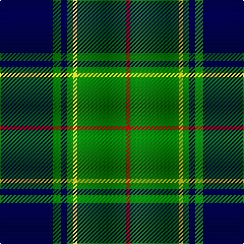

In pattern [BGBGYGR](/patterns/bgbgygr/).

This was sourced from weddslist.  It is a [7 stripes tartan](/stripes/stripes7/).

Original link http://www.weddslist.com/cgi-bin/tartans/pg.pl?source=sts

## Thread count
DB/52 G8 DB6 G6 Y4 G48 R/4

## Palette
Each colour and its ΔE from the base-6 reference it is a variant of.

| Colour | Shade | Base | ΔE (OKLab) |
|---|---|---|---|
| DB | <code style="background-color:#000050;">#000050</code> `#000050` | B <code style="background-color:#2A418A;">#2A418A</code> | 0.21 |
| G | <code style="background-color:#008000;">#008000</code> `#008000` | G <code style="background-color:#006100;">#006100</code> | 0.10 |
| R | <code style="background-color:#C00000;">#C00000</code> `#C00000` | R <code style="background-color:#CC0000;">#CC0000</code> | 0.03 |
| Y | <code style="background-color:#F0C000;">#F0C000</code> `#F0C000` | Y <code style="background-color:#F2BF00;">#F2BF00</code> | 0.00 |

# Sample pattern

## Nearest tartans

The nearest existing variants by ΔTartan distance.

1. [Land's End](/setts/s8/g2k26ga2k2ga9r2ga9k2x2~g003000-ga008000-k000030-r802040/) — ΔT 1.05
1. [Keppoch](/setts/s7/k5g2k5g2b8g25w4x2~b2c2c80-g006818-k101010-wf8f8f8/) — ΔT 1.09
1. [Rowan](/setts/s9/b1k1b8y1g12y1b8k1b1x2~b304080-g008000-k000000-yf0c000/) — ΔT 1.11
1. [Hartmann (Personal)](/setts/s8/b4k8w3k8g4k4g32k4x2~b2888c4-g006818-k101010-we0e0e0/) — ΔT 1.14
1. [MacIntyre Hunting (VS)](/setts/s6/g4b12r3b12g32w4x2~b202060-g006818-rc80000-wfcfcfc/) — ΔT 1.16
1. [Banff Centennial](/setts/s8/k1b1k1b12g12k1g1y1x4~b1870a4-g004c00-k000000-yfcb000/) — ΔT 1.16
1. [Tennessee State American District Tartan Tartan Number: 3067. Earliest known date: 1999 Official state tartan recorded at the Grandfather Mountain Highland Games, 1999. This ties in with the tartan displayed on the Tennessee Highland Game website. Colour choice explained as follows: Green for Agriculture; Blue for the Smoky Mountains; Purple for the State Flower the Iris; Red for Sacrifices of Veterans and Pioneers of the Volunteer State; White to symbolize the 3 Grand Divisions of the State of Tennessee. See products available Copyright © Blair Urquhart, Comrie, 2015](/setts/s10/r2b12w1b1g1r1g7b1g12w1x4~b1c0070-g006818-rc80000-we0e0e0/) — ΔT 1.19
1. [MacIntyre L](/setts/s6/g4b12r3b12g32w4~b000064-g004c00-rc80000-wd0d0d0/) — ΔT 1.19
1. [St. Andrew Society, Sao Paulo (Corp)](/setts/s6/b5w3b36g38y5g5x2~b2c2c80-g006818-we0e0e0-ye8c000/) — ΔT 1.19
1. [Brunton (Personal)](/setts/s8/k7r3k27g27y3g3y3g3x2~g007c48-k101010-rc80000-yc4bc68/) — ΔT 1.22

## Neighbour map

Every grey dot is one of 15726 variants placed by the first two principal components of the ΔTartan feature space (44% of its variance). Red is this tartan; blue dots are its nearest — click one to open its page.

<svg viewBox="0 0 640 380" role="img" style="max-width:100%;height:auto;border:1px solid #e0e0e0;border-radius:4px;display:block" xmlns="http://www.w3.org/2000/svg"><image href="/nn/cloud.v1.png" width="640" height="380"/><a href="/setts/s8/g2k26ga2k2ga9r2ga9k2x2~g003000-ga008000-k000030-r802040/"><circle cx="321.7" cy="180.4" r="4" fill="#3465a4"><title>Land's End</title></circle></a><a href="/setts/s7/k5g2k5g2b8g25w4x2~b2c2c80-g006818-k101010-wf8f8f8/"><circle cx="294.3" cy="187.4" r="4" fill="#3465a4"><title>Keppoch</title></circle></a><a href="/setts/s9/b1k1b8y1g12y1b8k1b1x2~b304080-g008000-k000000-yf0c000/"><circle cx="294.1" cy="176.5" r="4" fill="#3465a4"><title>Rowan</title></circle></a><a href="/setts/s8/b4k8w3k8g4k4g32k4x2~b2888c4-g006818-k101010-we0e0e0/"><circle cx="302.1" cy="190.1" r="4" fill="#3465a4"><title>Hartmann (Personal)</title></circle></a><a href="/setts/s6/g4b12r3b12g32w4x2~b202060-g006818-rc80000-wfcfcfc/"><circle cx="292.2" cy="211.3" r="4" fill="#3465a4"><title>MacIntyre Hunting (VS)</title></circle></a><a href="/setts/s8/k1b1k1b12g12k1g1y1x4~b1870a4-g004c00-k000000-yfcb000/"><circle cx="272.3" cy="174.3" r="4" fill="#3465a4"><title>Banff Centennial</title></circle></a><a href="/setts/s10/r2b12w1b1g1r1g7b1g12w1x4~b1c0070-g006818-rc80000-we0e0e0/"><circle cx="283.0" cy="166.3" r="4" fill="#3465a4"><title>Tennessee State American District Tartan Tartan Number: 3067. Earliest known date: 1999 Official state tartan recorded at the Grandfather Mountain Highland Games, 1999. This ties in with the tartan displayed on the Tennessee Highland Game website. Colour choice explained as follows: Green for Agriculture; Blue for the Smoky Mountains; Purple for the State Flower the Iris; Red for Sacrifices of Veterans and Pioneers of the Volunteer State; White to symbolize the 3 Grand Divisions of the State of Tennessee. See products available Copyright © Blair Urquhart, Comrie, 2015</title></circle></a><a href="/setts/s6/g4b12r3b12g32w4~b000064-g004c00-rc80000-wd0d0d0/"><circle cx="298.0" cy="217.8" r="4" fill="#3465a4"><title>MacIntyre L</title></circle></a><a href="/setts/s6/b5w3b36g38y5g5x2~b2c2c80-g006818-we0e0e0-ye8c000/"><circle cx="290.8" cy="200.5" r="4" fill="#3465a4"><title>St. Andrew Society, Sao Paulo (Corp)</title></circle></a><a href="/setts/s8/k7r3k27g27y3g3y3g3x2~g007c48-k101010-rc80000-yc4bc68/"><circle cx="249.0" cy="189.0" r="4" fill="#3465a4"><title>Brunton (Personal)</title></circle></a><circle cx="284.9" cy="183.3" r="5" fill="#c00000"/></svg>

ID: /setts/s7/b26g4b3g3y2g24r2x2~b000050-g008000-rc00000-yf0c000/
