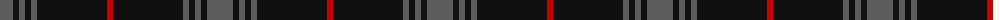
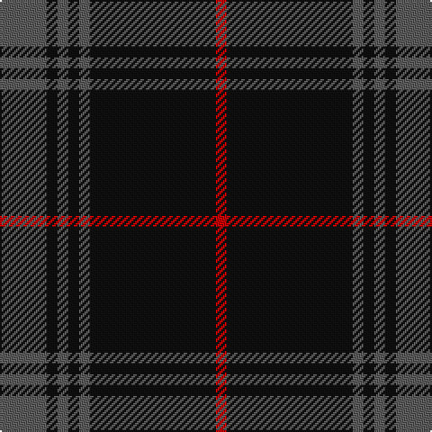

In pattern [BKBKBKR](/patterns/bkbkbkr/).

This was sourced from tartans-authority.  It is a [7 stripes tartan](/stripes/stripes7/).

Original link http://www.tartansauthority.com/tartan-ferret/display/8552/

## Thread count
N/26 K6 N6 K6 N6 K70 R/6

## Palette
Each colour and its ΔE from the base-6 reference it is a variant of.

| Colour | Shade | Base | ΔE (OKLab) |
|---|---|---|---|
| K | <code style="background-color:#101010;">#101010</code> `#101010` | K <code style="background-color:#000000;">#000000</code> | 0.17 |
| N | <code style="background-color:#5C5C5C;">#5C5C5C</code> `#5C5C5C` | B <code style="background-color:#2A418A;">#2A418A</code> | 0.15 |
| R | <code style="background-color:#C80000;">#C80000</code> `#C80000` | R <code style="background-color:#CC0000;">#CC0000</code> | 0.01 |

# Sample pattern

## Nearest tartans

The nearest existing variants by ΔTartan distance.

1. [Nightstalker (Corporate)](/setts/s8/b8k8b16k8b8k64g8k8-b5c5c5c-g006818-k101010/) — ΔT 0.93
1. [City Building (Glasgow) LLP](/setts/s10/b6k4b72k10b6k16y4k16b12k6-b5c5c5c-k101010-ya0a0a0/) — ΔT 1.30
1. [Spirit of Glyndwr Gold Welsh Fashion Tartan Tartan Number: 8351. Earliest known date: 25th May 2010 Ysbryd yr aur Glyndwr, a modern day plaid, designed and woven in Wales to commemorate Owain Glyn Dwr, crowned Welsh Prince 1406. Colours represent the slates and dark waters of Mid and North Wales, Glyndwrs homeland, with the added Gold yarn representing the gold colour in his standard (flag). Woven by the Cambrian Woollen Mill, Mid Wales exclusively for Wales Tartan Centres, Swansea. See products available Copyright © Blair Urquhart, Comrie, 2015](/setts/s8/k24b18k11b4k11b18k53y4-b5c5c5c-k101010-ybc8c00/) — ΔT 1.32
1. [Spirit of Glyndwr Gold (Fashion)](/setts/s8/k24b18k11b4k11b18k53r4-b5c5c5c-k101010-rc80000/) — ΔT 1.33
1. [Korner-MacPherson (Personal)](/setts/s7/b10r6b70k56b8k22b4-b5c5c5c-k101010-rc80000/) — ΔT 1.50
1. [Grey Spirit (Fashion)](/setts/s6/b12k34b12k34b90k8-b5c5c5c-k101010/) — ΔT 1.53
1. [TACC (Corporate)](/setts/s7/b68k14b24k80b6k8ba6-b5c5c5c-ba5c8ca8-k101010/) — ΔT 1.54
1. [Witches' Blood, The](/setts/s10/k44b34k4b8k4b4k74b8k4r6-b505050-k101010-ra00000/) — ΔT 1.56
1. [Pride of Scotland Platinum Fashion Tartan Tartan Number: 6850. Earliest known date: 01/01/2006 ONLY FOR DISPLAY PURPOSE. Design owned by McCalls of Aberdeen and woven exclusively by Lochcarron of Scotland. See products available Copyright © Blair Urquhart, Comrie, 2015](/setts/s11/k14b4y4b4k26b4k4y4b26k52w4-b5c5c5c-k101010-wc49cd8-yb0b0b0/) — ΔT 1.58
1. [Mountain Rescue Association Honor Guard](/setts/s7/k64b4k12b4k26ba60w4-b0000ff-ba2f4f4f-k101010-wffffff/) — ΔT 1.58

## Neighbour map

Every grey dot is one of 15726 variants placed by the first two principal components of the ΔTartan feature space (44% of its variance). Red is this tartan; blue dots are its nearest — click one to open its page.

<svg viewBox="0 0 640 380" role="img" style="max-width:100%;height:auto;border:1px solid #e0e0e0;border-radius:4px;display:block" xmlns="http://www.w3.org/2000/svg"><image href="/nn/cloud.v1.png" width="640" height="380"/><a href="/setts/s8/b8k8b16k8b8k64g8k8-b5c5c5c-g006818-k101010/"><circle cx="458.3" cy="233.0" r="4" fill="#3465a4"><title>Nightstalker (Corporate)</title></circle></a><a href="/setts/s10/b6k4b72k10b6k16y4k16b12k6-b5c5c5c-k101010-ya0a0a0/"><circle cx="450.5" cy="175.3" r="4" fill="#3465a4"><title>City Building (Glasgow) LLP</title></circle></a><a href="/setts/s8/k24b18k11b4k11b18k53y4-b5c5c5c-k101010-ybc8c00/"><circle cx="453.6" cy="232.9" r="4" fill="#3465a4"><title>Spirit of Glyndwr Gold Welsh Fashion Tartan Tartan Number: 8351. Earliest known date: 25th May 2010 Ysbryd yr aur Glyndwr, a modern day plaid, designed and woven in Wales to commemorate Owain Glyn Dwr, crowned Welsh Prince 1406. Colours represent the slates and dark waters of Mid and North Wales, Glyndwrs homeland, with the added Gold yarn representing the gold colour in his standard (flag). Woven by the Cambrian Woollen Mill, Mid Wales exclusively for Wales Tartan Centres, Swansea. See products available Copyright © Blair Urquhart, Comrie, 2015</title></circle></a><a href="/setts/s8/k24b18k11b4k11b18k53r4-b5c5c5c-k101010-rc80000/"><circle cx="460.3" cy="235.1" r="4" fill="#3465a4"><title>Spirit of Glyndwr Gold (Fashion)</title></circle></a><a href="/setts/s7/b10r6b70k56b8k22b4-b5c5c5c-k101010-rc80000/"><circle cx="387.1" cy="208.1" r="4" fill="#3465a4"><title>Korner-MacPherson (Personal)</title></circle></a><a href="/setts/s6/b12k34b12k34b90k8-b5c5c5c-k101010/"><circle cx="433.2" cy="257.4" r="4" fill="#3465a4"><title>Grey Spirit (Fashion)</title></circle></a><a href="/setts/s7/b68k14b24k80b6k8ba6-b5c5c5c-ba5c8ca8-k101010/"><circle cx="367.7" cy="219.5" r="4" fill="#3465a4"><title>TACC (Corporate)</title></circle></a><a href="/setts/s10/k44b34k4b8k4b4k74b8k4r6-b505050-k101010-ra00000/"><circle cx="512.4" cy="199.7" r="4" fill="#3465a4"><title>Witches' Blood, The</title></circle></a><a href="/setts/s11/k14b4y4b4k26b4k4y4b26k52w4-b5c5c5c-k101010-wc49cd8-yb0b0b0/"><circle cx="389.6" cy="168.9" r="4" fill="#3465a4"><title>Pride of Scotland Platinum Fashion Tartan Tartan Number: 6850. Earliest known date: 01/01/2006 ONLY FOR DISPLAY PURPOSE. Design owned by McCalls of Aberdeen and woven exclusively by Lochcarron of Scotland. See products available Copyright © Blair Urquhart, Comrie, 2015</title></circle></a><a href="/setts/s7/k64b4k12b4k26ba60w4-b0000ff-ba2f4f4f-k101010-wffffff/"><circle cx="374.1" cy="198.4" r="4" fill="#3465a4"><title>Mountain Rescue Association Honor Guard</title></circle></a><circle cx="449.8" cy="211.2" r="5" fill="#c00000"/></svg>

ID: /setts/s7/b26k6b6k6b6k70r6-b5c5c5c-k101010-rc80000/
