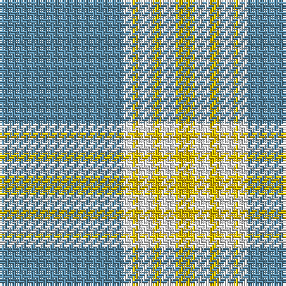

In pattern [BWYWYWY](/patterns/bwywywy/).

This was sourced from tartans-authority.  It is a [7 stripes tartan](/stripes/stripes7/).

Original link http://www.tartansauthority.com/tartan-ferret/display/10007/

## Attestations

This cloth appears in 2 source records; the oldest owns this page.

- Jan. 2004 — Argentine Flag (Fashion) (tartans-authority, [record](http://www.tartansauthority.com/tartan-ferret/display/10007/))
- undated — Argentine Flag Fashion Tartan Tartan Number: 10007. Earliest known date: Jan. 2004 This tartan has been created to be a seamlessly tileable version of the Argentine flag for a computer screen. See products available Copyright © Blair Urquhart, Comrie, 2015 (house-of-tartan, [record](http://www.house-of-tartan.scotland.net/house/TartanViewjs.asp?colr=Def&tnam=10007))

## Thread count
B/52 LN4 Y2 LN6 Y4 LN6 Y/8

## Palette
Each colour and its ΔE from the base-6 reference it is a variant of.

| Colour | Shade | Base | ΔE (OKLab) |
|---|---|---|---|
| B | <code style="background-color:#5C8CA8;">#5C8CA8</code> `#5C8CA8` | B <code style="background-color:#2A418A;">#2A418A</code> | 0.23 |
| LN | <code style="background-color:#E0E0E0;">#E0E0E0</code> `#E0E0E0` | W <code style="background-color:#F7F7F7;">#F7F7F7</code> | 0.07 |
| Y | <code style="background-color:#E8C000;">#E8C000</code> `#E8C000` | Y <code style="background-color:#F2BF00;">#F2BF00</code> | 0.02 |

# Sample pattern

## Nearest tartans

The nearest existing variants by ΔTartan distance.

1. [Ingenico](/setts/s6/y50r4y12ya23r4g4x2~g289c18-rc80000-y48a4c0-yae8c000/) — ΔT 1.76
1. [Argentine Flag](/setts/s7/b26w2y1w3y2w3y4x2~b0099cc-wffffff-yffff00/) — ΔT 1.78
1. [Doune (District)](/setts/s9/r10b11k2b3k2b2k8r40w4x2~b5c8ca8-k101010-r888888-wf8f8f8/) — ΔT 1.88
1. [Scotch House (Corporate)](/setts/s8/g52b6w3b2w2b2w16r3x2~b202060-g8c7038-r880000-wa8ace8/) — ΔT 1.89
1. [Machair](/setts/s6/y72b16w9b4w5b16x2~b003c64-we0e0e0-ya08858/) — ΔT 1.91
1. [Carlisle, Ancient](/setts/s5/b11y2r1y2r1x4~b5480b0-rc00000-yf0c000/) — ΔT 1.98
1. [Southern Lakes](/setts/s8/b32k2b4k2b8y29w2k2~b5c8ca8-k000000-wf8f8f8-ya08858/) — ΔT 2.02
1. [Elvan](/setts/s11/y42g10b2g2w2g2y10w6g2w3y2x2~b00008c-g604000-wc8c8c8-yd8c0a4/) — ΔT 2.05
1. [Tailor Ishida, Kobe](/setts/s5/y25r1ya1b9w4x2~b5c5c5c-rdc0000-wffffff-y48a4c0-yac4bc68/) — ΔT 2.09
1. [Longniddry Turquoise (Dance)](/setts/s8/w38k2wa2k2w5g10wa30w4x2~g006818-k101010-w98c8e8-wae0e0e0/) — ΔT 2.09

## Neighbour map

Every grey dot is one of 15726 variants placed by the first two principal components of the ΔTartan feature space (44% of its variance). Red is this tartan; blue dots are its nearest — click one to open its page.

<svg viewBox="0 0 640 380" role="img" style="max-width:100%;height:auto;border:1px solid #e0e0e0;border-radius:4px;display:block" xmlns="http://www.w3.org/2000/svg"><image href="/nn/cloud.v1.png" width="640" height="380"/><a href="/setts/s6/y50r4y12ya23r4g4x2~g289c18-rc80000-y48a4c0-yae8c000/"><circle cx="386.8" cy="196.7" r="4" fill="#3465a4"><title>Ingenico</title></circle></a><a href="/setts/s7/b26w2y1w3y2w3y4x2~b0099cc-wffffff-yffff00/"><circle cx="399.0" cy="141.6" r="4" fill="#3465a4"><title>Argentine Flag</title></circle></a><a href="/setts/s9/r10b11k2b3k2b2k8r40w4x2~b5c8ca8-k101010-r888888-wf8f8f8/"><circle cx="373.7" cy="144.6" r="4" fill="#3465a4"><title>Doune (District)</title></circle></a><a href="/setts/s8/g52b6w3b2w2b2w16r3x2~b202060-g8c7038-r880000-wa8ace8/"><circle cx="412.8" cy="127.6" r="4" fill="#3465a4"><title>Scotch House (Corporate)</title></circle></a><a href="/setts/s6/y72b16w9b4w5b16x2~b003c64-we0e0e0-ya08858/"><circle cx="380.5" cy="181.3" r="4" fill="#3465a4"><title>Machair</title></circle></a><a href="/setts/s5/b11y2r1y2r1x4~b5480b0-rc00000-yf0c000/"><circle cx="407.0" cy="211.2" r="4" fill="#3465a4"><title>Carlisle, Ancient</title></circle></a><a href="/setts/s8/b32k2b4k2b8y29w2k2~b5c8ca8-k000000-wf8f8f8-ya08858/"><circle cx="340.8" cy="162.6" r="4" fill="#3465a4"><title>Southern Lakes</title></circle></a><a href="/setts/s11/y42g10b2g2w2g2y10w6g2w3y2x2~b00008c-g604000-wc8c8c8-yd8c0a4/"><circle cx="408.0" cy="109.7" r="4" fill="#3465a4"><title>Elvan</title></circle></a><a href="/setts/s5/y25r1ya1b9w4x2~b5c5c5c-rdc0000-wffffff-y48a4c0-yac4bc68/"><circle cx="389.2" cy="159.4" r="4" fill="#3465a4"><title>Tailor Ishida, Kobe</title></circle></a><a href="/setts/s8/w38k2wa2k2w5g10wa30w4x2~g006818-k101010-w98c8e8-wae0e0e0/"><circle cx="302.8" cy="145.2" r="4" fill="#3465a4"><title>Longniddry Turquoise (Dance)</title></circle></a><circle cx="449.5" cy="157.2" r="5" fill="#c00000"/></svg>

ID: /setts/s7/b26w2y1w3y2w3y4x2~b5c8ca8-we0e0e0-ye8c000/
