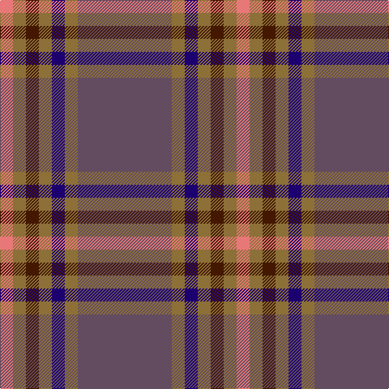

In pattern [BGBGBGR](/patterns/bgbgbgr/).

This was sourced from register-of-tartans.  It is a [7 stripes tartan](/stripes/stripes7/).

Original link https://www.tartanregister.gov.uk/tartanDetails.aspx?ref=2834

## Attestations

This cloth appears in 2 source records; the oldest owns this page.

- 01/01/1983 — Marino (register-of-tartans, [record](https://www.tartanregister.gov.uk/tartanDetails.aspx?ref=2834))
- pre 1983 — Marino (Fashion) (tartans-authority, [record](http://www.tartansauthority.com/tartan-ferret/display/5704/))

## Thread count
LR/16 LT16 DR16 LT16 DB16 LT16 N/116

## Palette
Each colour and its ΔE from the base-6 reference it is a variant of.

| Colour | Shade | Base | ΔE (OKLab) |
|---|---|---|---|
| DB | <code style="background-color:#1C0070;">#1C0070</code> `#1C0070` | B <code style="background-color:#2A418A;">#2A418A</code> | 0.14 |
| DR | <code style="background-color:#441800;">#441800</code> `#441800` | B <code style="background-color:#2A418A;">#2A418A</code> | 0.23 |
| LR | <code style="background-color:#E87878;">#E87878</code> `#E87878` | R <code style="background-color:#CC0000;">#CC0000</code> | 0.19 |
| LT | <code style="background-color:#8C7038;">#8C7038</code> `#8C7038` | G <code style="background-color:#006100;">#006100</code> | 0.18 |
| N | <code style="background-color:#644C60;">#644C60</code> `#644C60` | B <code style="background-color:#2A418A;">#2A418A</code> | 0.12 |

# Sample pattern

## Nearest tartans

The nearest existing variants by ΔTartan distance.

1. [Scotch Mist](/setts/s8/b4r4b4k4b18k3ba38w3x2~b646464-ba444444-k101010-r8c8c8c-we0e0e0/) — ΔT 1.38
1. [Tenmaya Corporate Tartan Tartan Number: 2346. Earliest known date: 1996 May 1996 for Tenmaya Department Store Ltd in Okayama, Japan. Sample in STA Johnston Collection. Designed for British promotion October/November 1996 which demonstrated weaving and woven by Archie Snmall from Selkirk who was sent to Fukuoka to demonstrate weaving. See products available Copyright © Blair Urquhart, Comrie, 2015](/setts/s8/w1b12r1ba1r1ba2r5w1x4~b5c5c5c-ba003c64-rd05054-wc0c0c0/) — ΔT 1.48
1. [Hebridean Granite Fashion Tartan Tartan Number: 6821. Earliest known date: 2005 For a new House of Edgar collection. Intended to emulate the gray morning suit perhaps. See products available Copyright © Blair Urquhart, Comrie, 2015](/setts/s8/r3y4r4b4r18b3ba36w3x2~b383838-ba484848-r888888-we0e0e0-yb0b0b0/) — ΔT 1.52
1. [Balfour blue & brown](/setts/s6/b18y2r6y2r19ra3x2~b304080-r806050-rac00000-yf0c000/) — ΔT 1.63
1. [Cameron, hunting](/setts/s6/r15ra5r30b32r4y3x2~b304080-r806050-rac00000-yf0c000/) — ΔT 1.65
1. [MacArthur-Fox, dress](/setts/s6/b2r16ba3r3ba13ra2x4~b5480b0-ba304080-r800000-rac00000/) — ΔT 1.67
1. [Bressuire (District)](/setts/s7/r1g4y1g3r4b15w1x4~b506878-g006818-r880000-we0e0e0-ybc8c00/) — ΔT 1.69
1. [Tenmaya Check](/setts/s8/w1r12ra1b1ra1b2ra5w1x4~b003c64-r888888-rad05054-wc0c0c0/) — ΔT 1.71
1. [Dama Classic](/setts/s8/g30y3g3y3g12b30k3b5x2~b2e2e2e-g615e57-k181818-ye2d1a3/) — ΔT 1.72
1. [Dundhuin Dress (Personal)](/setts/s5/r62b17y12g8ga8x2~b5f749c-g649848-ga23321b-r905966-yf8e38c/) — ΔT 1.73

## Neighbour map

Every grey dot is one of 15726 variants placed by the first two principal components of the ΔTartan feature space (44% of its variance). Red is this tartan; blue dots are its nearest — click one to open its page.

<svg viewBox="0 0 640 380" role="img" style="max-width:100%;height:auto;border:1px solid #e0e0e0;border-radius:4px;display:block" xmlns="http://www.w3.org/2000/svg"><image href="/nn/cloud.v1.png" width="640" height="380"/><a href="/setts/s8/b4r4b4k4b18k3ba38w3x2~b646464-ba444444-k101010-r8c8c8c-we0e0e0/"><circle cx="328.3" cy="177.1" r="4" fill="#3465a4"><title>Scotch Mist</title></circle></a><a href="/setts/s8/w1b12r1ba1r1ba2r5w1x4~b5c5c5c-ba003c64-rd05054-wc0c0c0/"><circle cx="336.0" cy="177.5" r="4" fill="#3465a4"><title>Tenmaya Corporate Tartan Tartan Number: 2346. Earliest known date: 1996 May 1996 for Tenmaya Department Store Ltd in Okayama, Japan. Sample in STA Johnston Collection. Designed for British promotion October/November 1996 which demonstrated weaving and woven by Archie Snmall from Selkirk who was sent to Fukuoka to demonstrate weaving. See products available Copyright © Blair Urquhart, Comrie, 2015</title></circle></a><a href="/setts/s8/r3y4r4b4r18b3ba36w3x2~b383838-ba484848-r888888-we0e0e0-yb0b0b0/"><circle cx="301.3" cy="167.1" r="4" fill="#3465a4"><title>Hebridean Granite Fashion Tartan Tartan Number: 6821. Earliest known date: 2005 For a new House of Edgar collection. Intended to emulate the gray morning suit perhaps. See products available Copyright © Blair Urquhart, Comrie, 2015</title></circle></a><a href="/setts/s6/b18y2r6y2r19ra3x2~b304080-r806050-rac00000-yf0c000/"><circle cx="316.2" cy="222.9" r="4" fill="#3465a4"><title>Balfour blue &amp; brown</title></circle></a><a href="/setts/s6/r15ra5r30b32r4y3x2~b304080-r806050-rac00000-yf0c000/"><circle cx="378.2" cy="238.7" r="4" fill="#3465a4"><title>Cameron, hunting</title></circle></a><a href="/setts/s6/b2r16ba3r3ba13ra2x4~b5480b0-ba304080-r800000-rac00000/"><circle cx="347.4" cy="239.4" r="4" fill="#3465a4"><title>MacArthur-Fox, dress</title></circle></a><a href="/setts/s7/r1g4y1g3r4b15w1x4~b506878-g006818-r880000-we0e0e0-ybc8c00/"><circle cx="331.2" cy="176.1" r="4" fill="#3465a4"><title>Bressuire (District)</title></circle></a><a href="/setts/s8/w1r12ra1b1ra1b2ra5w1x4~b003c64-r888888-rad05054-wc0c0c0/"><circle cx="341.0" cy="176.5" r="4" fill="#3465a4"><title>Tenmaya Check</title></circle></a><a href="/setts/s8/g30y3g3y3g12b30k3b5x2~b2e2e2e-g615e57-k181818-ye2d1a3/"><circle cx="334.2" cy="207.3" r="4" fill="#3465a4"><title>Dama Classic</title></circle></a><a href="/setts/s5/r62b17y12g8ga8x2~b5f749c-g649848-ga23321b-r905966-yf8e38c/"><circle cx="314.7" cy="207.5" r="4" fill="#3465a4"><title>Dundhuin Dress (Personal)</title></circle></a><circle cx="338.4" cy="200.3" r="5" fill="#c00000"/></svg>

ID: /setts/s7/b29g4ba4g4bb4g4r4x4~b644c60-ba1c0070-bb441800-g8c7038-re87878/
