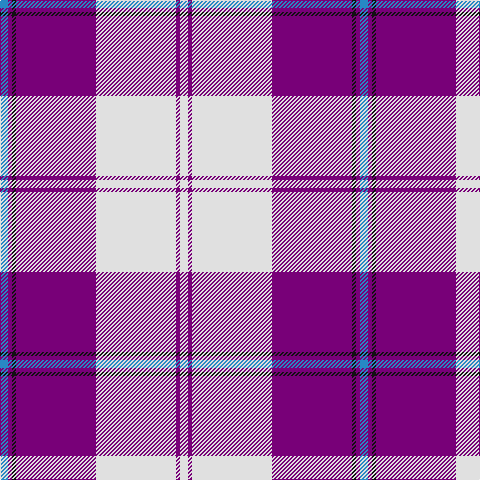

In pattern [BBKBWBW](/patterns/bbkbwbw/).

This was sourced from house-of-tartan.  It is a [7 stripes tartan](/stripes/stripes7/).

Original link http://www.house-of-tartan.scotland.net/house/TartanViewjs.asp?colr=Def&tnam=6531

## Thread count
B/8 P4 K4 P80 LN80 P4 LN/8

## Palette
Each colour and its ΔE from the base-6 reference it is a variant of.

| Colour | Shade | Base | ΔE (OKLab) |
|---|---|---|---|
| B | <code style="background-color:#2888C4;">#2888C4</code> `#2888C4` | B <code style="background-color:#2A418A;">#2A418A</code> | 0.21 |
| K | <code style="background-color:#101010;">#101010</code> `#101010` | K <code style="background-color:#000000;">#000000</code> | 0.17 |
| LN | <code style="background-color:#E0E0E0;">#E0E0E0</code> `#E0E0E0` | W <code style="background-color:#F7F7F7;">#F7F7F7</code> | 0.07 |
| P | <code style="background-color:#780078;">#780078</code> `#780078` | B <code style="background-color:#2A418A;">#2A418A</code> | 0.17 |

# Sample pattern

## Nearest tartans

The nearest existing variants by ΔTartan distance.

1. [Cunningham Dress Purple (Dance)](/setts/s7/w5b2w34b34k2b2ba4~b780078-ba2888c4-k101010-wf8f8f8~x2/) — ΔT 0.49
1. [Longniddry Purple](/setts/s8/b42w2wa2w2b5ba12wa32b4~b780078-ba2888c4-wa8ace8-waf8f8f8~x2/) — ΔT 0.78
1. [Longniddry Dress (Dance)](/setts/s8/b42w2wa2w2b5ba12wa32b4~b780078-ba2888c4-wa8ace8-wae0e0e0~x2/) — ΔT 0.85
1. [Longniddry Dress District Tartan Tartan Number: 88. Earliest known date: pre 2003 A dancers tartan from D.C. Dalgleish weavers of Selkirk See products available Copyright © Blair Urquhart, Comrie, 2015](/setts/s8/b42ba2w2ba2b5bb12w32b4~b780078-ba2c2c80-bb2888c4-we0e0e0~x2/) — ΔT 0.91
1. [Longniddry, dress](/setts/s8/b42ba2w2ba2b5bb12w32b4~b800080-ba304080-bb8080d0-we0e0e0~x2/) — ΔT 0.98
1. [Lennox Purple Dress District Tartan Tartan Number: 8189. Earliest known date: pre 2003 Families with the surname 'Lennox' are usually considered related to Clans Stewart or MacFarlane. Some of this surname also choose to wear the distinctive and ancient 'Lennox' tartan. D W Stewart reproduced the sett from a 'lost' portrait of the Countess of Lennox dating from the 16th century./Threadcount and colours aren't 100% original. Generated manually./ See products available Copyright © Blair Urquhart, Comrie, 2015](/setts/s7/b8ba2b24ba5w26k2w8~b780078-ba2c2c80-k101010-we0e0e0~x2/) — ΔT 1.31
1. [St Andrews Links Dress](/setts/s7/w30b4w3ba2r2ba24wa2~b8968cd-ba551a8b-rcd5555-wfdf5e6-waffffff~x2/) — ΔT 1.34
1. [Dunlop Dress Family Tartan Tartan Number: 1784. Earliest known date: 1984 Revised version See products available Copyright © Blair Urquhart, Comrie, 2015](/setts/s8/w3b1w30b1ba28w1ba1w3~b2c2c80-ba780078-we0e0e0~x2/) — ΔT 1.35
1. [St. Andrew's Links Dress (Corporate)](/setts/s7/y30w4y3b2r2b24wa2~b780078-re87878-wc49cd8-wafcfcfc-yb8b8b8~x2/) — ΔT 1.35
1. [MacPherson, dress (purple)](/setts/s7/w5k3w31b26w4b10ba4~b800080-ba5480b0-k000000-we0e0e0~x2/) — ΔT 1.36

## Neighbour map

Every grey dot is one of 15726 variants placed by the first two principal components of the ΔTartan feature space (44% of its variance). Red is this tartan; blue dots are its nearest — click one to open its page.

<svg viewBox="0 0 640 380" role="img" style="max-width:100%;height:auto;border:1px solid #e0e0e0;border-radius:4px;display:block" xmlns="http://www.w3.org/2000/svg"><image href="/nn/cloud.v1.png" width="640" height="380"/><a href="/setts/s7/w5b2w34b34k2b2ba4~b780078-ba2888c4-k101010-wf8f8f8~x2/"><circle cx="278.7" cy="130.6" r="4" fill="#3465a4"><title>Cunningham Dress Purple (Dance)</title></circle></a><a href="/setts/s8/b42w2wa2w2b5ba12wa32b4~b780078-ba2888c4-wa8ace8-waf8f8f8~x2/"><circle cx="281.9" cy="121.6" r="4" fill="#3465a4"><title>Longniddry Purple</title></circle></a><a href="/setts/s8/b42w2wa2w2b5ba12wa32b4~b780078-ba2888c4-wa8ace8-wae0e0e0~x2/"><circle cx="291.3" cy="126.2" r="4" fill="#3465a4"><title>Longniddry Dress (Dance)</title></circle></a><a href="/setts/s8/b42ba2w2ba2b5bb12w32b4~b780078-ba2c2c80-bb2888c4-we0e0e0~x2/"><circle cx="290.9" cy="126.9" r="4" fill="#3465a4"><title>Longniddry Dress District Tartan Tartan Number: 88. Earliest known date: pre 2003 A dancers tartan from D.C. Dalgleish weavers of Selkirk See products available Copyright © Blair Urquhart, Comrie, 2015</title></circle></a><a href="/setts/s8/b42ba2w2ba2b5bb12w32b4~b800080-ba304080-bb8080d0-we0e0e0~x2/"><circle cx="296.2" cy="126.2" r="4" fill="#3465a4"><title>Longniddry, dress</title></circle></a><a href="/setts/s7/b8ba2b24ba5w26k2w8~b780078-ba2c2c80-k101010-we0e0e0~x2/"><circle cx="236.0" cy="165.4" r="4" fill="#3465a4"><title>Lennox Purple Dress District Tartan Tartan Number: 8189. Earliest known date: pre 2003 Families with the surname 'Lennox' are usually considered related to Clans Stewart or MacFarlane. Some of this surname also choose to wear the distinctive and ancient 'Lennox' tartan. D W Stewart reproduced the sett from a 'lost' portrait of the Countess of Lennox dating from the 16th century./Threadcount and colours aren't 100% original. Generated manually./ See products available Copyright © Blair Urquhart, Comrie, 2015</title></circle></a><a href="/setts/s7/w30b4w3ba2r2ba24wa2~b8968cd-ba551a8b-rcd5555-wfdf5e6-waffffff~x2/"><circle cx="246.4" cy="119.9" r="4" fill="#3465a4"><title>St Andrews Links Dress</title></circle></a><a href="/setts/s8/w3b1w30b1ba28w1ba1w3~b2c2c80-ba780078-we0e0e0~x2/"><circle cx="373.2" cy="114.7" r="4" fill="#3465a4"><title>Dunlop Dress Family Tartan Tartan Number: 1784. Earliest known date: 1984 Revised version See products available Copyright © Blair Urquhart, Comrie, 2015</title></circle></a><a href="/setts/s7/y30w4y3b2r2b24wa2~b780078-re87878-wc49cd8-wafcfcfc-yb8b8b8~x2/"><circle cx="282.5" cy="132.7" r="4" fill="#3465a4"><title>St. Andrew's Links Dress (Corporate)</title></circle></a><a href="/setts/s7/w5k3w31b26w4b10ba4~b800080-ba5480b0-k000000-we0e0e0~x2/"><circle cx="248.8" cy="169.4" r="4" fill="#3465a4"><title>MacPherson, dress (purple)</title></circle></a><circle cx="299.4" cy="125.8" r="5" fill="#c00000"/></svg>

ID: /setts/s7/b2ba1k1ba20w20ba1w2~b2888c4-ba780078-k101010-we0e0e0~x4/
