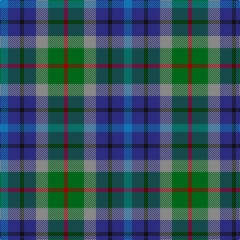

In pattern [BBKBRGR](/patterns/bbkbrgr/).

This was sourced from register-of-tartans.  It is a [7 stripes tartan](/stripes/stripes7/).

Original link https://www.tartanregister.gov.uk/tartanDetails.aspx?ref=5085

## Attestations

This cloth appears in 2 source records; the oldest owns this page.

- 06/04/2002 — New York City (register-of-tartans, [record](https://www.tartanregister.gov.uk/tartanDetails.aspx?ref=5085))
- 2002 — New York City (District) (tartans-authority, [record](http://www.tartansauthority.com/tartan-ferret/display/3812/))

## Thread count
B/16 DB24 K8 DB24 N24 G32 DR/8

## Palette
Each colour and its ΔE from the base-6 reference it is a variant of.

| Colour | Shade | Base | ΔE (OKLab) |
|---|---|---|---|
| B | <code style="background-color:#1474B4;">#1474B4</code> `#1474B4` | B <code style="background-color:#2A418A;">#2A418A</code> | 0.15 |
| DB | <code style="background-color:#2C2C80;">#2C2C80</code> `#2C2C80` | B <code style="background-color:#2A418A;">#2A418A</code> | 0.06 |
| DR | <code style="background-color:#A00000;">#A00000</code> `#A00000` | R <code style="background-color:#CC0000;">#CC0000</code> | 0.09 |
| G | <code style="background-color:#006818;">#006818</code> `#006818` | G <code style="background-color:#006100;">#006100</code> | 0.02 |
| K | <code style="background-color:#101010;">#101010</code> `#101010` | K <code style="background-color:#000000;">#000000</code> | 0.17 |
| N | <code style="background-color:#888888;">#888888</code> `#888888` | R <code style="background-color:#CC0000;">#CC0000</code> | 0.24 |

# Sample pattern

## Nearest tartans

The nearest existing variants by ΔTartan distance.

1. [Scotia Trade Tartan Tartan Number: 89. Earliest known date: 1968 Originally designed by James Allan of East Kilbride and woven by him in 1850. The sett was reconstructed by David Easton, Galashiels, as a National tartan for Scotland. It did not catch on and the tartan is rarely seen today. See products available Copyright © Blair Urquhart, Comrie, 2015](/setts/s8/b3ba3w2g8ba3b11bb7ga3~b2888c4-ba202060-bb780078-g604000-ga006818-we0e0e0~x2/) — ΔT 1.36
1. [Blackdown Hills Corporate Tartan Tartan Number: 6711. Earliest known date: 1991 The Blackdown Hills on the Devon/Somerset border were designated as an Area of Outstanding Natural Beauty (AONB) in 1991 and this tartan was designed to celebrate that occasion. Designed at Coldharbour Mill at Cullompton in Devon. See products available Copyright © Blair Urquhart, Comrie, 2015](/setts/s7/k4b4y1b4r4ba4w1~b34506c-ba202060-k101010-rc85858-wf8f8f8-yd87c00~x8/) — ΔT 1.38
1. [Fox-Eves Wedding](/setts/s6/r9b6ba13b21g18w4~b003c64-ba141e46-g808080-r800028-wf8f4d0~x2/) — ΔT 1.39
1. [Fox-Eves Wedding (Personal)](/setts/s6/r9b6ba13b21ra18w4~b1870a4-ba003c64-ra00000-ra888888-wfcfcfc~x2/) — ΔT 1.42
1. [Parliament Trade Tartan Tartan Number: 2477. Earliest known date: 1998 Created to celebrate the referendum result for the re-establishment of a Scottish Parliament as well as to provide a Parliamentary livery tartan. See products available Copyright © Blair Urquhart, Comrie, 2015](/setts/s7/b8g11k3g11r12ba10y2~b2c2c80-ba003c64-g006818-k101010-r880000-ye8c000~x2/) — ΔT 1.42
1. [DunBroch](/setts/s11/b4ba8k2ba5w2ba5g8bb7g2bb7g3~b483d8b-ba539dc2-bb700038-g00572b-k101010-we1cdb2~x2/) — ΔT 1.43
1. [Stewarton (Fashion)](/setts/s8/k1g3r3b3r3y3ra3k1~b1c0070-g006818-k101010-r888888-raa07c58-ya0a0a0~x4/) — ΔT 1.49
1. [Loch Katrine](/setts/s7/b8ba11w3ba11bb12g10r2~b2888c4-ba003c64-bb1c0070-g289c18-r901c38-wfcfcfc~x2/) — ΔT 1.49
1. [Devon Companion](/setts/s7/r5b4y1b4k4g4w1~b2c2c80-g603800-k101010-r888888-wfcfcfc-ye8c000~x4/) — ΔT 1.52
1. [Smithers (Name)](/setts/s11/b2ba6bb1ba3w1ba4k6g5k1g5b2~b6c0070-ba1474b4-bb5c5c5c-g006818-k101010-wc0c0c0~x4/) — ΔT 1.54

## Neighbour map

Every grey dot is one of 15726 variants placed by the first two principal components of the ΔTartan feature space (44% of its variance). Red is this tartan; blue dots are its nearest — click one to open its page.

<svg viewBox="0 0 640 380" role="img" style="max-width:100%;height:auto;border:1px solid #e0e0e0;border-radius:4px;display:block" xmlns="http://www.w3.org/2000/svg"><image href="/nn/cloud.v1.png" width="640" height="380"/><a href="/setts/s8/b3ba3w2g8ba3b11bb7ga3~b2888c4-ba202060-bb780078-g604000-ga006818-we0e0e0~x2/"><circle cx="83.2" cy="205.9" r="4" fill="#3465a4"><title>Scotia Trade Tartan Tartan Number: 89. Earliest known date: 1968 Originally designed by James Allan of East Kilbride and woven by him in 1850. The sett was reconstructed by David Easton, Galashiels, as a National tartan for Scotland. It did not catch on and the tartan is rarely seen today. See products available Copyright © Blair Urquhart, Comrie, 2015</title></circle></a><a href="/setts/s7/k4b4y1b4r4ba4w1~b34506c-ba202060-k101010-rc85858-wf8f8f8-yd87c00~x8/"><circle cx="56.4" cy="241.7" r="4" fill="#3465a4"><title>Blackdown Hills Corporate Tartan Tartan Number: 6711. Earliest known date: 1991 The Blackdown Hills on the Devon/Somerset border were designated as an Area of Outstanding Natural Beauty (AONB) in 1991 and this tartan was designed to celebrate that occasion. Designed at Coldharbour Mill at Cullompton in Devon. See products available Copyright © Blair Urquhart, Comrie, 2015</title></circle></a><a href="/setts/s6/r9b6ba13b21g18w4~b003c64-ba141e46-g808080-r800028-wf8f4d0~x2/"><circle cx="120.2" cy="250.6" r="4" fill="#3465a4"><title>Fox-Eves Wedding</title></circle></a><a href="/setts/s6/r9b6ba13b21ra18w4~b1870a4-ba003c64-ra00000-ra888888-wfcfcfc~x2/"><circle cx="129.0" cy="251.9" r="4" fill="#3465a4"><title>Fox-Eves Wedding (Personal)</title></circle></a><a href="/setts/s7/b8g11k3g11r12ba10y2~b2c2c80-ba003c64-g006818-k101010-r880000-ye8c000~x2/"><circle cx="112.9" cy="240.2" r="4" fill="#3465a4"><title>Parliament Trade Tartan Tartan Number: 2477. Earliest known date: 1998 Created to celebrate the referendum result for the re-establishment of a Scottish Parliament as well as to provide a Parliamentary livery tartan. See products available Copyright © Blair Urquhart, Comrie, 2015</title></circle></a><a href="/setts/s11/b4ba8k2ba5w2ba5g8bb7g2bb7g3~b483d8b-ba539dc2-bb700038-g00572b-k101010-we1cdb2~x2/"><circle cx="52.7" cy="217.7" r="4" fill="#3465a4"><title>DunBroch</title></circle></a><a href="/setts/s8/k1g3r3b3r3y3ra3k1~b1c0070-g006818-k101010-r888888-raa07c58-ya0a0a0~x4/"><circle cx="14.0" cy="257.6" r="4" fill="#3465a4"><title>Stewarton (Fashion)</title></circle></a><a href="/setts/s7/b8ba11w3ba11bb12g10r2~b2888c4-ba003c64-bb1c0070-g289c18-r901c38-wfcfcfc~x2/"><circle cx="71.1" cy="227.8" r="4" fill="#3465a4"><title>Loch Katrine</title></circle></a><a href="/setts/s7/r5b4y1b4k4g4w1~b2c2c80-g603800-k101010-r888888-wfcfcfc-ye8c000~x4/"><circle cx="50.0" cy="227.7" r="4" fill="#3465a4"><title>Devon Companion</title></circle></a><a href="/setts/s11/b2ba6bb1ba3w1ba4k6g5k1g5b2~b6c0070-ba1474b4-bb5c5c5c-g006818-k101010-wc0c0c0~x4/"><circle cx="92.8" cy="200.6" r="4" fill="#3465a4"><title>Smithers (Name)</title></circle></a><circle cx="73.3" cy="256.2" r="5" fill="#c00000"/></svg>

ID: /setts/s7/b2ba3k1ba3r3g4ra1~b1474b4-ba2c2c80-g006818-k101010-r888888-raa00000~x8/
