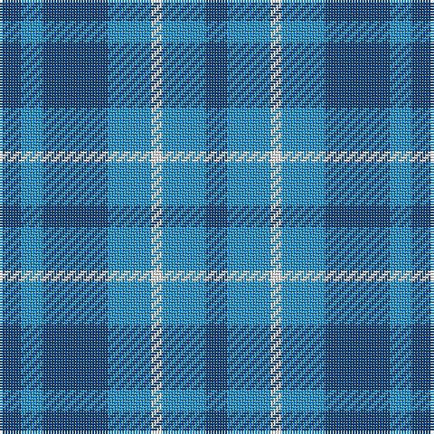

In pattern [BBBBWBB](/patterns/bbbbwbb/).

This was sourced from register-of-tartans.  It is a [7 stripes tartan](/stripes/stripes7/).

Original link https://www.tartanregister.gov.uk/tartanDetails.aspx?ref=10103

## Register references

External register numbers recorded for this tartan.

- Scottish Register of Tartans: [10103](https://www.tartanregister.gov.uk/tartanDetails.aspx?ref=10103)

## Thread count
B/8 Ba8 B24 Ba16 W4 Ba16 B/8

## Palette
Each colour and its ΔE from the base-6 reference it is a variant of.

| Colour | Shade | Base | ΔE (OKLab) |
|---|---|---|---|
| B | <code style="background-color:#144683;">#144683</code> `#144683` | B <code style="background-color:#2A418A;">#2A418A</code> | 0.03 |
| Ba | <code style="background-color:#2194D3;">#2194D3</code> `#2194D3` | B <code style="background-color:#2A418A;">#2A418A</code> | 0.24 |
| W | <code style="background-color:#FFFFFF;">#FFFFFF</code> `#FFFFFF` | W <code style="background-color:#F7F7F7;">#F7F7F7</code> | 0.02 |

# Sample pattern

## Nearest tartans

The nearest existing variants by ΔTartan distance.

1. [Manx Cornaa (Personal)](/setts/s6/b5ba5w1ba5b5ba1~b2c2c80-ba2888c4-we0e0e0~x4/) — ΔT 0.79
1. [Langdons (Corporate)](/setts/s7/b2w4wa1w4b6w2b2~b1c6894-w98c8e8-wae0e0e0~x4/) — ΔT 1.38
1. [Manx Cornaa (Personal)](/setts/s4/b1ba5b5w1~b2888c4-ba2c2c80-we0e0e0~x4/) — ΔT 1.51
1. [Manx, Cornaa](/setts/s4/b1ba5b5w1~b8080d0-ba304080-we0e0e0~x4/) — ΔT 1.85
1. [Mercer, Charles](/setts/s8/b9ba2b2y1ba7b2r1ba4~b2c2c80-ba1474b4-rc80000-ye8c000~x4/) — ΔT 1.95
1. [Norris (1957)](/setts/s6/g6b1g7w1b7r1~b3850c8-g408060-rc80000-wfcfcfc~x4/) — ΔT 1.98
1. [Outdoorsmen (Fashion)](/setts/s7/b3k1g4k1b4g9k2~b2474e8-g408060-k101010~x4/) — ΔT 2.02
1. [von Prondzynski (2016)](/setts/s7/b4w4b8r8b12w12y1~b3850c8-r888888-wc0c0c0-yffff00~x2/) — ΔT 2.08
1. [Keith Clan](/setts/s8/g9b4k4b3k4b4g9k2~b2474e8-g408060-k101010~x4/) — ΔT 2.11
1. [Murray Taylor](/setts/s6/b3ba3b16ba16b16w3~b202060-ba3c82af-wffffff~x2/) — ΔT 2.15

## Neighbour map

Every grey dot is one of 15726 variants placed by the first two principal components of the ΔTartan feature space (44% of its variance). Red is this tartan; blue dots are its nearest — click one to open its page.

<svg viewBox="0 0 640 380" role="img" style="max-width:100%;height:auto;border:1px solid #e0e0e0;border-radius:4px;display:block" xmlns="http://www.w3.org/2000/svg"><image href="/nn/cloud.v1.png" width="640" height="380"/><a href="/setts/s6/b5ba5w1ba5b5ba1~b2c2c80-ba2888c4-we0e0e0~x4/"><circle cx="274.6" cy="301.7" r="4" fill="#3465a4"><title>Manx Cornaa (Personal)</title></circle></a><a href="/setts/s7/b2w4wa1w4b6w2b2~b1c6894-w98c8e8-wae0e0e0~x4/"><circle cx="256.9" cy="273.7" r="4" fill="#3465a4"><title>Langdons (Corporate)</title></circle></a><a href="/setts/s4/b1ba5b5w1~b2888c4-ba2c2c80-we0e0e0~x4/"><circle cx="275.1" cy="294.4" r="4" fill="#3465a4"><title>Manx Cornaa (Personal)</title></circle></a><a href="/setts/s4/b1ba5b5w1~b8080d0-ba304080-we0e0e0~x4/"><circle cx="292.6" cy="293.9" r="4" fill="#3465a4"><title>Manx, Cornaa</title></circle></a><a href="/setts/s8/b9ba2b2y1ba7b2r1ba4~b2c2c80-ba1474b4-rc80000-ye8c000~x4/"><circle cx="302.9" cy="231.5" r="4" fill="#3465a4"><title>Mercer, Charles</title></circle></a><a href="/setts/s6/g6b1g7w1b7r1~b3850c8-g408060-rc80000-wfcfcfc~x4/"><circle cx="309.8" cy="247.0" r="4" fill="#3465a4"><title>Norris (1957)</title></circle></a><a href="/setts/s7/b3k1g4k1b4g9k2~b2474e8-g408060-k101010~x4/"><circle cx="295.3" cy="243.8" r="4" fill="#3465a4"><title>Outdoorsmen (Fashion)</title></circle></a><a href="/setts/s7/b4w4b8r8b12w12y1~b3850c8-r888888-wc0c0c0-yffff00~x2/"><circle cx="238.1" cy="222.9" r="4" fill="#3465a4"><title>von Prondzynski (2016)</title></circle></a><a href="/setts/s8/g9b4k4b3k4b4g9k2~b2474e8-g408060-k101010~x4/"><circle cx="187.2" cy="281.3" r="4" fill="#3465a4"><title>Keith Clan</title></circle></a><a href="/setts/s6/b3ba3b16ba16b16w3~b202060-ba3c82af-wffffff~x2/"><circle cx="320.6" cy="273.6" r="4" fill="#3465a4"><title>Murray Taylor</title></circle></a><circle cx="267.9" cy="286.3" r="5" fill="#c00000"/></svg>

ID: /setts/s7/b2ba4w1ba4b6ba2b2~b144683-ba2194d3-wffffff~x4/
