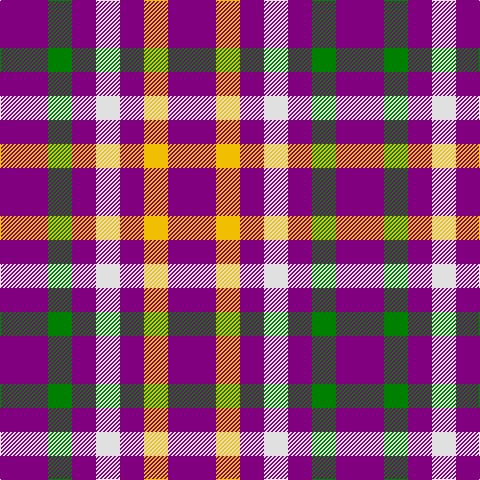

In pattern [BGBWBYB](/patterns/bgbwbyb/).

This was sourced from weddslist.  It is a [7 stripes tartan](/stripes/stripes7/).

Original link http://www.weddslist.com/cgi-bin/tartans/pg.pl?source=sts

## Thread count
P/48 G24 P24 LN24 P24 Y24 P/48

## Palette
Each colour and its ΔE from the base-6 reference it is a variant of.

| Colour | Shade | Base | ΔE (OKLab) |
|---|---|---|---|
| G | <code style="background-color:#008000;">#008000</code> `#008000` | G <code style="background-color:#006100;">#006100</code> | 0.10 |
| LN | <code style="background-color:#E0E0E0;">#E0E0E0</code> `#E0E0E0` | W <code style="background-color:#F7F7F7;">#F7F7F7</code> | 0.07 |
| P | <code style="background-color:#800080;">#800080</code> `#800080` | B <code style="background-color:#2A418A;">#2A418A</code> | 0.17 |
| Y | <code style="background-color:#F0C000;">#F0C000</code> `#F0C000` | Y <code style="background-color:#F2BF00;">#F2BF00</code> | 0.00 |

# Sample pattern

## Nearest tartans

The nearest existing variants by ΔTartan distance.

1. [Justus International Tartan Tartan Number: 109. Earliest known date: pre 2003 Y = Saffron. Seen at Grandfather Mountain Games by Bob Martin in 1981 or 1982 See products available Copyright © Blair Urquhart, Comrie, 2015](/setts/s7/b2g1b1w1b1y1b2~b780078-g006818-we0e0e0-ye8c000~x6/) — ΔT 0.19
1. [Justus International (Personal)](/setts/s7/b2g1b1w1b1y1b2~b780078-g285800-wfcfcfc-ye8c000~x24/) — ΔT 0.23
1. [Justus International (Personal)](/setts/s12/b2g1b1w1b1y1b2y1b1w1b1g1~b780078-g285800-wfcfcfc-ye8c000~x24/) — ΔT 1.73
1. [Ikelman No 3](/setts/s5/g5k2r2y2g5~g808080-k000000-rc00000-yf0c000~x10/) — ΔT 2.40
1. [U.S. Coast Guard](/setts/s8/r5b6r1b6r1b6r5w5~b2c2c80-rc80000-we0e0e0~x4/) — ΔT 2.49
1. [U.S. Coast Guard (Corporate)](/setts/s5/b6r1b6r5w5~b2c2c80-rc80000-we0e0e0~x4/) — ΔT 2.60
1. [Unidentified, Sample](/setts/s6/b11r4y9b4y2b11~b304080-rc00000-yf0c000~x2/) — ΔT 2.66
1. [Unidentified Sample](/setts/s6/b11r4y9b4y2b11~b2c4084-rdc0000-ye8c000~x2/) — ΔT 2.69
1. [Coronation](/setts/s7/b7w1r7b4r2b4w2~b2c4084-rdc0000-we0e0e0~x2/) — ΔT 2.69
1. [North Carolina State University](/setts/s12/w15b25r10w5b25w7b16k9b17k10b23r9~b5c5c5c-k101010-rc80000-wfcfcfc/) — ΔT 2.73

## Neighbour map

Every grey dot is one of 15726 variants placed by the first two principal components of the ΔTartan feature space (44% of its variance). Red is this tartan; blue dots are its nearest — click one to open its page.

<svg viewBox="0 0 640 380" role="img" style="max-width:100%;height:auto;border:1px solid #e0e0e0;border-radius:4px;display:block" xmlns="http://www.w3.org/2000/svg"><image href="/nn/cloud.v1.png" width="640" height="380"/><a href="/setts/s7/b2g1b1w1b1y1b2~b780078-g006818-we0e0e0-ye8c000~x6/"><circle cx="232.0" cy="302.4" r="4" fill="#3465a4"><title>Justus International Tartan Tartan Number: 109. Earliest known date: pre 2003 Y = Saffron. Seen at Grandfather Mountain Games by Bob Martin in 1981 or 1982 See products available Copyright © Blair Urquhart, Comrie, 2015</title></circle></a><a href="/setts/s7/b2g1b1w1b1y1b2~b780078-g285800-wfcfcfc-ye8c000~x24/"><circle cx="226.9" cy="299.7" r="4" fill="#3465a4"><title>Justus International (Personal)</title></circle></a><a href="/setts/s12/b2g1b1w1b1y1b2y1b1w1b1g1~b780078-g285800-wfcfcfc-ye8c000~x24/"><circle cx="136.4" cy="274.4" r="4" fill="#3465a4"><title>Justus International (Personal)</title></circle></a><a href="/setts/s5/g5k2r2y2g5~g808080-k000000-rc00000-yf0c000~x10/"><circle cx="223.5" cy="294.9" r="4" fill="#3465a4"><title>Ikelman No 3</title></circle></a><a href="/setts/s8/r5b6r1b6r1b6r5w5~b2c2c80-rc80000-we0e0e0~x4/"><circle cx="222.1" cy="258.2" r="4" fill="#3465a4"><title>U.S. Coast Guard</title></circle></a><a href="/setts/s5/b6r1b6r5w5~b2c2c80-rc80000-we0e0e0~x4/"><circle cx="210.4" cy="282.5" r="4" fill="#3465a4"><title>U.S. Coast Guard (Corporate)</title></circle></a><a href="/setts/s6/b11r4y9b4y2b11~b304080-rc00000-yf0c000~x2/"><circle cx="293.2" cy="271.1" r="4" fill="#3465a4"><title>Unidentified, Sample</title></circle></a><a href="/setts/s6/b11r4y9b4y2b11~b2c4084-rdc0000-ye8c000~x2/"><circle cx="291.9" cy="271.1" r="4" fill="#3465a4"><title>Unidentified Sample</title></circle></a><a href="/setts/s7/b7w1r7b4r2b4w2~b2c4084-rdc0000-we0e0e0~x2/"><circle cx="275.5" cy="247.4" r="4" fill="#3465a4"><title>Coronation</title></circle></a><a href="/setts/s12/w15b25r10w5b25w7b16k9b17k10b23r9~b5c5c5c-k101010-rc80000-wfcfcfc/"><circle cx="231.2" cy="232.9" r="4" fill="#3465a4"><title>North Carolina State University</title></circle></a><circle cx="231.4" cy="300.6" r="5" fill="#c00000"/></svg>

ID: /setts/s7/b2g1b1w1b1y1b2~b800080-g008000-we0e0e0-yf0c000~x24/
