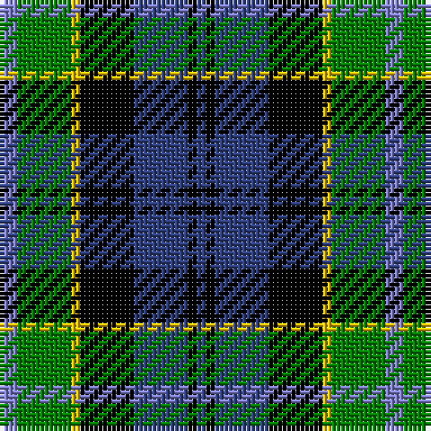

This page is one **sett** — a single exact thread-count. It belongs to the [tartan](/tartans/b2g6ly1k6db6k1db1/)
(the same proportion at any scale), whose colour order is pattern [BGYKBKB](/stripes/bgykbkb/).

Sourced from weddslist.  It is a [7 stripe tartan](/stripes/stripes7/).

Original link http://www.weddslist.com/cgi-bin/tartans/pg.pl?source=sts

## Also known as

This cloth is also recorded under:

- Hogarth, of Firhill

## Thread count
B/4 G12 Y2 K12 Ba12 K2 Ba/2

## Palette

Palette: <strong>Ingles Buchan</strong> <small style="color:#888">(1 of 5 colours)</small>
<table><thead><tr><th>Colour</th><th>Threads</th><th>Shade</th><th>Base</th><th>OKLCh</th></tr></thead><tbody><tr><td>B/</td><td style="text-align:right;font-variant-numeric:tabular-nums">4</td><td><code style="background-color:#8080D0;">#8080D0</code> <small style="color:#888">#8080D0</small></td><td>B <code style="background-color:#2A418A;">#2A418A</code></td><td><small style="color:#888">oklch(63.4% 0.119 282.5)</small></td></tr><tr><td>G</td><td style="text-align:right;font-variant-numeric:tabular-nums">12</td><td><code style="background-color:#008000;">#008000</code> <small style="color:#888">#008000</small></td><td>G <code style="background-color:#006100;">#006100</code></td><td><small style="color:#888">oklch(52.0% 0.177 142.5)</small></td></tr><tr><td>Y</td><td style="text-align:right;font-variant-numeric:tabular-nums">2</td><td><code style="background-color:#F0C000;">#F0C000</code> <small style="color:#888">#F0C000</small></td><td>Y <code style="background-color:#F2BF00;">#F2BF00</code></td><td><small style="color:#888">oklch(82.7% 0.169 90.5)</small></td></tr><tr><td>K</td><td style="text-align:right;font-variant-numeric:tabular-nums">12</td><td><code style="background-color:#000000;">#000000</code> <small style="color:#888">#000000</small></td><td>K <code style="background-color:#000000;">#000000</code></td><td><small style="color:#888">oklch(0.0% 0.000 0.0)</small></td></tr><tr><td>Ba</td><td style="text-align:right;font-variant-numeric:tabular-nums">12</td><td><code style="background-color:#304080;">#304080</code> <small style="color:#888">#304080</small></td><td>B <code style="background-color:#2A418A;">#2A418A</code></td><td><small style="color:#888">oklch(39.4% 0.109 270.2)</small></td></tr><tr><td>K</td><td style="text-align:right;font-variant-numeric:tabular-nums">2</td><td><code style="background-color:#000000;">#000000</code> <small style="color:#888">#000000</small></td><td>K <code style="background-color:#000000;">#000000</code></td><td><small style="color:#888">oklch(0.0% 0.000 0.0)</small></td></tr><tr><td>Ba/</td><td style="text-align:right;font-variant-numeric:tabular-nums">2</td><td><code style="background-color:#304080;">#304080</code> <small style="color:#888">#304080</small></td><td>B <code style="background-color:#2A418A;">#2A418A</code></td><td><small style="color:#888">oklch(39.4% 0.109 270.2)</small></td></tr></tbody></table>

# Sample pattern

## Nearest tartans

The nearest existing variants by ΔTartan distance, with this tartan at the top so the swatches line up against it.

ΔTartan

Tartan

Sett

—

<a href="/ttd/edit/#slug=b2g6ly1k6db6k1db1~x2">Hogarth, of Firhill</a> <a class="nn-out" href="/setts/s7/b2g6ly1k6db6k1db1~x2/" title="open its dictionary page">↗</a>

0.45

<a href="/ttd/edit/#slug=db1r1db6k6g6w1~x2">Wellington</a> <a class="nn-out" href="/setts/s6/db1r1db6k6g6w1~x2/" title="open its dictionary page">↗</a>

0.47

<a href="/ttd/edit/#slug=lr4g17k17db17r3db3~x2">Royal Highland</a> <a class="nn-out" href="/setts/s6/lr4g17k17db17r3db3~x2/" title="open its dictionary page">↗</a>

0.62

<a href="/ttd/edit/#slug=w3db14k12g12k2ly3~x2">MacNeil 6</a> <a class="nn-out" href="/setts/s6/w3db14k12g12k2ly3~x2/" title="open its dictionary page">↗</a>

0.63

<a href="/ttd/edit/#slug=r2g8w1k8db8k1db1~x4">Colquhoun</a> <a class="nn-out" href="/setts/s7/r2g8w1k8db8k1db1~x4/" title="open its dictionary page">↗</a>

0.67

<a href="/ttd/edit/#slug=r2db8k8w1g8k1~x2">Leslie, hunting</a> <a class="nn-out" href="/setts/s6/r2db8k8w1g8k1~x2/" title="open its dictionary page">↗</a>

0.73

<a href="/ttd/edit/#slug=g17ly2k14r2db9r2db10~x2">MacDonald, (Flora.. )</a> <a class="nn-out" href="/setts/s7/g17ly2k14r2db9r2db10~x2/" title="open its dictionary page">↗</a>

0.74

<a href="/ttd/edit/#slug=r4g16k16db4g3db12ly2~x2">Junior Chamber International</a> <a class="nn-out" href="/setts/s7/r4g16k16db4g3db12ly2~x2/" title="open its dictionary page">↗</a>

0.74

<a href="/ttd/edit/#slug=db4lg2db10k12dg10lb3dg2lb4~x2">Business Air</a> <a class="nn-out" href="/setts/s8/db4lg2db10k12dg10lb3dg2lb4~x2/" title="open its dictionary page">↗</a>

0.76

<a href="/ttd/edit/#slug=r1k1g6k6db6lb1~x4">Gaines Center for the Humanities</a> <a class="nn-out" href="/setts/s6/r1k1g6k6db6lb1~x4/" title="open its dictionary page">↗</a>

0.76

<a href="/ttd/edit/#slug=k6b2db12g8r5k2g3~x4">Cooke</a> <a class="nn-out" href="/setts/s7/k6b2db12g8r5k2g3~x4/" title="open its dictionary page">↗</a>

## Neighbour map

Every grey dot is one of 14299 variants placed by the first two principal components of the ΔTartan feature space (44% of its variance). Red is this tartan; blue dots are its nearest — click one to open its page.

<svg viewBox="0 0 640 380" role="img" style="max-width:100%;height:auto;border:1px solid #e0e0e0;border-radius:4px;display:block" xmlns="http://www.w3.org/2000/svg"><image href="/nn/cloud.v1.png" width="640" height="380"/><a href="/setts/s6/db1r1db6k6g6w1~x2/"><circle cx="101.9" cy="217.1" r="4" fill="#3465a4"><title>Wellington</title></circle></a><a href="/setts/s6/lr4g17k17db17r3db3~x2/"><circle cx="93.4" cy="223.9" r="4" fill="#3465a4"><title>Royal Highland</title></circle></a><a href="/setts/s6/w3db14k12g12k2ly3~x2/"><circle cx="78.0" cy="212.1" r="4" fill="#3465a4"><title>MacNeil 6</title></circle></a><a href="/setts/s7/r2g8w1k8db8k1db1~x4/"><circle cx="110.8" cy="192.2" r="4" fill="#3465a4"><title>Colquhoun</title></circle></a><a href="/setts/s6/r2db8k8w1g8k1~x2/"><circle cx="107.6" cy="206.5" r="4" fill="#3465a4"><title>Leslie, hunting</title></circle></a><a href="/setts/s7/g17ly2k14r2db9r2db10~x2/"><circle cx="116.7" cy="199.0" r="4" fill="#3465a4"><title>MacDonald, (Flora.. )</title></circle></a><a href="/setts/s7/r4g16k16db4g3db12ly2~x2/"><circle cx="109.6" cy="200.9" r="4" fill="#3465a4"><title>Junior Chamber International</title></circle></a><a href="/setts/s8/db4lg2db10k12dg10lb3dg2lb4~x2/"><circle cx="58.2" cy="210.5" r="4" fill="#3465a4"><title>Business Air</title></circle></a><a href="/setts/s6/r1k1g6k6db6lb1~x4/"><circle cx="103.0" cy="222.6" r="4" fill="#3465a4"><title>Gaines Center for the Humanities</title></circle></a><a href="/setts/s7/k6b2db12g8r5k2g3~x4/"><circle cx="81.8" cy="219.3" r="4" fill="#3465a4"><title>Cooke</title></circle></a><circle cx="83.2" cy="209.8" r="5" fill="#c00000"/></svg>

ID: /setts/s7/b2g6ly1k6db6k1db1~x2/
