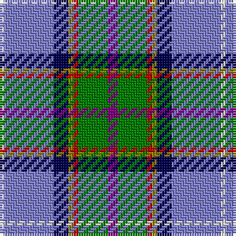

In pattern [BGRGBBW](/patterns/bgrgbbw/).

This was sourced from weddslist.  It is a [7 stripes tartan](/stripes/stripes7/).

Original link http://www.weddslist.com/cgi-bin/tartans/pg.pl?source=sts

## Thread count
LN/2 B20 DB6 LG2 R2 G12 P/4

## Palette
Each colour and its ΔE from the base-6 reference it is a variant of.

| Colour | Shade | Base | ΔE (OKLab) |
|---|---|---|---|
| B | <code style="background-color:#8080D0;">#8080D0</code> `#8080D0` | B <code style="background-color:#2A418A;">#2A418A</code> | 0.24 |
| DB | <code style="background-color:#000050;">#000050</code> `#000050` | B <code style="background-color:#2A418A;">#2A418A</code> | 0.21 |
| G | <code style="background-color:#008000;">#008000</code> `#008000` | G <code style="background-color:#006100;">#006100</code> | 0.10 |
| LG | <code style="background-color:#908000;">#908000</code> `#908000` | G <code style="background-color:#006100;">#006100</code> | 0.20 |
| LN | <code style="background-color:#E0E0E0;">#E0E0E0</code> `#E0E0E0` | W <code style="background-color:#F7F7F7;">#F7F7F7</code> | 0.07 |
| P | <code style="background-color:#800080;">#800080</code> `#800080` | B <code style="background-color:#2A418A;">#2A418A</code> | 0.17 |
| R | <code style="background-color:#C00000;">#C00000</code> `#C00000` | R <code style="background-color:#CC0000;">#CC0000</code> | 0.03 |

# Sample pattern

## Nearest tartans

The nearest existing variants by ΔTartan distance.

1. [Manx National District Tartan Tartan Number: 185. Earliest known date: pre 2003 These are the specifications supplied by the designer. See products available Copyright © Blair Urquhart, Comrie, 2015](/setts/s7/b2g6r1y1ba3bb10w1x2~b780078-ba202060-bb2888c4-g006818-rc80000-we0e0e0-ye8c000/) — ΔT 0.68
1. [Manx National District Tartan Tartan Number: 186. Earliest known date: pre 2003 Thread count of the sample donated by Dr. D.G. Teall in 1987, when the cloth was commercially available on the island. It differs slightly from the sett recorded by Stewart in 1959, but the design is essentially the same. D C Stewart's Nomindex (Name Index) notes. Th is seven-colour tartan was designed by Miss Patricia 'Paddy' McQaid as the Manx National Tartan at the instigation in 1958 of the Rt. Hon the Lord Sempill who was Chairman of Ellynyn ny Gael - a Manx Gaelic Society. The colours were explained as follows: light blue of the sky, dark blue of the sea, green of the hills & valleys, white of the cottages, purple of the heather, gold of the gorse in bloom and reddish brown of the bracken. The tartan was registered with the Tartans Society on 3rd November 1959 and Paddy McQuaid held the sole rights to production for some years. The tartan was very popular with the Royal Family of the day. See products available Copyright © Blair Urquhart, Comrie, 2015](/setts/s7/b2g8r1y1ba6bb15w1x4~b780078-ba202060-bb6490bc-g006818-rc80000-we0e0e0-ye8c000/) — ΔT 0.92
1. [Fremsaeter, Jenny (Personal)](/setts/s8/b32g5y8ba4bb5w5k5r8x2~b1474b4-ba00008c-bb680028-g289c18-k101010-ra07c58-wffffff-yb8b8b8/) — ΔT 1.11
1. [Manx National](/setts/s7/b8g31r4ga4ba17bb64w4~b800080-ba000050-bb8080d0-g008000-ga908000-rc00000-we0e0e0/) — ΔT 1.14
1. [Silversea](/setts/s7/r3b20ba20g2y4ya17w3x2~b112f4b-ba213e66-g36924f-re91009-wffffff-yacad9f-yaa5afb8/) — ΔT 1.15
1. [O'Reilly (Estimated threadcount)](/setts/s9/r4b3y2k2y12k2ba10bb25w2x2~b1474b4-ba2c2c80-bb5c8ca8-k101010-rc80000-wf8f8f8-ya0a0a0/) — ΔT 1.15
1. [Deeside District Tartan Tartan Number: 1833. Earliest known date: 1963 The name Deas is described as an 'alias' for Davidson in historic records, and is a recognised sept of Clan Dhai (Davidson). See products available Copyright © Blair Urquhart, Comrie, 2015](/setts/s7/w1r1b2r7g1ba5y1x4~b780078-ba1c0070-g006818-r888888-we0e0e0-ye8c000/) — ΔT 1.20
1. [RAF Leuchars](/setts/s10/y2g11r2g11k2b6ba13k2ba3ya2x4~b38409c-ba5064a0-g789484-k000000-rc80000-yb0b0b0-yae8c000/) — ΔT 1.24
1. [Julien Pigeut Tartan Tartan Number: 6574. Earliest known date: 2004 For the wedding of Julien and Sylvia Piguet. Also worn by Roland Mathez best man of Julien. See products available Copyright © Blair Urquhart, Comrie, 2015](/setts/s8/k40b15r10y3ba5w5bb10ba20~b5c5c5c-ba2888c4-bb2c2c80-k101010-r888888-we0e0e0-ye8c000/) — ΔT 1.25
1. [Madras College (Corporate)](/setts/s7/r3b25k6w20y2w2wa3x2~b003c64-k101010-rc80000-w74b4e0-wae0e0e0-ye8c000/) — ΔT 1.26

## Neighbour map

Every grey dot is one of 15726 variants placed by the first two principal components of the ΔTartan feature space (44% of its variance). Red is this tartan; blue dots are its nearest — click one to open its page.

<svg viewBox="0 0 640 380" role="img" style="max-width:100%;height:auto;border:1px solid #e0e0e0;border-radius:4px;display:block" xmlns="http://www.w3.org/2000/svg"><image href="/nn/cloud.v1.png" width="640" height="380"/><a href="/setts/s7/b2g6r1y1ba3bb10w1x2~b780078-ba202060-bb2888c4-g006818-rc80000-we0e0e0-ye8c000/"><circle cx="142.5" cy="146.5" r="4" fill="#3465a4"><title>Manx National District Tartan Tartan Number: 185. Earliest known date: pre 2003 These are the specifications supplied by the designer. See products available Copyright © Blair Urquhart, Comrie, 2015</title></circle></a><a href="/setts/s7/b2g8r1y1ba6bb15w1x4~b780078-ba202060-bb6490bc-g006818-rc80000-we0e0e0-ye8c000/"><circle cx="183.1" cy="126.7" r="4" fill="#3465a4"><title>Manx National District Tartan Tartan Number: 186. Earliest known date: pre 2003 Thread count of the sample donated by Dr. D.G. Teall in 1987, when the cloth was commercially available on the island. It differs slightly from the sett recorded by Stewart in 1959, but the design is essentially the same. D C Stewart's Nomindex (Name Index) notes. Th is seven-colour tartan was designed by Miss Patricia 'Paddy' McQaid as the Manx National Tartan at the instigation in 1958 of the Rt. Hon the Lord Sempill who was Chairman of Ellynyn ny Gael - a Manx Gaelic Society. The colours were explained as follows: light blue of the sky, dark blue of the sea, green of the hills &amp; valleys, white of the cottages, purple of the heather, gold of the gorse in bloom and reddish brown of the bracken. The tartan was registered with the Tartans Society on 3rd November 1959 and Paddy McQuaid held the sole rights to production for some years. The tartan was very popular with the Royal Family of the day. See products available Copyright © Blair Urquhart, Comrie, 2015</title></circle></a><a href="/setts/s8/b32g5y8ba4bb5w5k5r8x2~b1474b4-ba00008c-bb680028-g289c18-k101010-ra07c58-wffffff-yb8b8b8/"><circle cx="107.1" cy="120.3" r="4" fill="#3465a4"><title>Fremsaeter, Jenny (Personal)</title></circle></a><a href="/setts/s7/b8g31r4ga4ba17bb64w4~b800080-ba000050-bb8080d0-g008000-ga908000-rc00000-we0e0e0/"><circle cx="206.6" cy="114.1" r="4" fill="#3465a4"><title>Manx National</title></circle></a><a href="/setts/s7/r3b20ba20g2y4ya17w3x2~b112f4b-ba213e66-g36924f-re91009-wffffff-yacad9f-yaa5afb8/"><circle cx="73.6" cy="147.3" r="4" fill="#3465a4"><title>Silversea</title></circle></a><a href="/setts/s9/r4b3y2k2y12k2ba10bb25w2x2~b1474b4-ba2c2c80-bb5c8ca8-k101010-rc80000-wf8f8f8-ya0a0a0/"><circle cx="158.7" cy="116.7" r="4" fill="#3465a4"><title>O'Reilly (Estimated threadcount)</title></circle></a><a href="/setts/s7/w1r1b2r7g1ba5y1x4~b780078-ba1c0070-g006818-r888888-we0e0e0-ye8c000/"><circle cx="155.7" cy="169.2" r="4" fill="#3465a4"><title>Deeside District Tartan Tartan Number: 1833. Earliest known date: 1963 The name Deas is described as an 'alias' for Davidson in historic records, and is a recognised sept of Clan Dhai (Davidson). See products available Copyright © Blair Urquhart, Comrie, 2015</title></circle></a><a href="/setts/s10/y2g11r2g11k2b6ba13k2ba3ya2x4~b38409c-ba5064a0-g789484-k000000-rc80000-yb0b0b0-yae8c000/"><circle cx="117.1" cy="155.7" r="4" fill="#3465a4"><title>RAF Leuchars</title></circle></a><a href="/setts/s8/k40b15r10y3ba5w5bb10ba20~b5c5c5c-ba2888c4-bb2c2c80-k101010-r888888-we0e0e0-ye8c000/"><circle cx="104.9" cy="132.2" r="4" fill="#3465a4"><title>Julien Pigeut Tartan Tartan Number: 6574. Earliest known date: 2004 For the wedding of Julien and Sylvia Piguet. Also worn by Roland Mathez best man of Julien. See products available Copyright © Blair Urquhart, Comrie, 2015</title></circle></a><a href="/setts/s7/r3b25k6w20y2w2wa3x2~b003c64-k101010-rc80000-w74b4e0-wae0e0e0-ye8c000/"><circle cx="168.4" cy="139.3" r="4" fill="#3465a4"><title>Madras College (Corporate)</title></circle></a><circle cx="135.3" cy="138.9" r="5" fill="#c00000"/></svg>

ID: /setts/s7/b2g6r1ga1ba3bb10w1x2~b800080-ba000050-bb8080d0-g008000-ga908000-rc00000-we0e0e0/
