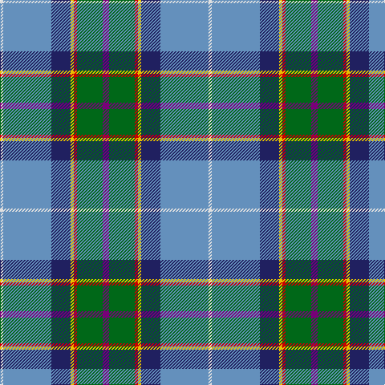

In pattern [BGRYBBW](/patterns/bgrybbw/).

This was sourced from house-of-tartan.  It is a [7 stripes tartan](/stripes/stripes7/).

Original link http://www.house-of-tartan.scotland.net/house/TartanViewjs.asp?colr=Def&tnam=186

## Thread count
LN/4 B60 DB24 Y4 R4 G32 P/8

## Palette
Each colour and its ΔE from the base-6 reference it is a variant of.

| Colour | Shade | Base | ΔE (OKLab) |
|---|---|---|---|
| B | <code style="background-color:#6490BC;">#6490BC</code> `#6490BC` | B <code style="background-color:#2A418A;">#2A418A</code> | 0.24 |
| DB | <code style="background-color:#202060;">#202060</code> `#202060` | B <code style="background-color:#2A418A;">#2A418A</code> | 0.11 |
| G | <code style="background-color:#006818;">#006818</code> `#006818` | G <code style="background-color:#006100;">#006100</code> | 0.02 |
| LN | <code style="background-color:#E0E0E0;">#E0E0E0</code> `#E0E0E0` | W <code style="background-color:#F7F7F7;">#F7F7F7</code> | 0.07 |
| P | <code style="background-color:#780078;">#780078</code> `#780078` | B <code style="background-color:#2A418A;">#2A418A</code> | 0.17 |
| R | <code style="background-color:#C80000;">#C80000</code> `#C80000` | R <code style="background-color:#CC0000;">#CC0000</code> | 0.01 |
| Y | <code style="background-color:#E8C000;">#E8C000</code> `#E8C000` | Y <code style="background-color:#F2BF00;">#F2BF00</code> | 0.02 |

# Sample pattern

## Nearest tartans

The nearest existing variants by ΔTartan distance.

1. [Manx National District Tartan Tartan Number: 185. Earliest known date: pre 2003 These are the specifications supplied by the designer. See products available Copyright © Blair Urquhart, Comrie, 2015](/setts/s7/b2g6r1y1ba3bb10w1x2~b780078-ba202060-bb2888c4-g006818-rc80000-we0e0e0-ye8c000/) — ΔT 0.75
1. [Manx National](/setts/s7/b8g31r4ga4ba17bb64w4~b800080-ba000050-bb8080d0-g008000-ga908000-rc00000-we0e0e0/) — ΔT 0.77
1. [Manx National](/setts/s7/b2g6r1ga1ba3bb10w1x2~b800080-ba000050-bb8080d0-g008000-ga908000-rc00000-we0e0e0/) — ΔT 0.92
1. [O'Reilly (Estimated threadcount)](/setts/s9/r4b3y2k2y12k2ba10bb25w2x2~b1474b4-ba2c2c80-bb5c8ca8-k101010-rc80000-wf8f8f8-ya0a0a0/) — ΔT 1.07
1. [WCWM 3947](/setts/s8/r2b30y3b2r16ra2g16w2x2~b3850c8-g289c18-r888888-rac80000-we0e0e0-ye8c000/) — ΔT 1.09
1. [Scout Mapping Service #1 (Corporate)](/setts/s7/b24r8g8ra2ga8k1y2x2~b2c2c80-g006818-ga289c18-k101010-r901c38-rac80000-yfccc00/) — ΔT 1.18
1. [Hek Family (Sunningdale, Berwick on Tweed)](/setts/s9/w1wa2g12k2w2k2b15w2y1x2~b816687-g1b6453-k101010-w00bfff-wafff8dc-yffb90f/) — ΔT 1.19
1. [Glen Lyon (Fashion)](/setts/s7/r3b1r11w1k5ba14y3x4~b1c1c50-ba206084-k101010-r888888-wfcfcfc-ybc8c00/) — ΔT 1.22
1. [Highland, Blue (Corporate)](/setts/s10/b4g13ba5y3bb6y3ba5bc6ba28w2x2~b780078-ba2c2c80-bb5c8ca8-bc5c5c5c-g006818-wf8f8f8-ye8c000/) — ΔT 1.23
1. [MacLeroy and Troine 1987](/setts/s10/k4b6w4b6ba8b37y12ba46r6ya4~b00688b-ba3b3131-k000000-r8b1a1a-wf3efed-yacb1b4-yad98719/) — ΔT 1.25

## Neighbour map

Every grey dot is one of 15726 variants placed by the first two principal components of the ΔTartan feature space (44% of its variance). Red is this tartan; blue dots are its nearest — click one to open its page.

<svg viewBox="0 0 640 380" role="img" style="max-width:100%;height:auto;border:1px solid #e0e0e0;border-radius:4px;display:block" xmlns="http://www.w3.org/2000/svg"><image href="/nn/cloud.v1.png" width="640" height="380"/><a href="/setts/s7/b2g6r1y1ba3bb10w1x2~b780078-ba202060-bb2888c4-g006818-rc80000-we0e0e0-ye8c000/"><circle cx="142.5" cy="146.5" r="4" fill="#3465a4"><title>Manx National District Tartan Tartan Number: 185. Earliest known date: pre 2003 These are the specifications supplied by the designer. See products available Copyright © Blair Urquhart, Comrie, 2015</title></circle></a><a href="/setts/s7/b8g31r4ga4ba17bb64w4~b800080-ba000050-bb8080d0-g008000-ga908000-rc00000-we0e0e0/"><circle cx="206.6" cy="114.1" r="4" fill="#3465a4"><title>Manx National</title></circle></a><a href="/setts/s7/b2g6r1ga1ba3bb10w1x2~b800080-ba000050-bb8080d0-g008000-ga908000-rc00000-we0e0e0/"><circle cx="135.3" cy="138.9" r="4" fill="#3465a4"><title>Manx National</title></circle></a><a href="/setts/s9/r4b3y2k2y12k2ba10bb25w2x2~b1474b4-ba2c2c80-bb5c8ca8-k101010-rc80000-wf8f8f8-ya0a0a0/"><circle cx="158.7" cy="116.7" r="4" fill="#3465a4"><title>O'Reilly (Estimated threadcount)</title></circle></a><a href="/setts/s8/r2b30y3b2r16ra2g16w2x2~b3850c8-g289c18-r888888-rac80000-we0e0e0-ye8c000/"><circle cx="213.3" cy="134.8" r="4" fill="#3465a4"><title>WCWM 3947</title></circle></a><a href="/setts/s7/b24r8g8ra2ga8k1y2x2~b2c2c80-g006818-ga289c18-k101010-r901c38-rac80000-yfccc00/"><circle cx="202.0" cy="114.6" r="4" fill="#3465a4"><title>Scout Mapping Service #1 (Corporate)</title></circle></a><a href="/setts/s9/w1wa2g12k2w2k2b15w2y1x2~b816687-g1b6453-k101010-w00bfff-wafff8dc-yffb90f/"><circle cx="179.3" cy="119.9" r="4" fill="#3465a4"><title>Hek Family (Sunningdale, Berwick on Tweed)</title></circle></a><a href="/setts/s7/r3b1r11w1k5ba14y3x4~b1c1c50-ba206084-k101010-r888888-wfcfcfc-ybc8c00/"><circle cx="178.7" cy="159.2" r="4" fill="#3465a4"><title>Glen Lyon (Fashion)</title></circle></a><a href="/setts/s10/b4g13ba5y3bb6y3ba5bc6ba28w2x2~b780078-ba2c2c80-bb5c8ca8-bc5c5c5c-g006818-wf8f8f8-ye8c000/"><circle cx="202.5" cy="118.4" r="4" fill="#3465a4"><title>Highland, Blue (Corporate)</title></circle></a><a href="/setts/s10/k4b6w4b6ba8b37y12ba46r6ya4~b00688b-ba3b3131-k000000-r8b1a1a-wf3efed-yacb1b4-yad98719/"><circle cx="180.8" cy="122.0" r="4" fill="#3465a4"><title>MacLeroy and Troine 1987</title></circle></a><circle cx="183.1" cy="126.7" r="5" fill="#c00000"/></svg>

ID: /setts/s7/b2g8r1y1ba6bb15w1x4~b780078-ba202060-bb6490bc-g006818-rc80000-we0e0e0-ye8c000/
