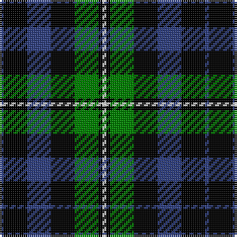

In pattern [BKBKGKW](/patterns/bkbkgkw/).

This was sourced from weddslist.  It is a [7 stripes tartan](/stripes/stripes7/).

Original link http://www.weddslist.com/cgi-bin/tartans/pg.pl?source=sts

## Thread count
B/2 K12 B12 K12 G12 K2 LN/2

## Palette
Each colour and its ΔE from the base-6 reference it is a variant of.

| Colour | Shade | Base | ΔE (OKLab) |
|---|---|---|---|
| B | <code style="background-color:#304080;">#304080</code> `#304080` | B <code style="background-color:#2C4084;">#2C4084</code> | 0.01 |
| G | <code style="background-color:#008000;">#008000</code> `#008000` | G <code style="background-color:#006400;">#006400</code> | 0.09 |
| K | <code style="background-color:#000000;">#000000</code> `#000000` | K <code style="background-color:#000000;">#000000</code> | 0.00 |
| LN | <code style="background-color:#E0E0E0;">#E0E0E0</code> `#E0E0E0` | W <code style="background-color:#F4F4F0;">#F4F4F0</code> | 0.06 |

# Sample pattern

## Nearest tartans

The nearest existing variants by ΔTartan distance.

1. [Wilson's, No 108](/setts/s8/k28g28k4g28k28b4ba28k4-b5480b0-ba800080-g008000-k000000/) — ΔT 0.84
1. [Scott, Sir Walter](/setts/s6/k6b18k22ba4g18k6-b800080-ba5480b0-g008000-k000000/) — ΔT 0.91
1. [MacLaggan](/setts/s7/k28g24w4g24k28b28k4-b304080-g008000-k000000-we0e0e0/) — ΔT 0.97
1. [Campbell, Sir Walter Scott](/setts/s6/k4g16b4k18ba14k4-b304080-ba800080-g008000-k000000/) — ΔT 1.01
1. [Murray](/setts/s6/b6k32g32k32ba6b6-b5480b0-ba304080-g008000-k000000/) — ΔT 1.05
1. [MacCallum](/setts/s7/g16k4w2g8k12b12k2-b00004c-g004c00-k000000-wd0d0d0/) — ΔT 1.07
1. [Fletcher](/setts/s7/b12k2b12k16r2g16k4-b304080-g008000-k000000-rc00000/) — ΔT 1.09
1. [Keith McCormick (Personal)](/setts/s8/g4k24g12k4g12k16b20k4-b483d8b-g006400-k000000/) — ΔT 1.10
1. [Strathspey](/setts/s7/k4g20k20b20k4b4k4-b304080-g008000-k000000/) — ΔT 1.10
1. [Scottish Airports](/setts/s6/b8g36b6k34b36ba8-b102040-ba800070-g008000-k000000/) — ΔT 1.12

## Neighbour map

Every grey dot is one of 15726 variants placed by the first two principal components of the ΔTartan feature space (44% of its variance). Red is this tartan; blue dots are its nearest — click one to open its page.

<svg viewBox="0 0 640 380" role="img" style="max-width:100%;height:auto;border:1px solid #e0e0e0;border-radius:4px;display:block" xmlns="http://www.w3.org/2000/svg"><image href="/nn/cloud.v1.png" width="640" height="380"/><a href="/setts/s8/k28g28k4g28k28b4ba28k4-b5480b0-ba800080-g008000-k000000/"><circle cx="161.2" cy="228.4" r="4" fill="#3465a4"><title>Wilson's, No 108</title></circle></a><a href="/setts/s6/k6b18k22ba4g18k6-b800080-ba5480b0-g008000-k000000/"><circle cx="166.6" cy="251.3" r="4" fill="#3465a4"><title>Scott, Sir Walter</title></circle></a><a href="/setts/s7/k28g24w4g24k28b28k4-b304080-g008000-k000000-we0e0e0/"><circle cx="149.9" cy="248.5" r="4" fill="#3465a4"><title>MacLaggan</title></circle></a><a href="/setts/s6/k4g16b4k18ba14k4-b304080-ba800080-g008000-k000000/"><circle cx="150.1" cy="255.5" r="4" fill="#3465a4"><title>Campbell, Sir Walter Scott</title></circle></a><a href="/setts/s6/b6k32g32k32ba6b6-b5480b0-ba304080-g008000-k000000/"><circle cx="232.4" cy="250.5" r="4" fill="#3465a4"><title>Murray</title></circle></a><a href="/setts/s7/g16k4w2g8k12b12k2-b00004c-g004c00-k000000-wd0d0d0/"><circle cx="190.9" cy="242.1" r="4" fill="#3465a4"><title>MacCallum</title></circle></a><a href="/setts/s7/b12k2b12k16r2g16k4-b304080-g008000-k000000-rc00000/"><circle cx="154.8" cy="230.8" r="4" fill="#3465a4"><title>Fletcher</title></circle></a><a href="/setts/s8/g4k24g12k4g12k16b20k4-b483d8b-g006400-k000000/"><circle cx="224.2" cy="262.4" r="4" fill="#3465a4"><title>Keith McCormick (Personal)</title></circle></a><a href="/setts/s7/k4g20k20b20k4b4k4-b304080-g008000-k000000/"><circle cx="186.2" cy="256.2" r="4" fill="#3465a4"><title>Strathspey</title></circle></a><a href="/setts/s6/b8g36b6k34b36ba8-b102040-ba800070-g008000-k000000/"><circle cx="159.1" cy="250.6" r="4" fill="#3465a4"><title>Scottish Airports</title></circle></a><circle cx="181.7" cy="240.2" r="5" fill="#c00000"/></svg>

ID: /setts/s7/b2k12b12k12g12k2w2-b304080-g008000-k000000-we0e0e0/
