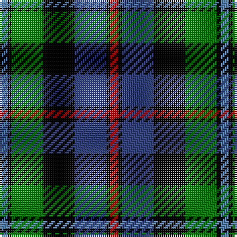

In pattern [BKGKBKR](/patterns/bkgkbkr/).

This was sourced from weddslist.  It is a [7 stripes tartan](/stripes/stripes7/).

Original link http://www.weddslist.com/cgi-bin/tartans/pg.pl?source=sts

## Attestations

This cloth appears in 2 source records; the oldest owns this page.

- undated — Argyll / MacCorquodale (weddslist, [record](http://www.weddslist.com/cgi-bin/tartans/pg.pl?source=sts))
- undated — Campbell of Cawdor (weddslist, [record](http://www.weddslist.com/cgi-bin/tartans/pg.pl?source=sts))

## Thread count
Ba/4 K2 G16 K16 B16 K2 R/4

## Palette
Each colour and its ΔE from the base-6 reference it is a variant of.

| Colour | Shade | Base | ΔE (OKLab) |
|---|---|---|---|
| B | <code style="background-color:#304080;">#304080</code> `#304080` | B <code style="background-color:#2A418A;">#2A418A</code> | 0.02 |
| Ba | <code style="background-color:#5480B0;">#5480B0</code> `#5480B0` | B <code style="background-color:#2A418A;">#2A418A</code> | 0.19 |
| G | <code style="background-color:#008000;">#008000</code> `#008000` | G <code style="background-color:#006100;">#006100</code> | 0.10 |
| K | <code style="background-color:#000000;">#000000</code> `#000000` | K <code style="background-color:#000000;">#000000</code> | 0.00 |
| R | <code style="background-color:#C00000;">#C00000</code> `#C00000` | R <code style="background-color:#CC0000;">#CC0000</code> | 0.03 |

# Sample pattern

## Nearest tartans

The nearest existing variants by ΔTartan distance.

1. [Colquhoun](/setts/s7/r2g8w1k8b8k1b1x4~b304080-g008000-k000000-rc00000-we0e0e0/) — ΔT 0.34
1. [Leslie, hunting](/setts/s6/r2b8k8w1g8k1x2~b304080-g008000-k000000-rc00000-we0e0e0/) — ΔT 0.43
1. [Hogarth, of Firhill](/setts/s7/b4g14y2k14ba14k2ba3x2~b5480b0-ba304080-g008000-k000000-yf0c000/) — ΔT 0.43
1. [MacDonald, (Flora.. )](/setts/s7/g17y2k14r2b9r2b10x2~b304080-g008000-k000000-rc00000-yf0c000/) — ΔT 0.44
1. [Junior Chamber International](/setts/s7/r4g16k16b4g3b12y2x2~b304080-g008000-k000000-rc00000-yf0c000/) — ΔT 0.52
1. [MacWilliam](/setts/s6/r10b24r4k30g36ba5~b304080-ba000050-g008000-k000000-rc00000/) — ΔT 0.61
1. [Hogarth, of Firhill](/setts/s7/b2g6y1k6ba6k1ba1x2~b8080d0-ba304080-g008000-k000000-yf0c000/) — ΔT 0.63
1. [Wellington](/setts/s6/b1r1b6k6g6w1x2~b304080-g008000-k000000-rc00000-we0e0e0/) — ΔT 0.65
1. [MacNeil 4](/setts/s6/w1b8k9g9k1y1x4~b304080-g008000-k000000-we0e0e0-yf0c000/) — ΔT 0.69
1. [Campbell Cawdor](/setts/s7/r2k1b8k8g8k1w2~b00004c-g004c00-k000000-rc80000-wd0d0d0/) — ΔT 0.72

## Neighbour map

Every grey dot is one of 15726 variants placed by the first two principal components of the ΔTartan feature space (44% of its variance). Red is this tartan; blue dots are its nearest — click one to open its page.

<svg viewBox="0 0 640 380" role="img" style="max-width:100%;height:auto;border:1px solid #e0e0e0;border-radius:4px;display:block" xmlns="http://www.w3.org/2000/svg"><image href="/nn/cloud.v1.png" width="640" height="380"/><a href="/setts/s7/r2g8w1k8b8k1b1x4~b304080-g008000-k000000-rc00000-we0e0e0/"><circle cx="106.7" cy="191.7" r="4" fill="#3465a4"><title>Colquhoun</title></circle></a><a href="/setts/s6/r2b8k8w1g8k1x2~b304080-g008000-k000000-rc00000-we0e0e0/"><circle cx="103.7" cy="206.4" r="4" fill="#3465a4"><title>Leslie, hunting</title></circle></a><a href="/setts/s7/b4g14y2k14ba14k2ba3x2~b5480b0-ba304080-g008000-k000000-yf0c000/"><circle cx="96.9" cy="204.4" r="4" fill="#3465a4"><title>Hogarth, of Firhill</title></circle></a><a href="/setts/s7/g17y2k14r2b9r2b10x2~b304080-g008000-k000000-rc00000-yf0c000/"><circle cx="112.9" cy="198.4" r="4" fill="#3465a4"><title>MacDonald, (Flora.. )</title></circle></a><a href="/setts/s7/r4g16k16b4g3b12y2x2~b304080-g008000-k000000-rc00000-yf0c000/"><circle cx="105.8" cy="200.4" r="4" fill="#3465a4"><title>Junior Chamber International</title></circle></a><a href="/setts/s6/r10b24r4k30g36ba5~b304080-ba000050-g008000-k000000-rc00000/"><circle cx="105.9" cy="205.6" r="4" fill="#3465a4"><title>MacWilliam</title></circle></a><a href="/setts/s7/b2g6y1k6ba6k1ba1x2~b8080d0-ba304080-g008000-k000000-yf0c000/"><circle cx="78.9" cy="209.0" r="4" fill="#3465a4"><title>Hogarth, of Firhill</title></circle></a><a href="/setts/s6/b1r1b6k6g6w1x2~b304080-g008000-k000000-rc00000-we0e0e0/"><circle cx="97.9" cy="217.0" r="4" fill="#3465a4"><title>Wellington</title></circle></a><a href="/setts/s6/w1b8k9g9k1y1x4~b304080-g008000-k000000-we0e0e0-yf0c000/"><circle cx="125.0" cy="196.6" r="4" fill="#3465a4"><title>MacNeil 4</title></circle></a><a href="/setts/s7/r2k1b8k8g8k1w2~b00004c-g004c00-k000000-rc80000-wd0d0d0/"><circle cx="114.7" cy="203.2" r="4" fill="#3465a4"><title>Campbell Cawdor</title></circle></a><circle cx="108.3" cy="198.4" r="5" fill="#c00000"/></svg>

ID: /setts/s7/b2k1g8k8ba8k1r2x2~b5480b0-ba304080-g008000-k000000-rc00000/
