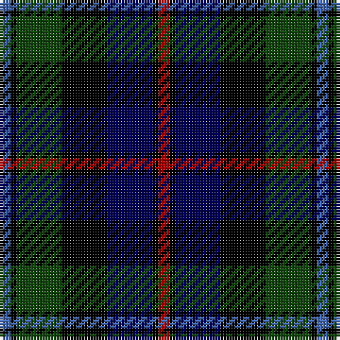

In pattern [BKGKBKR](/patterns/bkgkbkr/).

This was sourced from weddslist.  It is a [7 stripes tartan](/stripes/stripes7/).

Original link http://www.weddslist.com/cgi-bin/tartans/pg.pl?source=tinsel

## Thread count
B/4 K2 DG16 K16 DB16 K2 DR/4

## Palette
Each colour and its ΔE from the base-6 reference it is a variant of.

| Colour | Shade | Base | ΔE (OKLab) |
|---|---|---|---|
| B | <code style="background-color:#4367AE;">#4367AE</code> `#4367AE` | B <code style="background-color:#2A418A;">#2A418A</code> | 0.12 |
| DB | <code style="background-color:#000052;">#000052</code> `#000052` | B <code style="background-color:#2A418A;">#2A418A</code> | 0.20 |
| DG | <code style="background-color:#11450D;">#11450D</code> `#11450D` | G <code style="background-color:#006100;">#006100</code> | 0.09 |
| DR | <code style="background-color:#AA0000;">#AA0000</code> `#AA0000` | R <code style="background-color:#CC0000;">#CC0000</code> | 0.07 |
| K | <code style="background-color:#000000;">#000000</code> `#000000` | K <code style="background-color:#000000;">#000000</code> | 0.00 |

# Sample pattern

## Nearest tartans

The nearest existing variants by ΔTartan distance.

1. [Campbell of Cawdor](/setts/s7/b2k1g8k8ba8k1r2~b4367ae-ba000052-g11450d-k000000-raa0000/) — ΔT 0.00
1. [Colquhoun](/setts/s7/r2g8y1k8b8k1b1~b000052-g11450d-k000000-raa0000-yaaaaaa~x2/) — ΔT 0.32
1. [Colquhoun](/setts/s7/r2g8y1k8b8k1b1~b000052-g11450d-k000000-raa0000-yaaaaaa/) — ΔT 0.32
1. [Leslie Hunting](/setts/s6/r2b8k8y1g8k1~b000052-g11450d-k000000-raa0000-yaaaaaa~x2/) — ΔT 0.43
1. [Leslie Hunting](/setts/s6/r2b8k8y1g8k1~b000052-g11450d-k000000-raa0000-yaaaaaa/) — ΔT 0.43
1. [MacLeod](/setts/s7/r3k2g15k10b20k2y2~b000052-g11450d-k000000-raa0000-yaaaa00~x2/) — ΔT 0.69
1. [MacLeod](/setts/s7/r3k2g15k10b20k2y2~b000052-g11450d-k000000-raa0000-yaaaa00/) — ΔT 0.69
1. [Leslie Hunting](/setts/s6/r2b8k8w1g8k1~b000064-g004c00-k000000-rc80000-wd0d0d0~x2/) — ΔT 0.76
1. [Royal College of Physicians of Edinburgh](/setts/s6/b28r4k14r4g33y4~b000050-g003000-k000000-rc00000-yf0c000~x2/) — ΔT 0.78
1. [Mitchell](/setts/s6/k2g12k12r1b12y2~b000052-g11450d-k000000-raa0000-yaaaaaa~x2/) — ΔT 0.78

## Neighbour map

Every grey dot is one of 15726 variants placed by the first two principal components of the ΔTartan feature space (44% of its variance). Red is this tartan; blue dots are its nearest — click one to open its page.

<svg viewBox="0 0 640 380" role="img" style="max-width:100%;height:auto;border:1px solid #e0e0e0;border-radius:4px;display:block" xmlns="http://www.w3.org/2000/svg"><image href="/nn/cloud.v1.png" width="640" height="380"/><a href="/setts/s7/b2k1g8k8ba8k1r2~b4367ae-ba000052-g11450d-k000000-raa0000/"><circle cx="139.9" cy="214.6" r="4" fill="#3465a4"><title>Campbell of Cawdor</title></circle></a><a href="/setts/s7/r2g8y1k8b8k1b1~b000052-g11450d-k000000-raa0000-yaaaaaa~x2/"><circle cx="138.6" cy="208.7" r="4" fill="#3465a4"><title>Colquhoun</title></circle></a><a href="/setts/s7/r2g8y1k8b8k1b1~b000052-g11450d-k000000-raa0000-yaaaaaa/"><circle cx="138.6" cy="208.7" r="4" fill="#3465a4"><title>Colquhoun</title></circle></a><a href="/setts/s6/r2b8k8y1g8k1~b000052-g11450d-k000000-raa0000-yaaaaaa~x2/"><circle cx="135.2" cy="222.9" r="4" fill="#3465a4"><title>Leslie Hunting</title></circle></a><a href="/setts/s6/r2b8k8y1g8k1~b000052-g11450d-k000000-raa0000-yaaaaaa/"><circle cx="135.2" cy="222.9" r="4" fill="#3465a4"><title>Leslie Hunting</title></circle></a><a href="/setts/s7/r3k2g15k10b20k2y2~b000052-g11450d-k000000-raa0000-yaaaa00~x2/"><circle cx="178.4" cy="196.5" r="4" fill="#3465a4"><title>MacLeod</title></circle></a><a href="/setts/s7/r3k2g15k10b20k2y2~b000052-g11450d-k000000-raa0000-yaaaa00/"><circle cx="178.4" cy="196.5" r="4" fill="#3465a4"><title>MacLeod</title></circle></a><a href="/setts/s6/r2b8k8w1g8k1~b000064-g004c00-k000000-rc80000-wd0d0d0~x2/"><circle cx="120.8" cy="216.9" r="4" fill="#3465a4"><title>Leslie Hunting</title></circle></a><a href="/setts/s6/b28r4k14r4g33y4~b000050-g003000-k000000-rc00000-yf0c000~x2/"><circle cx="165.5" cy="210.4" r="4" fill="#3465a4"><title>Royal College of Physicians of Edinburgh</title></circle></a><a href="/setts/s6/k2g12k12r1b12y2~b000052-g11450d-k000000-raa0000-yaaaaaa~x2/"><circle cx="166.4" cy="207.6" r="4" fill="#3465a4"><title>Mitchell</title></circle></a><circle cx="139.9" cy="214.6" r="5" fill="#c00000"/></svg>

ID: /setts/s7/b2k1g8k8ba8k1r2~b4367ae-ba000052-g11450d-k000000-raa0000~x2/
