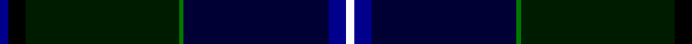

In pattern [BKKGKBW](/patterns/bkkgkbw/).

This was sourced from register-of-tartans.  It is a [7 stripes tartan](/stripes/stripes7/).

Original link https://www.tartanregister.gov.uk/tartanDetails.aspx?ref=3351

## Attestations

This cloth appears in 2 source records; the oldest owns this page.

- 01/01/1999 — Police College Tulliallan (register-of-tartans, [record](https://www.tartanregister.gov.uk/tartanDetails.aspx?ref=3351))
- 1999 — Police College Tulliallan (Corporate (tartans-authority, [record](http://www.tartansauthority.com/tartan-ferret/display/4231/))

## Thread count
DB/4 K8 DG72 G2 DBa68 DB8 W/4

## Palette
Each colour and its ΔE from the base-6 reference it is a variant of.

| Colour | Shade | Base | ΔE (OKLab) |
|---|---|---|---|
| DB | <code style="background-color:#00008C;">#00008C</code> `#00008C` | B <code style="background-color:#2A418A;">#2A418A</code> | 0.13 |
| DBa | <code style="background-color:#000034;">#000034</code> `#000034` | K <code style="background-color:#000000;">#000000</code> | 0.18 |
| DG | <code style="background-color:#001C00;">#001C00</code> `#001C00` | K <code style="background-color:#000000;">#000000</code> | 0.21 |
| G | <code style="background-color:#007800;">#007800</code> `#007800` | G <code style="background-color:#006100;">#006100</code> | 0.07 |
| K | <code style="background-color:#000000;">#000000</code> `#000000` | K <code style="background-color:#000000;">#000000</code> | 0.00 |
| W | <code style="background-color:#FCFCFC;">#FCFCFC</code> `#FCFCFC` | W <code style="background-color:#F7F7F7;">#F7F7F7</code> | 0.01 |

# Sample pattern

## Nearest tartans

The nearest existing variants by ΔTartan distance.

1. [Chesters, Eric (Personal)](/setts/s7/k12g8y1ga13w1b31k8~b000064-g006818-ga003c14-k101010-w98c8e8-yfccc00~x2/) — ΔT 1.38
1. [Scotland the Brave](/setts/s10/k6w1k40b1ka12g12b6g2ba2g4~b800080-ba800070-g003000-k000030-ka000000-we0e0e0~x2/) — ΔT 1.41
1. [Downs (Name)](/setts/s8/b10y2k2b1k18y1k45y2~b1474b4-k101010-ya0a0a0~x2/) — ΔT 1.43
1. [Nova Scotia Int. Tattoo (Corporate)](/setts/s7/b3ba2b21k12g24r1y3~b000054-ba787ca8-g003820-k101010-rc80000-ybc8c00~x2/) — ΔT 1.43
1. [Muir-Hill (Personal)](/setts/s7/w2k2r1b20k15g30y1~b003c64-g003820-k101010-rc80000-we0e0e0-yfccc00~x2/) — ΔT 1.45
1. [Pictou County](/setts/s8/b23w1r3w1b12y9g40b3~b181034-g003c28-r700014-wfcf8ec-yb0840c~x2/) — ΔT 1.48
1. [Singh, Gopal (Personal)](/setts/s6/k10r4g34b34k1y3~b000048-g002814-k000000-rfa4b00-yd87c00~x2/) — ΔT 1.50
1. [Royal Highland Yacht Club](/setts/s11/k26b3k1ba2k1b3k3b12g14k2w2~b141e46-ba840068-g003c14-k000028-we0e0e0~x2/) — ΔT 1.51
1. [Sidey Family Tartan (Name)](/setts/s10/b4w1k2b25k12ba1k2g16k2r1~b202060-ba1474b4-g006818-k101010-rc80000-we0e0e0~x2/) — ΔT 1.53
1. [Highland Pride of Scotland (Fashion)](/setts/s11/b9g2ba2bb2g18ba2k2g1k19b33w2~b202060-ba780078-bb440044-g285800-k101010-we0e0e0~x2/) — ΔT 1.54

## Neighbour map

Every grey dot is one of 15726 variants placed by the first two principal components of the ΔTartan feature space (44% of its variance). Red is this tartan; blue dots are its nearest — click one to open its page.

<svg viewBox="0 0 640 380" role="img" style="max-width:100%;height:auto;border:1px solid #e0e0e0;border-radius:4px;display:block" xmlns="http://www.w3.org/2000/svg"><image href="/nn/cloud.v1.png" width="640" height="380"/><a href="/setts/s7/k12g8y1ga13w1b31k8~b000064-g006818-ga003c14-k101010-w98c8e8-yfccc00~x2/"><circle cx="250.4" cy="155.3" r="4" fill="#3465a4"><title>Chesters, Eric (Personal)</title></circle></a><a href="/setts/s10/k6w1k40b1ka12g12b6g2ba2g4~b800080-ba800070-g003000-k000030-ka000000-we0e0e0~x2/"><circle cx="342.9" cy="107.7" r="4" fill="#3465a4"><title>Scotland the Brave</title></circle></a><a href="/setts/s8/b10y2k2b1k18y1k45y2~b1474b4-k101010-ya0a0a0~x2/"><circle cx="376.0" cy="107.1" r="4" fill="#3465a4"><title>Downs (Name)</title></circle></a><a href="/setts/s7/b3ba2b21k12g24r1y3~b000054-ba787ca8-g003820-k101010-rc80000-ybc8c00~x2/"><circle cx="242.4" cy="162.7" r="4" fill="#3465a4"><title>Nova Scotia Int. Tattoo (Corporate)</title></circle></a><a href="/setts/s7/w2k2r1b20k15g30y1~b003c64-g003820-k101010-rc80000-we0e0e0-yfccc00~x2/"><circle cx="288.5" cy="150.2" r="4" fill="#3465a4"><title>Muir-Hill (Personal)</title></circle></a><a href="/setts/s8/b23w1r3w1b12y9g40b3~b181034-g003c28-r700014-wfcf8ec-yb0840c~x2/"><circle cx="291.6" cy="117.8" r="4" fill="#3465a4"><title>Pictou County</title></circle></a><a href="/setts/s6/k10r4g34b34k1y3~b000048-g002814-k000000-rfa4b00-yd87c00~x2/"><circle cx="278.5" cy="163.0" r="4" fill="#3465a4"><title>Singh, Gopal (Personal)</title></circle></a><a href="/setts/s11/k26b3k1ba2k1b3k3b12g14k2w2~b141e46-ba840068-g003c14-k000028-we0e0e0~x2/"><circle cx="321.4" cy="144.1" r="4" fill="#3465a4"><title>Royal Highland Yacht Club</title></circle></a><a href="/setts/s10/b4w1k2b25k12ba1k2g16k2r1~b202060-ba1474b4-g006818-k101010-rc80000-we0e0e0~x2/"><circle cx="272.0" cy="122.0" r="4" fill="#3465a4"><title>Sidey Family Tartan (Name)</title></circle></a><a href="/setts/s11/b9g2ba2bb2g18ba2k2g1k19b33w2~b202060-ba780078-bb440044-g285800-k101010-we0e0e0~x2/"><circle cx="294.2" cy="110.8" r="4" fill="#3465a4"><title>Highland Pride of Scotland (Fashion)</title></circle></a><circle cx="318.5" cy="136.6" r="5" fill="#c00000"/></svg>

ID: /setts/s7/b2k4ka36g1kb34b4w2~b00008c-g007800-k000000-ka001c00-kb000034-wfcfcfc~x2/
