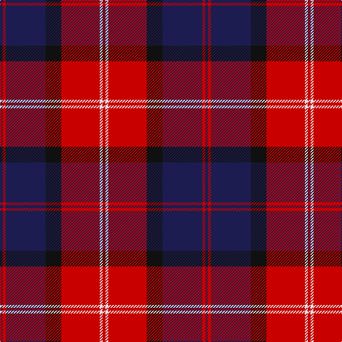

In pattern [BRBKRWR](/patterns/brbkrwr/).

This was sourced from tartans-authority.  It is a [7 stripes tartan](/stripes/stripes7/).

Original link http://www.tartansauthority.com/tartan-ferret/display/7893/

## Thread count
DB/4 R4 DB56 K22 R54 LN4 R/4

## Palette
Each colour and its ΔE from the base-6 reference it is a variant of.

| Colour | Shade | Base | ΔE (OKLab) |
|---|---|---|---|
| DB | <code style="background-color:#1C1C50;">#1C1C50</code> `#1C1C50` | B <code style="background-color:#2A418A;">#2A418A</code> | 0.14 |
| K | <code style="background-color:#101010;">#101010</code> `#101010` | K <code style="background-color:#000000;">#000000</code> | 0.17 |
| LN | <code style="background-color:#E0E0E0;">#E0E0E0</code> `#E0E0E0` | W <code style="background-color:#F7F7F7;">#F7F7F7</code> | 0.07 |
| R | <code style="background-color:#C80000;">#C80000</code> `#C80000` | R <code style="background-color:#CC0000;">#CC0000</code> | 0.01 |

# Sample pattern

## Nearest tartans

The nearest existing variants by ΔTartan distance.

1. [St. George's (Edinburgh) (School)](/setts/s10/r7k3r4k5r25k7y2b22k3b4x2~b2c2c80-k101010-rc80000-ye8c000/) — ΔT 0.86
1. [Graham of Menteith (Red)](/setts/s6/r36w3r5k21b24k3x2~b2c2c80-k101010-rc80000-wa8ace8/) — ΔT 0.90
1. [Galloway Dress (Yellow Line)](/setts/s6/g2r1b16r16b1y2x2~b2c2c80-g285800-rc80000-ye8c000/) — ΔT 0.94
1. [Galloway Dress District Tartan Tartan Number: 850. Earliest known date: 1950 This sett is taken from a sample in MacGregor-Hastie Collection at the Scottish Tartans Museum. It is the more usual form of the dress version. See products available Copyright © Blair Urquhart, Comrie, 2015](/setts/s6/g2r1b16r16b1y2x2~b2c2c80-g006818-rc80000-ye8c000/) — ΔT 0.95
1. [Memery (Name)](/setts/s9/w4k6r3k15r3k6r27b9w2x2~b2c2c80-k101010-rc80000-we0e0e0/) — ΔT 1.05
1. [Girl Guiding Scotland (Corporate)](/setts/s9/k36r3b3r3k8b24r18y3r3x2~b2c2c80-k101010-rc80050-ye8c000/) — ΔT 1.07
1. [Galloway Red](/setts/s6/g3r2b22r22b2w3x2~b2c2c80-g006818-rc80000-wfcfcfc/) — ΔT 1.08
1. [Robinson, dress](/setts/s6/g1b16r7k1r7k1x2~b304080-g008000-k000000-rc00000/) — ΔT 1.09
1. [Cetoloni (Personal)](/setts/s6/b1r12k6y1k6b1x4~b2c2c80-k101010-rc80000-ye8c000/) — ΔT 1.09
1. [Black and Red](/setts/s8/r25k2b4k2r8k31ba32k8~b5c5c5c-ba2c2c80-k101010-rc80000/) — ΔT 1.13

## Neighbour map

Every grey dot is one of 15726 variants placed by the first two principal components of the ΔTartan feature space (44% of its variance). Red is this tartan; blue dots are its nearest — click one to open its page.

<svg viewBox="0 0 640 380" role="img" style="max-width:100%;height:auto;border:1px solid #e0e0e0;border-radius:4px;display:block" xmlns="http://www.w3.org/2000/svg"><image href="/nn/cloud.v1.png" width="640" height="380"/><a href="/setts/s10/r7k3r4k5r25k7y2b22k3b4x2~b2c2c80-k101010-rc80000-ye8c000/"><circle cx="250.4" cy="163.1" r="4" fill="#3465a4"><title>St. George's (Edinburgh) (School)</title></circle></a><a href="/setts/s6/r36w3r5k21b24k3x2~b2c2c80-k101010-rc80000-wa8ace8/"><circle cx="248.0" cy="196.7" r="4" fill="#3465a4"><title>Graham of Menteith (Red)</title></circle></a><a href="/setts/s6/g2r1b16r16b1y2x2~b2c2c80-g285800-rc80000-ye8c000/"><circle cx="307.3" cy="169.3" r="4" fill="#3465a4"><title>Galloway Dress (Yellow Line)</title></circle></a><a href="/setts/s6/g2r1b16r16b1y2x2~b2c2c80-g006818-rc80000-ye8c000/"><circle cx="306.3" cy="169.0" r="4" fill="#3465a4"><title>Galloway Dress District Tartan Tartan Number: 850. Earliest known date: 1950 This sett is taken from a sample in MacGregor-Hastie Collection at the Scottish Tartans Museum. It is the more usual form of the dress version. See products available Copyright © Blair Urquhart, Comrie, 2015</title></circle></a><a href="/setts/s9/w4k6r3k15r3k6r27b9w2x2~b2c2c80-k101010-rc80000-we0e0e0/"><circle cx="235.3" cy="160.4" r="4" fill="#3465a4"><title>Memery (Name)</title></circle></a><a href="/setts/s9/k36r3b3r3k8b24r18y3r3x2~b2c2c80-k101010-rc80050-ye8c000/"><circle cx="248.7" cy="171.7" r="4" fill="#3465a4"><title>Girl Guiding Scotland (Corporate)</title></circle></a><a href="/setts/s6/g3r2b22r22b2w3x2~b2c2c80-g006818-rc80000-wfcfcfc/"><circle cx="276.1" cy="182.0" r="4" fill="#3465a4"><title>Galloway Red</title></circle></a><a href="/setts/s6/g1b16r7k1r7k1x2~b304080-g008000-k000000-rc00000/"><circle cx="323.7" cy="182.8" r="4" fill="#3465a4"><title>Robinson, dress</title></circle></a><a href="/setts/s6/b1r12k6y1k6b1x4~b2c2c80-k101010-rc80000-ye8c000/"><circle cx="272.4" cy="191.3" r="4" fill="#3465a4"><title>Cetoloni (Personal)</title></circle></a><a href="/setts/s8/r25k2b4k2r8k31ba32k8~b5c5c5c-ba2c2c80-k101010-rc80000/"><circle cx="238.4" cy="179.8" r="4" fill="#3465a4"><title>Black and Red</title></circle></a><circle cx="269.1" cy="169.7" r="5" fill="#c00000"/></svg>

ID: /setts/s7/b2r2b28k11r27w2r2x2~b1c1c50-k101010-rc80000-we0e0e0/
