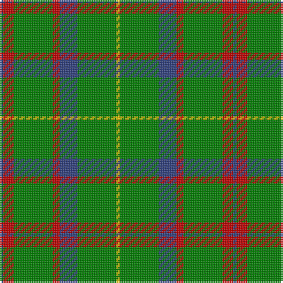

In pattern [BRGRBGY](/patterns/brgrbgy/).

This was sourced from weddslist.  It is a [7 stripes tartan](/stripes/stripes7/).

Original link http://www.weddslist.com/cgi-bin/tartans/pg.pl?source=sts

## Thread count
B/2 R6 G22 R4 B10 G22 Y/2

## Palette
Each colour and its ΔE from the base-6 reference it is a variant of.

| Colour | Shade | Base | ΔE (OKLab) |
|---|---|---|---|
| B | <code style="background-color:#304080;">#304080</code> `#304080` | B <code style="background-color:#2C4084;">#2C4084</code> | 0.01 |
| G | <code style="background-color:#008000;">#008000</code> `#008000` | G <code style="background-color:#006400;">#006400</code> | 0.09 |
| R | <code style="background-color:#C00000;">#C00000</code> `#C00000` | R <code style="background-color:#C80000;">#C80000</code> | 0.02 |
| Y | <code style="background-color:#F0C000;">#F0C000</code> `#F0C000` | Y <code style="background-color:#E8C000;">#E8C000</code> | 0.01 |

# Sample pattern

## Nearest tartans

The nearest existing variants by ΔTartan distance.

1. [MacKintosh Hunting Clan Tartan Tartan Number: 544. Earliest known date: 1951 This sett appears in D.C. Stewarts book, The Setts of the Scottish Tartans, with slightly different proportions. The Lyon Court Book No. 1 records the sett in relation to the narrowest stripe. ie Y 1, Vt (Vert meaning green) 10 1/2, Bu 5, etc. The rendering illustrated here multiplies the Lyon count by two. Commercially manufactured cloth may vary from these proportions. D.C. Stewart calls the sett "a modern arrangement". See products available Copyright © Blair Urquhart, Comrie, 2015](/setts/s7/b2r6g22r4b10g22y2-b2c2c80-g006818-rc80000-ye8c000/) — ΔT 0.74
1. [Arkansas](/setts/s7/g12w4g48r24g12k12g8-g006818-k101010-rc8002c-wfcfcfc/) — ΔT 1.01
1. [Duke of York, hunting](/setts/s8/g99b20w8b30y8b10y8g46-b304080-g008000-we0e0e0-yf0c000/) — ΔT 1.02
1. [McGirr (Letterkenny) David, (Pers.)](/setts/s8/g16r4g60b20r4w20g16r4-b68889c-g006818-rc8002c-we0e0e0/) — ΔT 1.03
1. [Glenlivet](/setts/s8/g18r6g75b6g13ga35g12b6-b0000ff-g228b22-ga604000-rff0000/) — ΔT 1.03
1. [MacKintosh Hunting](/setts/s7/y4g24b12r6g24r8b2-b2c2c80-g006818-rc80000-ye8c000/) — ΔT 1.12
1. [Paton (Personal)](/setts/s7/r6g40k40g40y4g4y4-g006818-k101010-r880000-yd09800/) — ΔT 1.14
1. [Scottish Scouts](/setts/s7/r6g44b32g28r4g12y2-b304080-g008000-rc00000-yf0c000/) — ΔT 1.20
1. [Campbell & Co (Beauly) (Corporate)](/setts/s9/g8r10g62r10g62y10g8y54ya6-g006818-rc8002c-ya08858-yafccc00/) — ΔT 1.22
1. [Tulloch Homes](/setts/s7/g6ga14r9b7r9ga54y6-b14283c-g289c18-ga006818-rc80000-ye8c000/) — ΔT 1.22

## Neighbour map

Every grey dot is one of 15726 variants placed by the first two principal components of the ΔTartan feature space (44% of its variance). Red is this tartan; blue dots are its nearest — click one to open its page.

<svg viewBox="0 0 640 380" role="img" style="max-width:100%;height:auto;border:1px solid #e0e0e0;border-radius:4px;display:block" xmlns="http://www.w3.org/2000/svg"><image href="/nn/cloud.v1.png" width="640" height="380"/><a href="/setts/s7/b2r6g22r4b10g22y2-b2c2c80-g006818-rc80000-ye8c000/"><circle cx="368.1" cy="216.3" r="4" fill="#3465a4"><title>MacKintosh Hunting Clan Tartan Tartan Number: 544. Earliest known date: 1951 This sett appears in D.C. Stewarts book, The Setts of the Scottish Tartans, with slightly different proportions. The Lyon Court Book No. 1 records the sett in relation to the narrowest stripe. ie Y 1, Vt (Vert meaning green) 10 1/2, Bu 5, etc. The rendering illustrated here multiplies the Lyon count by two. Commercially manufactured cloth may vary from these proportions. D.C. Stewart calls the sett &quot;a modern arrangement&quot;. See products available Copyright © Blair Urquhart, Comrie, 2015</title></circle></a><a href="/setts/s7/g12w4g48r24g12k12g8-g006818-k101010-rc8002c-wfcfcfc/"><circle cx="366.6" cy="207.6" r="4" fill="#3465a4"><title>Arkansas</title></circle></a><a href="/setts/s8/g99b20w8b30y8b10y8g46-b304080-g008000-we0e0e0-yf0c000/"><circle cx="360.3" cy="188.5" r="4" fill="#3465a4"><title>Duke of York, hunting</title></circle></a><a href="/setts/s8/g16r4g60b20r4w20g16r4-b68889c-g006818-rc8002c-we0e0e0/"><circle cx="351.6" cy="179.0" r="4" fill="#3465a4"><title>McGirr (Letterkenny) David, (Pers.)</title></circle></a><a href="/setts/s8/g18r6g75b6g13ga35g12b6-b0000ff-g228b22-ga604000-rff0000/"><circle cx="417.8" cy="196.4" r="4" fill="#3465a4"><title>Glenlivet</title></circle></a><a href="/setts/s7/y4g24b12r6g24r8b2-b2c2c80-g006818-rc80000-ye8c000/"><circle cx="321.5" cy="214.8" r="4" fill="#3465a4"><title>MacKintosh Hunting</title></circle></a><a href="/setts/s7/r6g40k40g40y4g4y4-g006818-k101010-r880000-yd09800/"><circle cx="345.8" cy="218.2" r="4" fill="#3465a4"><title>Paton (Personal)</title></circle></a><a href="/setts/s7/r6g44b32g28r4g12y2-b304080-g008000-rc00000-yf0c000/"><circle cx="406.8" cy="198.3" r="4" fill="#3465a4"><title>Scottish Scouts</title></circle></a><a href="/setts/s9/g8r10g62r10g62y10g8y54ya6-g006818-rc8002c-ya08858-yafccc00/"><circle cx="372.7" cy="207.4" r="4" fill="#3465a4"><title>Campbell &amp; Co (Beauly) (Corporate)</title></circle></a><a href="/setts/s7/g6ga14r9b7r9ga54y6-b14283c-g289c18-ga006818-rc80000-ye8c000/"><circle cx="355.4" cy="189.3" r="4" fill="#3465a4"><title>Tulloch Homes</title></circle></a><circle cx="364.2" cy="214.8" r="5" fill="#c00000"/></svg>

ID: /setts/s7/b2r6g22r4b10g22y2-b304080-g008000-rc00000-yf0c000/
