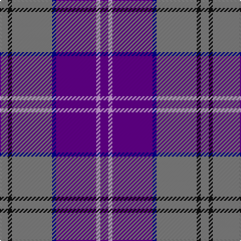

In pattern [BWBBGKG](/patterns/bwbbgkg/).

This was sourced from register-of-tartans.  It is a [7 stripes tartan](/stripes/stripes7/).

Original link https://www.tartanregister.gov.uk/tartanDetails.aspx?ref=11442

## Thread count
N/8 K4 N40 DB4 P40 LP4 P/8

## Palette
Each colour and its ΔE from the base-6 reference it is a variant of.

| Colour | Shade | Base | ΔE (OKLab) |
|---|---|---|---|
| DB | <code style="background-color:#00008C;">#00008C</code> `#00008C` | B <code style="background-color:#2A418A;">#2A418A</code> | 0.13 |
| K | <code style="background-color:#101010;">#101010</code> `#101010` | K <code style="background-color:#000000;">#000000</code> | 0.17 |
| LP | <code style="background-color:#C49CD8;">#C49CD8</code> `#C49CD8` | W <code style="background-color:#F7F7F7;">#F7F7F7</code> | 0.25 |
| N | <code style="background-color:#808080;">#808080</code> `#808080` | G <code style="background-color:#006100;">#006100</code> | 0.23 |
| P | <code style="background-color:#64008C;">#64008C</code> `#64008C` | B <code style="background-color:#2A418A;">#2A418A</code> | 0.14 |

# Sample pattern

## Nearest tartans

The nearest existing variants by ΔTartan distance.

1. [McIntosh, Georgina (Personal)](/setts/s6/b9w1g2w1ba4r1x12~b9050d8-ba2c2c80-g006818-rc80000-w98c8e8/) — ΔT 1.26
1. [Scottish Highlander Dress (Fashion)](/setts/s8/b26w2b3ba15r26ra2r3ba4x2~b9058d8-ba202060-r888888-ra901c38-wfcfcfc/) — ΔT 1.34
1. [McIntosh, Georgina (Personal)](/setts/s6/b9r1b2r1r4w1x12~b2c2c80-rc80000-we0e0e0/) — ΔT 1.42
1. [Aberdeen Academy of Performing Art](/setts/s6/b4ba2bb3b24bc24w3x2~b2c2c80-ba780078-bb440044-bc5c8ca8-wfcfcfc/) — ΔT 1.43
1. [Murdoch](/setts/s6/k2r1b17r17ba1y2x4~b304080-ba102040-k000000-r802040-yf0c000/) — ΔT 1.47
1. [Serenade (Fashion)](/setts/s10/b6ba12y3ba12bb6b2bb26ba16w2ba6x2~b2c2c80-ba780078-bb1474b4-wc8c8c8-y00c8c8/) — ΔT 1.51
1. [Learmonth Family (Herts) (Personal)](/setts/s10/b16w2b5ba12b8y2bb4b8ba23y4x2~b9058d8-ba440044-bb2c2c80-wc49cd8-y48a4c0/) — ΔT 1.52
1. [Glen Moray](/setts/s8/b1y1b13ya3g3ya3r1ya1x4~b2c2c80-g8c7038-rc80000-ybc8c00-yaa08858/) — ΔT 1.54
1. [Cheadle (Personal)](/setts/s6/b10y3b8ba42g5r5x2~b780078-ba2c2c80-g006818-r888888-ye8c000/) — ΔT 1.58
1. [St. Leonards (Corporate)](/setts/s8/r16b2ra6r3k4ba2b40ba6x2~b2c2c80-ba2888c4-k101010-rc80000-ra888888/) — ΔT 1.59

## Neighbour map

Every grey dot is one of 15726 variants placed by the first two principal components of the ΔTartan feature space (44% of its variance). Red is this tartan; blue dots are its nearest — click one to open its page.

<svg viewBox="0 0 640 380" role="img" style="max-width:100%;height:auto;border:1px solid #e0e0e0;border-radius:4px;display:block" xmlns="http://www.w3.org/2000/svg"><image href="/nn/cloud.v1.png" width="640" height="380"/><a href="/setts/s6/b9w1g2w1ba4r1x12~b9050d8-ba2c2c80-g006818-rc80000-w98c8e8/"><circle cx="246.6" cy="184.7" r="4" fill="#3465a4"><title>McIntosh, Georgina (Personal)</title></circle></a><a href="/setts/s8/b26w2b3ba15r26ra2r3ba4x2~b9058d8-ba202060-r888888-ra901c38-wfcfcfc/"><circle cx="211.0" cy="159.3" r="4" fill="#3465a4"><title>Scottish Highlander Dress (Fashion)</title></circle></a><a href="/setts/s6/b9r1b2r1r4w1x12~b2c2c80-rc80000-we0e0e0/"><circle cx="284.0" cy="202.2" r="4" fill="#3465a4"><title>McIntosh, Georgina (Personal)</title></circle></a><a href="/setts/s6/b4ba2bb3b24bc24w3x2~b2c2c80-ba780078-bb440044-bc5c8ca8-wfcfcfc/"><circle cx="263.0" cy="181.4" r="4" fill="#3465a4"><title>Aberdeen Academy of Performing Art</title></circle></a><a href="/setts/s6/k2r1b17r17ba1y2x4~b304080-ba102040-k000000-r802040-yf0c000/"><circle cx="312.8" cy="168.5" r="4" fill="#3465a4"><title>Murdoch</title></circle></a><a href="/setts/s10/b6ba12y3ba12bb6b2bb26ba16w2ba6x2~b2c2c80-ba780078-bb1474b4-wc8c8c8-y00c8c8/"><circle cx="295.4" cy="182.1" r="4" fill="#3465a4"><title>Serenade (Fashion)</title></circle></a><a href="/setts/s10/b16w2b5ba12b8y2bb4b8ba23y4x2~b9058d8-ba440044-bb2c2c80-wc49cd8-y48a4c0/"><circle cx="239.3" cy="174.1" r="4" fill="#3465a4"><title>Learmonth Family (Herts) (Personal)</title></circle></a><a href="/setts/s8/b1y1b13ya3g3ya3r1ya1x4~b2c2c80-g8c7038-rc80000-ybc8c00-yaa08858/"><circle cx="304.6" cy="155.2" r="4" fill="#3465a4"><title>Glen Moray</title></circle></a><a href="/setts/s6/b10y3b8ba42g5r5x2~b780078-ba2c2c80-g006818-r888888-ye8c000/"><circle cx="354.6" cy="181.7" r="4" fill="#3465a4"><title>Cheadle (Personal)</title></circle></a><a href="/setts/s8/r16b2ra6r3k4ba2b40ba6x2~b2c2c80-ba2888c4-k101010-rc80000-ra888888/"><circle cx="316.8" cy="134.7" r="4" fill="#3465a4"><title>St. Leonards (Corporate)</title></circle></a><circle cx="276.6" cy="179.7" r="5" fill="#c00000"/></svg>

ID: /setts/s7/b2w1b10ba1g10k1g2x4~b64008c-ba00008c-g808080-k101010-wc49cd8/
