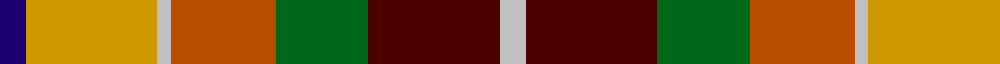

In pattern [BYWRGBW](/patterns/bywrgbw/).

This was sourced from register-of-tartans.  It is a [7 stripes tartan](/stripes/stripes7/).

Original link https://www.tartanregister.gov.uk/tartanDetails.aspx?ref=2002

## Attestations

This cloth appears in 2 source records; the oldest owns this page.

- 01/11/1996 — Kipp (Personal) (register-of-tartans, [record](https://www.tartanregister.gov.uk/tartanDetails.aspx?ref=2002))
- pre 1998 — Kipp (Personal) (tartans-authority, [record](http://www.tartansauthority.com/tartan-ferret/display/2445/))

## Thread count
DB/4 DY20 N2 DO16 G14 DR20 N/4

## Palette
Each colour and its ΔE from the base-6 reference it is a variant of.

| Colour | Shade | Base | ΔE (OKLab) |
|---|---|---|---|
| DB | <code style="background-color:#1C0070;">#1C0070</code> `#1C0070` | B <code style="background-color:#2A418A;">#2A418A</code> | 0.14 |
| DO | <code style="background-color:#B84C00;">#B84C00</code> `#B84C00` | R <code style="background-color:#CC0000;">#CC0000</code> | 0.08 |
| DR | <code style="background-color:#4C0000;">#4C0000</code> `#4C0000` | B <code style="background-color:#2A418A;">#2A418A</code> | 0.25 |
| DY | <code style="background-color:#D09800;">#D09800</code> `#D09800` | Y <code style="background-color:#F2BF00;">#F2BF00</code> | 0.12 |
| G | <code style="background-color:#006818;">#006818</code> `#006818` | G <code style="background-color:#006100;">#006100</code> | 0.02 |
| N | <code style="background-color:#C0C0C0;">#C0C0C0</code> `#C0C0C0` | W <code style="background-color:#F7F7F7;">#F7F7F7</code> | 0.17 |

# Sample pattern

## Nearest tartans

The nearest existing variants by ΔTartan distance.

1. [Kipp](/setts/s7/b1y7w1ya7g7r7w1x2~b000050-g008000-r802040-we0e0e0-yf0c000-yad08010/) — ΔT 1.18
1. [Pride, The Tartan of](/setts/s6/r8y4ya3g6b6ba1x5~b2888c4-ba780078-g006818-rc80000-yd87c00-yae8c000/) — ΔT 1.22
1. [Porcupine City of](/setts/s7/r10b3ba1w8ba1y2g5x4~b5c5c5c-ba1c0070-g006818-rb03000-wc0c0c0-yd09800/) — ΔT 1.24
1. [Nicolson of Taransay (Personal)](/setts/s7/w6g10r22b16ga2ga4ga5x2~b2c2c80-g006818-ga289c18-rc80000-we0e0e0/) — ΔT 1.25
1. [Unidentified Silk Plaid #2](/setts/s7/y7ya12g30r12ra14rb11ya2x2~g005020-rec7440-rae13200-rbc82828-yc89600-yafadc00/) — ΔT 1.25
1. [Mekos, The](/setts/s6/g19ga23y3b15r11w5x2~b2c2c80-g603800-ga006818-rc80000-wfcfcfc-yfccc00/) — ΔT 1.28
1. [Unnamed No 14](/setts/s9/r22b6ba10y4r4w4g22ba8y3~b5480b0-ba304080-g008000-rc00000-we0e0e0-yf0c000/) — ΔT 1.31
1. [Alabama (Fashion)](/setts/s7/r3w8k9g16r12b12y3x2~b5c5c5c-g006818-k101010-rc80000-wc0c0c0-yd09800/) — ΔT 1.33
1. [Jacobite Silk sash](/setts/s10/w2r8g5y6w5ga21w6r8ra4w2~g503c14-ga005020-rdc0000-rac82828-we0e0e0-ye8c000/) — ΔT 1.35
1. [Kildare County Crest (Fashion)](/setts/s11/y40k5g48k5r20k5ya14k10w4r28ya10~g5c6428-k101010-r880000-we0e0e0-ybc8c00-yaa0a0a0/) — ΔT 1.35

## Neighbour map

Every grey dot is one of 15726 variants placed by the first two principal components of the ΔTartan feature space (44% of its variance). Red is this tartan; blue dots are its nearest — click one to open its page.

<svg viewBox="0 0 640 380" role="img" style="max-width:100%;height:auto;border:1px solid #e0e0e0;border-radius:4px;display:block" xmlns="http://www.w3.org/2000/svg"><image href="/nn/cloud.v1.png" width="640" height="380"/><a href="/setts/s7/b1y7w1ya7g7r7w1x2~b000050-g008000-r802040-we0e0e0-yf0c000-yad08010/"><circle cx="39.1" cy="176.1" r="4" fill="#3465a4"><title>Kipp</title></circle></a><a href="/setts/s6/r8y4ya3g6b6ba1x5~b2888c4-ba780078-g006818-rc80000-yd87c00-yae8c000/"><circle cx="63.4" cy="205.7" r="4" fill="#3465a4"><title>Pride, The Tartan of</title></circle></a><a href="/setts/s7/r10b3ba1w8ba1y2g5x4~b5c5c5c-ba1c0070-g006818-rb03000-wc0c0c0-yd09800/"><circle cx="114.8" cy="161.3" r="4" fill="#3465a4"><title>Porcupine City of</title></circle></a><a href="/setts/s7/w6g10r22b16ga2ga4ga5x2~b2c2c80-g006818-ga289c18-rc80000-we0e0e0/"><circle cx="103.5" cy="160.2" r="4" fill="#3465a4"><title>Nicolson of Taransay (Personal)</title></circle></a><a href="/setts/s7/y7ya12g30r12ra14rb11ya2x2~g005020-rec7440-rae13200-rbc82828-yc89600-yafadc00/"><circle cx="106.4" cy="153.1" r="4" fill="#3465a4"><title>Unidentified Silk Plaid #2</title></circle></a><a href="/setts/s6/g19ga23y3b15r11w5x2~b2c2c80-g603800-ga006818-rc80000-wfcfcfc-yfccc00/"><circle cx="68.1" cy="203.3" r="4" fill="#3465a4"><title>Mekos, The</title></circle></a><a href="/setts/s9/r22b6ba10y4r4w4g22ba8y3~b5480b0-ba304080-g008000-rc00000-we0e0e0-yf0c000/"><circle cx="87.5" cy="161.4" r="4" fill="#3465a4"><title>Unnamed No 14</title></circle></a><a href="/setts/s7/r3w8k9g16r12b12y3x2~b5c5c5c-g006818-k101010-rc80000-wc0c0c0-yd09800/"><circle cx="23.5" cy="214.5" r="4" fill="#3465a4"><title>Alabama (Fashion)</title></circle></a><a href="/setts/s10/w2r8g5y6w5ga21w6r8ra4w2~g503c14-ga005020-rdc0000-rac82828-we0e0e0-ye8c000/"><circle cx="79.4" cy="133.1" r="4" fill="#3465a4"><title>Jacobite Silk sash</title></circle></a><a href="/setts/s11/y40k5g48k5r20k5ya14k10w4r28ya10~g5c6428-k101010-r880000-we0e0e0-ybc8c00-yaa0a0a0/"><circle cx="94.8" cy="133.4" r="4" fill="#3465a4"><title>Kildare County Crest (Fashion)</title></circle></a><circle cx="62.4" cy="171.6" r="5" fill="#c00000"/></svg>

ID: /setts/s7/b2y10w1r8g7ba10w2x2~b1c0070-ba4c0000-g006818-rb84c00-wc0c0c0-yd09800/
