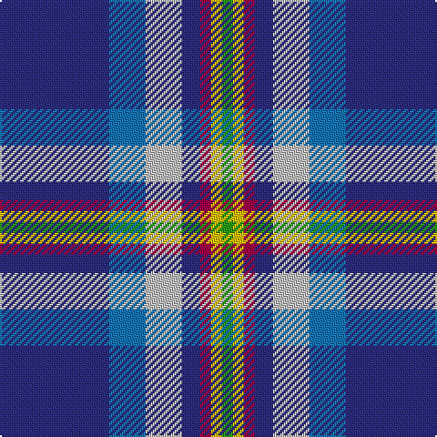

In pattern [BBWBRYG](/patterns/bbwbryg/).

This was sourced from tartans-authority.  It is a [7 stripes tartan](/stripes/stripes7/).

Original link http://www.tartansauthority.com/tartan-ferret/display/10374/

## Thread count
DB/60 B20 N20 DB10 R6 Y6 G/6

## Palette
Each colour and its ΔE from the base-6 reference it is a variant of.

| Colour | Shade | Base | ΔE (OKLab) |
|---|---|---|---|
| B | <code style="background-color:#1474B4;">#1474B4</code> `#1474B4` | B <code style="background-color:#2A418A;">#2A418A</code> | 0.15 |
| DB | <code style="background-color:#2C2C80;">#2C2C80</code> `#2C2C80` | B <code style="background-color:#2A418A;">#2A418A</code> | 0.06 |
| G | <code style="background-color:#289C18;">#289C18</code> `#289C18` | G <code style="background-color:#006100;">#006100</code> | 0.19 |
| N | <code style="background-color:#C0C0C0;">#C0C0C0</code> `#C0C0C0` | W <code style="background-color:#F7F7F7;">#F7F7F7</code> | 0.17 |
| R | <code style="background-color:#A00048;">#A00048</code> `#A00048` | R <code style="background-color:#CC0000;">#CC0000</code> | 0.12 |
| Y | <code style="background-color:#E8C000;">#E8C000</code> `#E8C000` | Y <code style="background-color:#F2BF00;">#F2BF00</code> | 0.02 |

# Sample pattern

## Nearest tartans

The nearest existing variants by ΔTartan distance.

1. [Peterson, Oren (Name)](/setts/s6/w1g2r10ra1b15wa1~b2c2c80-g009020-r888888-rac80000-wc49cd8-wae0e0e0~x4/) — ΔT 1.06
1. [Oren Peterson](/setts/s6/r1g2b10ra1ba15w1~b778899-ba000080-g006400-rd02090-raff0000-wffffff~x4/) — ΔT 1.06
1. [Pride of the Nation (Fashion)](/setts/s8/b12ba6b50bb39bc12bd6bc6w4~b5c8ca8-ba2c2c80-bb1c1c50-bc9050d8-bd780078-we0e0e0/) — ΔT 1.06
1. [State Seal of Louisiana (Fashion)](/setts/s9/b49w11y7k16wa5b20w10k6ba5~b1474b4-ba2888c4-k101010-wc0c0c0-wae8ccb8-ybc8c00~x2/) — ΔT 1.07
1. [Lambert, Patrice (Personal)](/setts/s8/w1b3g6k1ba12y1ba2y1~b440044-ba2c2c80-g006818-k101010-we0e0e0-yfccc00~x4/) — ΔT 1.07
1. [Shearer (2016)](/setts/s6/k4b4ba32r4bb17w2~b646464-ba003c64-bb788cb4-k000000-rc8002c-wfcfcfc~x2/) — ΔT 1.09
1. [Isle of Harris (District)](/setts/s6/b3k2g2k1ba10w1~b2888c4-ba2c2c80-g289c18-k101010-wfcfcfc~x8/) — ΔT 1.16
1. [Hodgkinson](/setts/s8/b5y5ba12g1ba1r1ba1w2~b5c8ca8-ba2c2c80-g006818-rc80000-we0e0e0-ye8c000~x4/) — ΔT 1.16
1. [Yorkshire C.C.C. Corporate Tartan Tartan Number: 670. Earliest known date: 1983 Nothing See products available Copyright © Blair Urquhart, Comrie, 2015](/setts/s8/b5y5ba12g1ba1r1ba1w2~b5c8ca8-ba2c2c80-g006818-rc80000-we0e0e0-ye8c000~x2/) — ΔT 1.16
1. [Ferster, James Carney (Personal)](/setts/s6/b12ba35w4wa3k11r5~b1474b4-ba003c64-k101010-r880000-w98c8e8-wafcfcfc~x2/) — ΔT 1.17

## Neighbour map

Every grey dot is one of 15726 variants placed by the first two principal components of the ΔTartan feature space (44% of its variance). Red is this tartan; blue dots are its nearest — click one to open its page.

<svg viewBox="0 0 640 380" role="img" style="max-width:100%;height:auto;border:1px solid #e0e0e0;border-radius:4px;display:block" xmlns="http://www.w3.org/2000/svg"><image href="/nn/cloud.v1.png" width="640" height="380"/><a href="/setts/s6/w1g2r10ra1b15wa1~b2c2c80-g009020-r888888-rac80000-wc49cd8-wae0e0e0~x4/"><circle cx="267.4" cy="147.7" r="4" fill="#3465a4"><title>Peterson, Oren (Name)</title></circle></a><a href="/setts/s6/r1g2b10ra1ba15w1~b778899-ba000080-g006400-rd02090-raff0000-wffffff~x4/"><circle cx="242.6" cy="143.5" r="4" fill="#3465a4"><title>Oren Peterson</title></circle></a><a href="/setts/s8/b12ba6b50bb39bc12bd6bc6w4~b5c8ca8-ba2c2c80-bb1c1c50-bc9050d8-bd780078-we0e0e0/"><circle cx="214.4" cy="149.2" r="4" fill="#3465a4"><title>Pride of the Nation (Fashion)</title></circle></a><a href="/setts/s9/b49w11y7k16wa5b20w10k6ba5~b1474b4-ba2888c4-k101010-wc0c0c0-wae8ccb8-ybc8c00~x2/"><circle cx="210.5" cy="151.5" r="4" fill="#3465a4"><title>State Seal of Louisiana (Fashion)</title></circle></a><a href="/setts/s8/w1b3g6k1ba12y1ba2y1~b440044-ba2c2c80-g006818-k101010-we0e0e0-yfccc00~x4/"><circle cx="232.3" cy="143.1" r="4" fill="#3465a4"><title>Lambert, Patrice (Personal)</title></circle></a><a href="/setts/s6/k4b4ba32r4bb17w2~b646464-ba003c64-bb788cb4-k000000-rc8002c-wfcfcfc~x2/"><circle cx="246.5" cy="148.7" r="4" fill="#3465a4"><title>Shearer (2016)</title></circle></a><a href="/setts/s6/b3k2g2k1ba10w1~b2888c4-ba2c2c80-g289c18-k101010-wfcfcfc~x8/"><circle cx="239.9" cy="184.0" r="4" fill="#3465a4"><title>Isle of Harris (District)</title></circle></a><a href="/setts/s8/b5y5ba12g1ba1r1ba1w2~b5c8ca8-ba2c2c80-g006818-rc80000-we0e0e0-ye8c000~x4/"><circle cx="200.3" cy="132.2" r="4" fill="#3465a4"><title>Hodgkinson</title></circle></a><a href="/setts/s8/b5y5ba12g1ba1r1ba1w2~b5c8ca8-ba2c2c80-g006818-rc80000-we0e0e0-ye8c000~x2/"><circle cx="200.3" cy="132.2" r="4" fill="#3465a4"><title>Yorkshire C.C.C. Corporate Tartan Tartan Number: 670. Earliest known date: 1983 Nothing See products available Copyright © Blair Urquhart, Comrie, 2015</title></circle></a><a href="/setts/s6/b12ba35w4wa3k11r5~b1474b4-ba003c64-k101010-r880000-w98c8e8-wafcfcfc~x2/"><circle cx="217.0" cy="169.6" r="4" fill="#3465a4"><title>Ferster, James Carney (Personal)</title></circle></a><circle cx="235.7" cy="158.5" r="5" fill="#c00000"/></svg>

ID: /setts/s7/b30ba10w10b5r3y3g3~b2c2c80-ba1474b4-g289c18-ra00048-wc0c0c0-ye8c000~x2/
