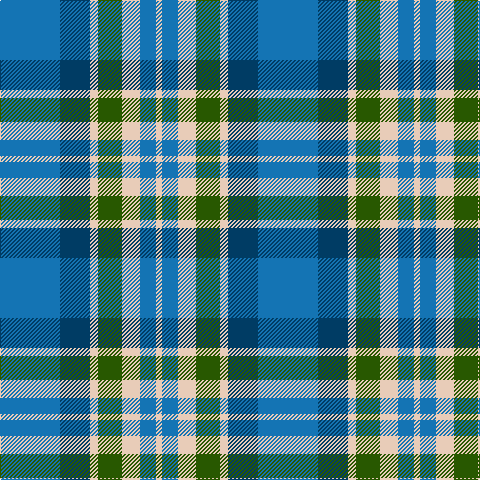

In pattern [BBWGWBW](/stripes/bbwgwbw/).

This was sourced from tartans-authority.  It is a [7 stripe tartan](/stripes/stripes7/).

Original link http://www.tartansauthority.com/tartan-ferret/display/10830/

## Thread count
B/60 DB30 LR8 G24 LR18 B16 LR/6

## Palette
Each colour and its ΔE from the base-6 reference it is a variant of.

| Colour | Shade | Base | ΔE (OKLab) |
|---|---|---|---|
| B | <code style="background-color:#1474B4;">#1474B4</code> `#1474B4` | B <code style="background-color:#2A418A;">#2A418A</code> | 0.15 |
| DB | <code style="background-color:#003C64;">#003C64</code> `#003C64` | B <code style="background-color:#2A418A;">#2A418A</code> | 0.08 |
| G | <code style="background-color:#285800;">#285800</code> `#285800` | G <code style="background-color:#006100;">#006100</code> | 0.03 |
| LR | <code style="background-color:#E8CCB8;">#E8CCB8</code> `#E8CCB8` | W <code style="background-color:#F7F7F7;">#F7F7F7</code> | 0.12 |

# Sample pattern

## Nearest tartans

The nearest existing variants by ΔTartan distance.

1. [Newall (Dumbarton) (Personal)](/setts/s7/t30dp15w4dg12w9t8w3~x2/) — ΔT 0.91
1. [Flower of Scotland](/setts/s6/r3b25k16b3g25b3~x2/) — ΔT 1.02
1. [Keela (Corporate)](/setts/s7/dt7w3dt2w6dt16t26r4~x2/) — ΔT 1.16
1. [Afternoon Tea / Earl Grey](/setts/s6/r15t98dt72ly25dt8w15/) — ΔT 1.17
1. [Afternoon Tea / Mint Tea](/setts/s6/w15lg98dt72b25dt8ly15/) — ΔT 1.25
1. [Crombie House Check](/setts/s6/k3lb10db2g6db18g2~x2/) — ΔT 1.28
1. [Sterling (Name)](/setts/s5/g11lo10dt11b33w3~x2/) — ΔT 1.28
1. [All as One (Corporate)](/setts/s5/k11t38r11g11k5~x2/) — ΔT 1.31
1. [Sterling, Rob (Florida) (Personal)](/setts/s5/g11lo10dp11b33w3~x2/) — ΔT 1.39
1. [Tilburg (District)](/setts/s5/db9ly9db9t23r3~x2/) — ΔT 1.39

## Neighbour map

Every grey dot is one of 14299 variants placed by the first two principal components of the ΔTartan feature space (44% of its variance). Red is this tartan; blue dots are its nearest — click one to open its page.

<svg viewBox="0 0 640 380" role="img" style="max-width:100%;height:auto;border:1px solid #e0e0e0;border-radius:4px;display:block" xmlns="http://www.w3.org/2000/svg"><image href="/nn/cloud.v1.png" width="640" height="380"/><a href="/setts/s7/t30dp15w4dg12w9t8w3~x2/"><circle cx="214.2" cy="206.4" r="4" fill="#3465a4"><title>Newall (Dumbarton) (Personal)</title></circle></a><a href="/setts/s6/r3b25k16b3g25b3~x2/"><circle cx="210.4" cy="230.2" r="4" fill="#3465a4"><title>Flower of Scotland</title></circle></a><a href="/setts/s7/dt7w3dt2w6dt16t26r4~x2/"><circle cx="213.5" cy="181.9" r="4" fill="#3465a4"><title>Keela (Corporate)</title></circle></a><a href="/setts/s6/r15t98dt72ly25dt8w15/"><circle cx="208.3" cy="186.1" r="4" fill="#3465a4"><title>Afternoon Tea / Earl Grey</title></circle></a><a href="/setts/s6/w15lg98dt72b25dt8ly15/"><circle cx="193.2" cy="181.5" r="4" fill="#3465a4"><title>Afternoon Tea / Mint Tea</title></circle></a><a href="/setts/s6/k3lb10db2g6db18g2~x2/"><circle cx="227.3" cy="208.4" r="4" fill="#3465a4"><title>Crombie House Check</title></circle></a><a href="/setts/s5/g11lo10dt11b33w3~x2/"><circle cx="229.0" cy="218.8" r="4" fill="#3465a4"><title>Sterling (Name)</title></circle></a><a href="/setts/s5/k11t38r11g11k5~x2/"><circle cx="228.6" cy="231.3" r="4" fill="#3465a4"><title>All as One (Corporate)</title></circle></a><a href="/setts/s5/g11lo10dp11b33w3~x2/"><circle cx="229.5" cy="213.6" r="4" fill="#3465a4"><title>Sterling, Rob (Florida) (Personal)</title></circle></a><a href="/setts/s5/db9ly9db9t23r3~x2/"><circle cx="194.6" cy="245.3" r="4" fill="#3465a4"><title>Tilburg (District)</title></circle></a><circle cx="215.7" cy="215.3" r="5" fill="#c00000"/></svg>

ID: /setts/s7/b30dt15lb4dg12lb9b8lb3~x2/
