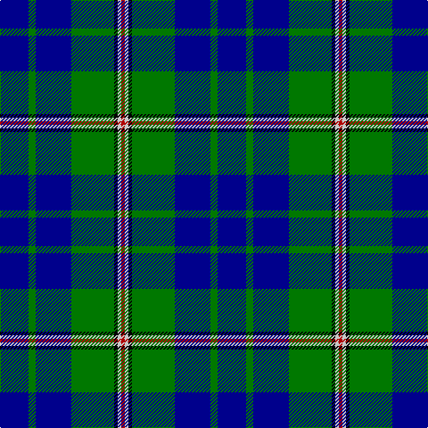

In pattern [BGBGKWR](/patterns/bgbgkwr/).

This was sourced from register-of-tartans.  It is a [7 stripes tartan](/stripes/stripes7/).

Original link https://www.tartanregister.gov.uk/tartanDetails.aspx?ref=3206

## Thread count
DB/32 G8 DB40 G48 K4 N4 DR/4

## Palette
Each colour and its ΔE from the base-6 reference it is a variant of.

| Colour | Shade | Base | ΔE (OKLab) |
|---|---|---|---|
| B | <code style="background-color:#788CB4;">#788CB4</code> `#788CB4` | B <code style="background-color:#2A418A;">#2A418A</code> | 0.25 |
| DB | <code style="background-color:#00008C;">#00008C</code> `#00008C` | B <code style="background-color:#2A418A;">#2A418A</code> | 0.13 |
| DR | <code style="background-color:#B00000;">#B00000</code> `#B00000` | R <code style="background-color:#CC0000;">#CC0000</code> | 0.06 |
| DY | <code style="background-color:#C88C00;">#C88C00</code> `#C88C00` | Y <code style="background-color:#F2BF00;">#F2BF00</code> | 0.15 |
| G | <code style="background-color:#007800;">#007800</code> `#007800` | G <code style="background-color:#006100;">#006100</code> | 0.07 |
| K | <code style="background-color:#000000;">#000000</code> `#000000` | K <code style="background-color:#000000;">#000000</code> | 0.00 |
| N | <code style="background-color:#C8C8C8;">#C8C8C8</code> `#C8C8C8` | W <code style="background-color:#F7F7F7;">#F7F7F7</code> | 0.14 |
| P | <code style="background-color:#64008C;">#64008C</code> `#64008C` | B <code style="background-color:#2A418A;">#2A418A</code> | 0.14 |

# Sample pattern

## Nearest tartans

The nearest existing variants by ΔTartan distance.

1. [Vance (Family Association) Corporate Family Tartan Tartan Number: 2208. Earliest known date: December 1994 Designed and Copyrighted in the US by Mark W. Vance. Details from Vance Family Association website. See products available Copyright © Blair Urquhart, Comrie, 2015](/setts/s6/k16b96k8g52b8ka12-b2888c4-g006818-k000000-ka101010/) — ΔT 1.04
1. [Miller](/setts/s8/r4b12g30ba18b60ba18g12y4-b000050-ba1474b4-g146400-r8c0000-yc88c00/) — ΔT 1.27
1. [Vance (Family Association)](/setts/s6/r16b96w8g52b8k12-b304080-g008000-k000000-rc00000-we0e0e0/) — ΔT 1.39
1. [Greenways Marketing Intl (Corporate)](/setts/s7/b48g6b6g6y4g36r4-b1c0070-g006818-r880000-yd09800/) — ΔT 1.39
1. [Nowell/Noel (Name)](/setts/s7/b6g8b40g48k4w6r2-b00008c-g007800-k000000-rb00000-wc8c8c8/) — ΔT 1.41
1. [Carmichael](/setts/s6/k10g64b64r6b6y6-b2c2c80-g006818-k000000-rc80000-ye8c000/) — ΔT 1.43
1. [Isle of Harris (District)](/setts/s6/b24k16g16k8ba80w8-b2888c4-ba2c2c80-g289c18-k101010-wfcfcfc/) — ΔT 1.43
1. [Lee (Personal)](/setts/s7/g8k4g48r16g12b36w8-b00008c-g004c00-k000000-r8c0000-wc8c8c8/) — ΔT 1.43
1. [Wishart Htg (Clan)](/setts/s7/k14b8g62b6y4b54w8-b2c2c80-g004c00-k000000-wc8c8c8-ye8c000/) — ΔT 1.44
1. [Gracie](/setts/s8/g94r6g12b70y6b70g12r6-b1c0070-g006818-r880000-yd09800/) — ΔT 1.45

## Neighbour map

Every grey dot is one of 15726 variants placed by the first two principal components of the ΔTartan feature space (44% of its variance). Red is this tartan; blue dots are its nearest — click one to open its page.

<svg viewBox="0 0 640 380" role="img" style="max-width:100%;height:auto;border:1px solid #e0e0e0;border-radius:4px;display:block" xmlns="http://www.w3.org/2000/svg"><image href="/nn/cloud.v1.png" width="640" height="380"/><a href="/setts/s6/k16b96k8g52b8ka12-b2888c4-g006818-k000000-ka101010/"><circle cx="256.9" cy="176.2" r="4" fill="#3465a4"><title>Vance (Family Association) Corporate Family Tartan Tartan Number: 2208. Earliest known date: December 1994 Designed and Copyrighted in the US by Mark W. Vance. Details from Vance Family Association website. See products available Copyright © Blair Urquhart, Comrie, 2015</title></circle></a><a href="/setts/s8/r4b12g30ba18b60ba18g12y4-b000050-ba1474b4-g146400-r8c0000-yc88c00/"><circle cx="224.7" cy="176.6" r="4" fill="#3465a4"><title>Miller</title></circle></a><a href="/setts/s6/r16b96w8g52b8k12-b304080-g008000-k000000-rc00000-we0e0e0/"><circle cx="273.9" cy="176.7" r="4" fill="#3465a4"><title>Vance (Family Association)</title></circle></a><a href="/setts/s7/b48g6b6g6y4g36r4-b1c0070-g006818-r880000-yd09800/"><circle cx="308.6" cy="193.5" r="4" fill="#3465a4"><title>Greenways Marketing Intl (Corporate)</title></circle></a><a href="/setts/s7/b6g8b40g48k4w6r2-b00008c-g007800-k000000-rb00000-wc8c8c8/"><circle cx="278.5" cy="143.7" r="4" fill="#3465a4"><title>Nowell/Noel (Name)</title></circle></a><a href="/setts/s6/k10g64b64r6b6y6-b2c2c80-g006818-k000000-rc80000-ye8c000/"><circle cx="246.8" cy="185.5" r="4" fill="#3465a4"><title>Carmichael</title></circle></a><a href="/setts/s6/b24k16g16k8ba80w8-b2888c4-ba2c2c80-g289c18-k101010-wfcfcfc/"><circle cx="239.3" cy="182.6" r="4" fill="#3465a4"><title>Isle of Harris (District)</title></circle></a><a href="/setts/s7/g8k4g48r16g12b36w8-b00008c-g004c00-k000000-r8c0000-wc8c8c8/"><circle cx="244.8" cy="191.9" r="4" fill="#3465a4"><title>Lee (Personal)</title></circle></a><a href="/setts/s7/k14b8g62b6y4b54w8-b2c2c80-g004c00-k000000-wc8c8c8-ye8c000/"><circle cx="242.0" cy="165.9" r="4" fill="#3465a4"><title>Wishart Htg (Clan)</title></circle></a><a href="/setts/s8/g94r6g12b70y6b70g12r6-b1c0070-g006818-r880000-yd09800/"><circle cx="322.4" cy="185.9" r="4" fill="#3465a4"><title>Gracie</title></circle></a><circle cx="260.2" cy="185.5" r="5" fill="#c00000"/></svg>

ID: /setts/s7/b32g8b40g48k4w4r4-b00008c-g007800-k000000-rb00000-wc8c8c8/
